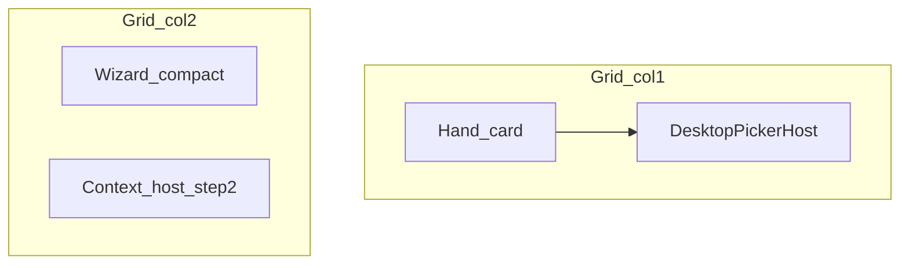

# Desktop workspace UI (hand-first + inline picker)

## Master and parent linkage

- **Master:** [hlm-master-plan.plan.md](hlm-master-plan.plan.md) — track
  `track-desktop-web-ui-help` lists this file as the **active execution slice**
  after snapshot / two-pane baseline.
- **Parent / context:** [hlm_desktop_web_ui_ce34a47e.plan.md](hlm_desktop_web_ui_ce34a47e.plan.md)
  (desktop two-pane, help popover, inline context host). This plan **extends**
  that layout; do not regress mobile flows defined there.

## Goals (desktop only; mobile unchanged)

| Requirement | Approach |
|---------------|----------|
| 当前手牌尽可能大 | Main column: larger preview grid, spacing, optional min-height on preview region |
| 步骤合适尺寸 | Right rail: compact typography and spacing for hints + wizard buttons |
| 选牌不沉底 | ≥1024px: move `#pickerModal > .sheet` into `#desktopPickerHost` under hand; no bottom-sheet overlay |

## Layout (≥1024px)

## Implementation (concise)

1. **HTML** [`public/index.html`](../../public/index.html): insert
   `#desktopPickerHost.desktop-picker-host` immediately **after** `.hand-card`,
   before `#desktopSidePanel`.

2. **JS** [`public/app.js`](../../public/app.js) (or small extracted module if
   SLOC warrants): **`mountDesktopPickerInline(byId)`** — same pattern as
   `mountDesktopContextInline`: on desktop move `.sheet` from `#pickerModal` to
   host; add `desktop-inline-picker` on `#pickerModal`; set
   `data-picker-inline-host="desktopPickerHost"`. On mobile / teardown, move
   back. **`matchMedia('(min-width: 1024px)')`** `change` listener to relocate
   on breakpoint cross.

3. **modal visibility** [`public/modalUi.js`](../../public/modalUi.js): extend
   `setModalOpen` so when `#pickerModal` has `desktop-inline-picker` and host
   id in `dataset`, toggle **`#desktopPickerHost.hidden`** in sync with `open`
   (single source of truth: `store.uiState.modal.picker`).

4. **CSS** [`public/styles-responsive.css`](../../public/styles-responsive.css):
   - `#desktopPickerHost`: `grid-column: 1 / 2`; card chrome; scroll inside
     sheet.
   - `#pickerModal.desktop-inline-picker`: mirror
     `#contextModal.desktop-inline-context` (static, transparent, no dim
     overlay).
   - `.desktop-picker-host .sheet`: full border-radius, `max-height` +
     `overflow: auto`.
   - Tweak `.tile-preview` / `.tile-chip` in main column for larger hand.
   - Tighten `.desktop-side-panel` hint/control density.

5. **Wiring:** Existing `openModalByKey("picker")` paths unchanged; mobile keeps
   bottom sheet. Verify `#tileContextMenu` (`position: fixed`) after DOM move.

## Gates

- `npm test`, `npm run quality:complexity`, `cloc` on touched files.
- Update [CHANGELOG.md](../../CHANGELOG.md) `[Unreleased]`.
- Update master **ValidationEvidence** and this plan **status** after pass.

## Non-goals

- Wizard state machine changes; result/help modal strategy; mobile picker UX.

## Risks

- Resize across 1024px: relocation must keep one `.sheet` in correct parent.
- Focus after **完成** on inline picker: spot-check a11y.

## Review checklist (pre-execution)

- [x] Linked from master `track-desktop-web-ui-help` and parent desktop plan.
- [x] Breakpoint aligned with existing `1024px` desktop rules.
- [x] Visibility sync owned by `setModalOpen` + modal state (no duplicate flags).

## Implementation record (2026-03-28)

- Delivered: `public/index.html` `#desktopPickerHost`; `public/desktopPickerMount.js`
  (`syncDesktopPickerSheet`, `installDesktopPickerLayoutListener`); `public/app.js`
  bootstrap order; `public/modalUi.js` host `hidden` sync; `public/styles-responsive.css`
  inline picker chrome, `#pickerModal.desktop-inline-picker`, 12-col grid in host,
  compact rail hints, hand preview tweaks.
- Tests: `tests/unit/modalUi.test.js`, `tests/unit/desktopPickerMount.test.js`,
  `tests/unit/indexStylesheetLinks.test.js` updated.
- Gates: `npm test`, `npm run quality:complexity` pass; `CHANGELOG.md` `[Unreleased]`.

## Follow-up (2026-03-28, shipped v4.9.4)

- **Shell vertical pack:** `.container.app-shell` gained `align-content: start`
  in `public/styles-responsive.css` so `min-height: 100vh` no longer stretched
  implicit grid rows (version / **当前手牌** / step rail drifting mid-viewport).
  Covered by `indexStylesheetLinks.test.js`; user confirmed resolved.
- **Release notes:** `CHANGELOG.md` `[4.9.4]`; `package.json` / `appVersion.js`
  `4.9.4` build `2`.

## Related next slice

- 和牌条件 **桌面双套 UI**（select / number + 移动控件保留）：
  [hlm_desktop_context_controls_dual_ui.plan.md](hlm_desktop_context_controls_dual_ui.plan.md)
  — **completed** same day; see child plan status `completed`.
