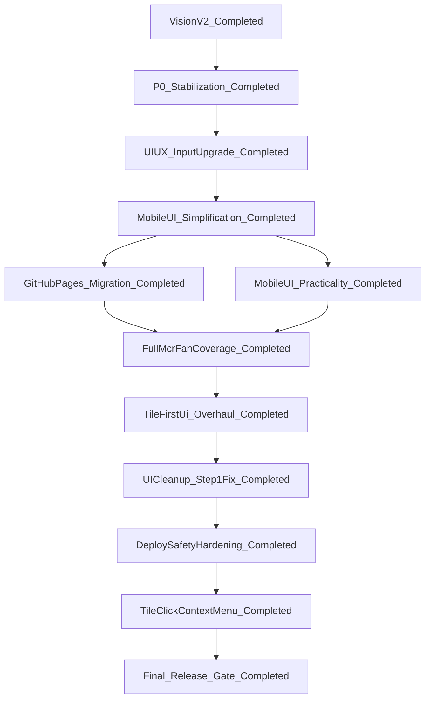

---
name: hlm-master-plan
overview: Coordinate all HLM delivery tracks under one execution order, shared quality guardrails, and release gates.
todos:
  - id: track-vision-v2
    content: Keep Vision V2 outcomes stable and reuse its contracts in downstream features.
    status: completed
  - id: track-p0-stabilization
    content: Keep P0 stabilizations intact and avoid regressions while shipping new UI/UX work.
    status: completed
  - id: track-ui-ux-input-upgrade
    content: Execute phased UI/UX input upgrade plan with strict test-first phase gates.
    status: completed
  - id: track-mobile-ui-simplification
    content: Execute mobile-first UI simplification with review-revise iteration loop.
    status: completed
  - id: enforce-engineering-guardrails
    content: Apply function-size, complexity, SLOC, and testing guardrails for all touched files.
    status: completed
  - id: final-release-gate
    content: Pass full validation gates before claiming completion.
    status: completed
  - id: track-github-pages-migration
    content: Execute dedicated-repo and GitHub Pages migration track for hlm.
    status: completed
  - id: track-mobile-ui-practicality
    content: Execute mobile UI practicality upgrade (14-slot, Unicode, context menu).
    status: completed
  - id: track-security-privacy-hardening
    content: Execute security and privacy hardening for public-source and public-pages exposure.
    status: completed
  - id: track-full-mcr-fan-coverage
    content: Execute full MCR fan coverage and Chinese terminology unification.
    status: completed
  - id: track-tile-first-ui-overhaul
    content: Execute tile-first UI overhaul with dynamic context menu and one-layer/two-layer picker strategy.
    status: completed
  - id: track-ui-cleanup-step1
    content: Execute UI cleanup and step 1 fix (picker 1–2 clicks, clear/reset, remove slot menu).
    status: completed
  - id: track-deploy-safety-hardening
    content: Execute deploy safety hardening (doctor, dry-run, mismatch warning, auth hints, CI matrix).
    status: completed
  - id: track-tile-click-context-menu
    content: >
      Replace persistent pattern-action buttons with tile-click-triggered
      dynamic context menu; hide impossible options by remaining slots.
    status: completed
  - id: track-holistic-ux-scoring
    content: >
      Execute holistic UX and scoring plan: flower fans, splash, context
      modal HIG redesign, click reduction, result modal + static fan lexicon
      (row info button disclosure). Child: hlm_holistic_ux_scoring.plan.md
    status: completed
  - id: track-post-holistic-ui-polish
    content: >
      Post-holistic polish (7 child todos incl. gates): presets removal, HIG
      timing list, bottom apply CTA, result layout + remove info modal, Guobiao
      fanLexicon, splash visuals, master closeout. Child:
      hlm_post_holistic_ui_polish.plan.md
    status: completed
  - id: track-five-principles-exact-scoring
    content: >
      Implement decomposition-aware exact scoring for five Guobiao counting
      principles with comprehensive unit/regression/integration tests. Child:
      hlm-five-principles-exact-engine_cf4e8446.plan.md
    status: completed
  - id: track-desktop-web-ui-help
    content: >
      Desktop/macOS web UI: baseline hlm_desktop_web_ui_ce34a47e.plan.md;
      workspace slice desktop_workspace_ui_76498db2.plan.md (implemented);
      hlm_desktop_context_controls_dual_ui.plan.md (和牌条件桌面双套 UI:
      implemented; regression/manual follow-up optional).
    status: completed
  - id: track-help-zh-expansion
    content: >
      中文帮助详版（程序目的、使用步骤、番种释义；复用 lexicon；单模板双端）。
      Child: hlm_help_zh_expansion_d3a197ba.plan.md
    status: completed
  - id: track-round-setup-four-player-settlement
    content: >
      启动先定义四家（座位/起始分/庄家）并在结果窗体展示四家结算
      （局前/增减/局后）；按和牌方式区分荣和与自摸。Child:
      hlm_round_setup_four_player_settlement_c30c89d1.plan.md
    status: completed
  - id: track-round-setup-table-ui
    content: >
      启动门「设定玩家」牌桌俯视 UI（四风位+中心庄家/CTA）；保留 DOM id；
      TDD 契约测试。Child: hlm_round_setup_table_ui_525519a5.plan.md
    status: completed
  - id: track-round-settlement-roles-visible
    content: >
      点和时强制手选放铳者；移动端/桌面端均可设置结算角色；结果区显示
      结算校验失败原因（避免静默全 0）。Child:
      hlm_round_settlement_roles_visible_01c13181.plan.md
    status: completed
  - id: track-score-config-mcr-presets
    content: >
      结算公式参数化（scoreRuleConfig）并提供双预设：
      MCR_Official + Current_Compat；支持规则选择与自定义持久化回退。Child:
      hlm_score_config_mcr_presets_620b275b.plan.md
    status: completed
  - id: track-mcr-p0-official-alignment
    content: >
      国标预设对齐体育总局核心口径：8 分起和、花牌不计入起和、自摸/点和
      底分+基本分结算；保留 Current_Compat 行为。Child:
      hlm_mcr_p0_alignment_01c0c730.plan.md
    status: completed
  - id: track-onboarding-shell-hig
    content: >
      Option B：将「设定玩家」并入 main.app-shell 为向导第 1 步（三步流）+
      模态/表单 HIG 打磨。Child:
      hlm_onboarding_shell_merge_f9a1c8e0.plan.md（**completed** 2026-04-03；v5.2.0）
    status: completed
  - id: track-ux-audit-followup
    content: >
      UX audit follow-up: modal backdrop dismiss, help popover outside-click,
      splash skip, calculate hint, copy/score bounds, score-rule details,
      Escape/focus polish. Child: hlm_ux_audit_followup_5d8c2f1a.plan.md
      (**completed** 2026-04-05).
    status: completed
  - id: track-mcr-full-official-alignment
    content: >
      Full latest-Guobiao conformance track: official rule-source freeze,
      rule-to-code trace matrix, TDD closure for remaining fan/scoring gaps,
      and full-gate validation. Child:
      hlm_mcr_full_official_alignment_a1b2c3d4.plan.md
    status: completed
  - id: track-mjpdf-official-alignment-execution
    content: >
      MJ.pdf authoritative alignment execution: extract official checklist,
      audit rule-to-code gaps, apply TDD remediation, and run full validation
      gates. Child: hlm_mjpdf_alignment_execution_7866867f.plan.md
    status: completed
isProject: false
---

# HLM Master Plan

## Purpose

- Provide a single source of truth for HLM roadmap sequencing.
- Merge existing HLM plans into one coordinated execution model.
- Standardize engineering guardrails and release readiness gates.

## Completion Snapshot (Historical Baseline)

- Status: `completed` (historical baseline before reopening)
- MaintenanceMode: `active` (master plan closed; monitoring mode)
- CompletionDate: `2026-03-17`
- CompletedTracks:
  - `GitHub Pages migration`
  - `Security/privacy hardening`
  - `Mobile UI practicality`
  - `Full MCR fan coverage`
  - `UI cleanup and step 1 fix`
  - `Deploy safety hardening`
  - `Tile-click context menu`
  - `Context menu visual and layout`
  - `Final release gate`
- ValidationBaseline:
  - `npm test` pass
  - `npm run quality:complexity` pass
  - per-file `cloc` checks recorded in work evidence

## Reopened Track Snapshot (Historical)

- Status: `closed`
- ActiveTrack: `none`
- ChildExecutionPlan:
  - [hlm-tile-first-ui-overhaul_9db3c6ce.plan.md](hlm-tile-first-ui-overhaul_9db3c6ce.plan.md)
  - `hlm_ui_cleanup_and_step1_fix_07c1e0a1.plan.md` (historical reference;
  file not present in current workspace)
  - [hlm_deploy_hardening_b0d19373.plan.md](hlm_deploy_hardening_b0d19373.plan.md)
  - [hlm_tile_click_context_menu_998eab78.plan.md](hlm_tile_click_context_menu_998eab78.plan.md)
  - [hlm_context_menu_visual.plan.md](hlm_context_menu_visual.plan.md)
- ReopenDate: `2026-03-17`
- ReopenIntent:
  - `Implement tile-first hand input UI and workflow overhaul.`
  - `Apply deterministic dynamic context-menu legality at 14-tile boundary.`
  - `Ship locked picker-mode behavior (mobile two-layer default, desktop preference restore).`
- FollowUpIntent:
  - `UI cleanup and step 1 fix delivered.`
  - `Deploy safety hardening delivered.`
  - `Final release gate rerun completed.`

## Consolidated Plan Index

- Vision V2 track (historical snapshot, completed):
[hlm-vision-v2-plan_fbaccd9f.plan.md](hlm-vision-v2-plan_fbaccd9f.plan.md)
- P0 stabilization track (historical snapshot, completed):
[hlm-p0-stabilization_fadba898.plan.md](hlm-p0-stabilization_fadba898.plan.md)
- UI/UX input upgrade track (historical snapshot, completed):
[hlm-ui-ux-input-upgrade.plan.md](hlm-ui-ux-input-upgrade.plan.md)
- Mobile UI simplification track (historical snapshot, completed):
[hlm-mobile-ui-simplification.plan.md](hlm-mobile-ui-simplification.plan.md)
- GitHub Pages migration track (historical snapshot, completed):
[hlm_github_pages_migration_1186808d.plan.md](hlm_github_pages_migration_1186808d.plan.md)
- Mobile UI practicality upgrade track (historical snapshot, completed):
[hlm-mobile-ui-practicality-upgrade.plan.md](hlm-mobile-ui-practicality-upgrade.plan.md)
- Full MCR fan coverage track (historical snapshot, completed):
`full_mcr_fan_coverage_512ff761.plan.md` (historical external archive)
  - external historical reference (outside workspace scope)
  - optional local mirror path if later imported:
  `.cursor/plans/full_mcr_fan_coverage_512ff761.plan.md`
- Tile-first UI overhaul track (historical snapshot, completed):
[hlm-tile-first-ui-overhaul_9db3c6ce.plan.md](hlm-tile-first-ui-overhaul_9db3c6ce.plan.md)
- UI cleanup and step 1 fix track (completed):
`hlm_ui_cleanup_and_step1_fix_07c1e0a1.plan.md` (historical reference; file
not present in current workspace)
- Deploy safety hardening track (completed):
[hlm_deploy_hardening_b0d19373.plan.md](hlm_deploy_hardening_b0d19373.plan.md)
- Tile-click context menu track (completed):
[hlm_tile_click_context_menu_998eab78.plan.md](hlm_tile_click_context_menu_998eab78.plan.md)
- Context menu visual and layout (vertical menu, anchor positioning) (completed):
[hlm_context_menu_visual.plan.md](hlm_context_menu_visual.plan.md)
- Holistic UX and scoring (completed 2026-03-22; flower tiles, splash,
  context modal HIG, click reduction, result modal + fan lexicon + row info):
[hlm_holistic_ux_scoring.plan.md](hlm_holistic_ux_scoring.plan.md)
- Post-holistic UI polish (**completed** 2026-03-22; presets removal, timing
  HIG, result layout, Guobiao lexicon, splash refinement):
[hlm_post_holistic_ui_polish.plan.md](hlm_post_holistic_ui_polish.plan.md)
- Five-principles exact scoring (**completed**; decomposition-aware engine +
  full test hardening):
[hlm-five-principles-exact-engine_cf4e8446.plan.md](hlm-five-principles-exact-engine_cf4e8446.plan.md)
- Desktop web UI + help入口 (**baseline / workspace / 双套条件** 已完成):
  [hlm_desktop_web_ui_ce34a47e.plan.md](hlm_desktop_web_ui_ce34a47e.plan.md),
  [desktop_workspace_ui_76498db2.plan.md](desktop_workspace_ui_76498db2.plan.md),
  [hlm_desktop_context_controls_dual_ui.plan.md](hlm_desktop_context_controls_dual_ui.plan.md).
- 中文帮助详版（**completed**）:
  [hlm_help_zh_expansion_d3a197ba.plan.md](hlm_help_zh_expansion_d3a197ba.plan.md)
- 四家对局初始化与结果结算（**completed**）:
  [hlm_round_setup_four_player_settlement_c30c89d1.plan.md](hlm_round_setup_four_player_settlement_c30c89d1.plan.md)
- 启动门牌桌式四风位 UI（**completed** 2026-04-03）:
  [hlm_round_setup_table_ui_525519a5.plan.md](hlm_round_setup_table_ui_525519a5.plan.md)
- 点和结算角色强制手选与错误可视化（**completed** 2026-04-03）:
  [hlm_round_settlement_roles_visible_01c13181.plan.md](hlm_round_settlement_roles_visible_01c13181.plan.md)
- 结算公式参数化 + 双预设（**completed** 2026-04-03）:
  [hlm_score_config_mcr_presets_620b275b.plan.md](hlm_score_config_mcr_presets_620b275b.plan.md)
- 国标结算口径 P0（**completed** 2026-04-03；v5.1.0）:
  [hlm_mcr_p0_alignment_01c0c730.plan.md](hlm_mcr_p0_alignment_01c0c730.plan.md)
- 启动并入壳 + 三步向导（**completed** 2026-04-03；v5.2.0；Option B）:
  [hlm_onboarding_shell_merge_f9a1c8e0.plan.md](hlm_onboarding_shell_merge_f9a1c8e0.plan.md)
- UX audit follow-up（**completed** 2026-04-05）:
  [hlm_ux_audit_followup_5d8c2f1a.plan.md](hlm_ux_audit_followup_5d8c2f1a.plan.md)
- Full latest-Guobiao conformance（**completed** 2026-04-07）:
  [hlm_mcr_full_official_alignment_a1b2c3d4.plan.md](hlm_mcr_full_official_alignment_a1b2c3d4.plan.md)
  ; trace matrix shell
  [hlm_rule_code_trace_matrix.plan.md](hlm_rule_code_trace_matrix.plan.md)
- Historical supporting plans (traceability only):
  - [hlm_版本升级工具与中文术语统一_35161103.plan.md](hlm_版本升级工具与中文术语统一_35161103.plan.md)
  - `spike_full_automation_6a79ecff.plan.md` (historical reference; file
    not present in current workspace)
  - [hlm_layered_mahjong_encoding_rollout_(risk-hardened)_ee14faa7.plan.md](hlm_layered_mahjong_encoding_rollout_(risk-hardened)_ee14faa7.plan.md)

## Archived Superseded Plan Notes

- ArchivedPlan: `vlm_tile_encoding_plan_f7b7f64d.plan.md`
- PriorIntent:
  - Introduce layered tile encoding (`code<->id` + uncertainty mask).
  - Keep CSV and JSON external contracts stable.
  - Roll out via TDD with roundtrip and bounds tests.
- SupersededReason:
  - Replaced by a risk-hardened successor with stricter
  contract-freeze and migration-safety wording.
- SuccessorPlan:
  - `hlm_layered_mahjong_encoding_rollout_(risk-hardened)_ee14faa7.plan.md`
- ArchiveDate: `2026-03-16`
- ExecutionPolicy:
  - Do not recreate or execute the archived draft.
  - Execute successor plan only when this track is re-opened.

## Plan Location Policy

- Active HLM plans must live under:
`.cursor/plans`
- Any older/out-of-workspace plan is considered historical reference only.
- Execution always follows plans referenced in this master index.
- Completed child plans are treated as historical snapshots for traceability;
only plans marked `in_progress` or `pending` define executable next actions.

## Dependency and Execution Order

- Vision V2 and P0 are prerequisites.
- UI/UX plan executes in phased order defined in its own plan.
- Mobile simplification plan executes after UI/UX input-upgrade phases.
- GitHub Pages migration executes after mobile simplification exits.
- Mobile UI practicality upgrade executes after or in parallel with Pages
migration (master plan approval required for parallel).
- Security/privacy hardening (completed) ran after Pages artifact refactor.
- Full MCR fan coverage executes after both Pages migration and
practicality upgrade exit (or after Pages if practicality is deferred).
- Tile-first UI overhaul executes after Full MCR fan coverage exits.
- UI cleanup and step 1 fix executes after tile-first UI overhaul exits.
- Deploy safety hardening executes after UI cleanup track exits.
- Tile-click context menu track executes after deploy safety hardening
  (builds on completed tile-first UI overhaul).
- Final release gate reruns after tile-click context menu track exits.
- Holistic UX and scoring track (**new**): runs after the historical baseline
  above; does not invalidate prior `completed` milestones — see child plan
  [hlm_holistic_ux_scoring.plan.md](hlm_holistic_ux_scoring.plan.md).
- Post-holistic UI polish (**completed** 2026-03-22): see
  [hlm_post_holistic_ui_polish.plan.md](hlm_post_holistic_ui_polish.plan.md).
- Round setup table metaphor UI (**completed** 2026-04-03): see
  [hlm_round_setup_table_ui_525519a5.plan.md](hlm_round_setup_table_ui_525519a5.plan.md).
- Settlement role visibility + manual discarder enforcement (**completed** 2026-04-03):
  [hlm_round_settlement_roles_visible_01c13181.plan.md](hlm_round_settlement_roles_visible_01c13181.plan.md).
- Score config scalability with MCR + compat presets (**completed** 2026-04-03):
  [hlm_score_config_mcr_presets_620b275b.plan.md](hlm_score_config_mcr_presets_620b275b.plan.md).
- MCR official settlement + gate alignment P0 (**completed** 2026-04-03):
  [hlm_mcr_p0_alignment_01c0c730.plan.md](hlm_mcr_p0_alignment_01c0c730.plan.md).
- MJ.pdf authoritative alignment execution (**in_progress**):
  [hlm_mjpdf_alignment_execution_7866867f.plan.md](hlm_mjpdf_alignment_execution_7866867f.plan.md).
- Onboarding in main shell + three-step wizard (**completed** 2026-04-03;
  **v5.2.0**): prerequisite `track-round-setup-table-ui` + four-player
  settlement; child
  [hlm_onboarding_shell_merge_f9a1c8e0.plan.md](hlm_onboarding_shell_merge_f9a1c8e0.plan.md)
  （`uiFlowState` 三步、`goWizardNext` 写 `roundState`、`handCardSection`、
  `roundSetupGateDom` `main` 断言、CHANGELOG [5.2.0]）。

## Phase Status Dashboard

### Current delivery queue (post-baseline)

- TrackId (latest closed): `track-mjpdf-official-alignment-execution`
  （**completed** 2026-04-07）→
  [hlm_mjpdf_alignment_execution_7866867f.plan.md](hlm_mjpdf_alignment_execution_7866867f.plan.md)
- Prior closed: `track-mcr-full-official-alignment`（**completed** 2026-04-07）→
  [hlm_mcr_full_official_alignment_a1b2c3d4.plan.md](hlm_mcr_full_official_alignment_a1b2c3d4.plan.md)
- Prior closed: `track-ux-audit-followup`（**completed** 2026-04-05）→
  [hlm_ux_audit_followup_5d8c2f1a.plan.md](hlm_ux_audit_followup_5d8c2f1a.plan.md)
- Active TrackId: `maintenance`（no queued code track）
- Prior TrackId: `track-mcr-p0-official-alignment`（**completed** 2026-04-03）→
  [hlm_mcr_p0_alignment_01c0c730.plan.md](hlm_mcr_p0_alignment_01c0c730.plan.md)
- Earlier: `track-score-config-mcr-presets`（**completed** 2026-04-03）→
  [hlm_score_config_mcr_presets_620b275b.plan.md](hlm_score_config_mcr_presets_620b275b.plan.md)
- Prerequisite（**completed**）:
  `track-round-setup-four-player-settlement` →
  [hlm_round_setup_four_player_settlement_c30c89d1.plan.md](hlm_round_setup_four_player_settlement_c30c89d1.plan.md)
- Prerequisite（**completed**）:
  `track-round-setup-table-ui` →
  [hlm_round_setup_table_ui_525519a5.plan.md](hlm_round_setup_table_ui_525519a5.plan.md)
- Prerequisite（**completed**）:
  `track-round-settlement-roles-visible` →
  [hlm_round_settlement_roles_visible_01c13181.plan.md](hlm_round_settlement_roles_visible_01c13181.plan.md)
- ChildPlans — 桌面 UI（已完成）:
  - Baseline / history:
    [hlm_desktop_web_ui_ce34a47e.plan.md](hlm_desktop_web_ui_ce34a47e.plan.md)
  - Workspace:
    [desktop_workspace_ui_76498db2.plan.md](desktop_workspace_ui_76498db2.plan.md)
  - 和牌条件桌面双套 UI:
    [hlm_desktop_context_controls_dual_ui.plan.md](hlm_desktop_context_controls_dual_ui.plan.md)
- ChildPlans — 牌桌式启动门（已完成）:
  - [hlm_round_setup_table_ui_525519a5.plan.md](hlm_round_setup_table_ui_525519a5.plan.md)
- ChildPlans — 最近完成:
  - [hlm_mjpdf_alignment_execution_7866867f.plan.md](hlm_mjpdf_alignment_execution_7866867f.plan.md)
    （**completed**；`track-mjpdf-official-alignment-execution`）
  - [hlm_mcr_full_official_alignment_a1b2c3d4.plan.md](hlm_mcr_full_official_alignment_a1b2c3d4.plan.md)
    （**completed** 2026-04-07；`track-mcr-full-official-alignment`）;
    [hlm_rule_code_trace_matrix.plan.md](hlm_rule_code_trace_matrix.plan.md)
  - [hlm_ux_audit_followup_5d8c2f1a.plan.md](hlm_ux_audit_followup_5d8c2f1a.plan.md)
    （**completed** 2026-04-05；`track-ux-audit-followup`）
  - [hlm_onboarding_shell_merge_f9a1c8e0.plan.md](hlm_onboarding_shell_merge_f9a1c8e0.plan.md)
    （**completed** 2026-04-03；`track-onboarding-shell-hig`）
- ChildPlans — 历史可执行轨道（均已 completed）:
  - [hlm_score_config_mcr_presets_620b275b.plan.md](hlm_score_config_mcr_presets_620b275b.plan.md)
  - [hlm_mcr_p0_alignment_01c0c730.plan.md](hlm_mcr_p0_alignment_01c0c730.plan.md)
- **Closed slice：**
  `track-mcr-full-official-alignment`（**completed** 2026-04-07；trace matrix +
  doc-sync test + exclusion truth table；子计划
  [hlm_rule_code_trace_matrix.plan.md](hlm_rule_code_trace_matrix.plan.md)）
- TrackTodoStatus: `completed`（`track-mjpdf-official-alignment-execution`）
- Prior closed: `track-onboarding-shell-hig` →
  [hlm_onboarding_shell_merge_f9a1c8e0.plan.md](hlm_onboarding_shell_merge_f9a1c8e0.plan.md)
- Prior closed: `track-five-principles-exact-scoring` →
  [hlm-five-principles-exact-engine_cf4e8446.plan.md](hlm-five-principles-exact-engine_cf4e8446.plan.md)
  (2026-03-22)
- Earlier closed: `track-post-holistic-ui-polish` →
  [hlm_post_holistic_ui_polish.plan.md](hlm_post_holistic_ui_polish.plan.md)
  (2026-03-22)
- Historical closed: `track-holistic-ux-scoring` →
  [hlm_holistic_ux_scoring.plan.md](hlm_holistic_ux_scoring.plan.md)
  (2026-03-22)

### Current Status

- Owner: `project-owner`
- OverallStatus: `in_progress`
- ProgressPercent: `100`（MJ.pdf strict_81 alignment track completed）
- ActivePhase: `maintenance`
- Focus:
  - `MJ.pdf strict_81 slice-1 delivered: canonical ids + quan_bu_kao pattern`
    `support + timing semantics realigned; full gates pass for this slice.`
    [hlm_mjpdf_alignment_execution_7866867f.plan.md](hlm_mjpdf_alignment_execution_7866867f.plan.md)
  - `Closed 2026-04-07: MJ.pdf authoritative alignment execution (strict_81`
    `canonical ids + quan_bu_kao pattern + timing semantics + full gates) —`
    [hlm_mjpdf_alignment_execution_7866867f.plan.md](hlm_mjpdf_alignment_execution_7866867f.plan.md)
  - `Delivered 2026-04-03: onboarding shell merge — 三步向导（设定玩家入主壳`
    `v5.2.0）—`
    [hlm_onboarding_shell_merge_f9a1c8e0.plan.md](hlm_onboarding_shell_merge_f9a1c8e0.plan.md)
  - `Delivered 2026-04-03: MCR P0 — 国标预设 8 分起和（花牌不计起和）、`
    `officialBaseFan 结算、评分穿线、v5.1.0 —`
    [hlm_mcr_p0_alignment_01c0c730.plan.md](hlm_mcr_p0_alignment_01c0c730.plan.md)
  - `Closed 2026-04-03: 四家结算表头/列对齐（table 布局）— see master`
    `ValidationEvidence +`
    [hlm_round_setup_four_player_settlement_c30c89d1.plan.md](hlm_round_setup_four_player_settlement_c30c89d1.plan.md)
  - `Prior delivered: manual discarder for dianhe + settlement errors —`
    [hlm_round_settlement_roles_visible_01c13181.plan.md](hlm_round_settlement_roles_visible_01c13181.plan.md)
  - `Delivered 2026-04-03: round setup table-metaphor gate UI + dealer highlight`
    `+ roundSetupGateDom.test.js —`
    [hlm_round_setup_table_ui_525519a5.plan.md](hlm_round_setup_table_ui_525519a5.plan.md)
  - `Primary: run manual desktop matrix (Chrome/Safari) after help expansion.`
  - `Regression: inline picker + context form + reset after dual-UI; manual`
    `keyboard through select/number on desktop host.`
  - `Desktop shell: align-content:start fix in v4.10.0; user confirmed.`
  - `Preserve hlm_desktop_web_ui baseline: inline context host, help surfaces,`
    `two-pane shell.`
  - `TDD + npm test + quality:complexity + cloc per slice gates.`
  - `Delivered 2026-04-07: full MCR official alignment track + rule->code trace`
    `matrix + ruleTraceMatrix.docSync.test.js / writeRuleTraceMatrix.mjs`
    `(v5.2.15) —`
    [hlm_mcr_full_official_alignment_a1b2c3d4.plan.md](hlm_mcr_full_official_alignment_a1b2c3d4.plan.md)
  - `Delivered 2026-04-03: result modal 番数行含起和（v5.2.2）当 gateFan <`
    `totalFan 时显示「总番（起和 x 番）」。`
- ExitGateCheck:
  - Unit: `pass`
  - Integration: `pass`
  - Regression: `pass`
  - FullSuite: `pass`
  - Complexity: `pass`
  - SLOCReview: `pass`
  - AccessibilityKeyboardFlow: `pass`
  - DesktopBrowserMatrix: `pass`（automated **Chromium + WebKit + mobile**
    viewport via `npm run test:e2e` + `scripts/e2eStaticServe.mjs`; real Safari
    / extra breakpoints still optional）
  - SecurityScan: `carry-forward pass`
  - PublicArtifactScope: `carry-forward pass`
  - PublishLayoutDecision: `carry-forward pass`
- RisksAndBlockers:
  - `Primary risk (mitigated for MCR track): registry count vs detector/exclusion`
    `drift — control: rule-to-code matrix +`
    `tests/unit/ruleTraceMatrix.docSync.test.js` +
    `exclusionMap.truthTable.test.js` + structure tests.`
  - `No blocker; primary risk is desktop CSS regressions on tablet/mobile`
    `breakpoints without tight responsive scoping and test coverage.`
  - `Workspace slice: moving picker .sheet across breakpoint requires`
    `resize-safe remount and setModalOpen/host sync to avoid orphaned DOM`
    `or duplicate sheets.`
  - `Context dual UI: duplicate controls risk desync from hidden fields;`
    `centralize sync and cover resetContext + resize in tests.`
  - `Potential risk: help overlay focus handling and reset-action clarity`
    `can regress keyboard UX or cause accidental context loss.`
  - `Help 详版: 番种 
 列表变长时须验证窄屏 modal 与桌面 popover 滚动、`
    ` tabindex 与 heading 层级，避免对话框内焦点陷阱回归.`
  - `Playwright covers load + splash + help on Chromium/WebKit/tablet/mobile,`
    `plus Chromium/WebKit/tablet/mobile wizard 14-tiles -> result modal path`
    `and tablet modal-flow assertions; real Safari on Apple hardware optional.`
  - `Onboarding v5.2.0 shipped (2026-04-03): manual spot-check wizard 1→2→3 +`
    `resize/breakpoints still recommended beyond automated smoke.`
- NextActions:
  - `MJ.pdf strict_81 alignment track closed; keep maintenance-only regression`
    `hygiene for scoring rules/docs synchronization.`
  - `MCR alignment track closed (2026-04-07): trace matrix v1 +`
    `ruleTraceMatrix.docSync.test.js + writeRuleTraceMatrix.mjs; exclusion`
    `truth table covers all EXCLUSION_MAP keys. MJ.pdf strict_81 follow-up`
    `completed in current track: canonical 81-row registry restored and`
    `non-canonical split aliases removed from active scoring path.`
  - `Regression hygiene: run npm test + quality:complexity after any`
    `fanRegistry / detector / exclusionMap / matrix regen change.`
  - `Next optional slice: expand calculate-path assertions with context variants`
    `(dianhe/discarder/flower/kong/timing) across all projects — TDD when prioritized.`
  - `Manual UI pass: in-shell setup + three-step wizard + settlement on`
    `desktop/mobile breakpoints (post v5.2.0).`
  - `2026-04-05: track-ux-audit-followup closed — backdrop/popover dismiss,`
    `splash skip, calculate hint, score bounds, details score-rule block,`
    `Escape/focus polish; see hlm_ux_audit_followup_5d8c2f1a.plan.md.`
- ValidationEvidence:
  - `2026-04-07: maintenance iteration 32 — mobile calculate-path enabled;`
    `wizard 14-tiles -> result now passes on Chromium/WebKit/tablet/mobile;`
    `npm test + quality:complexity pass.`
  - `2026-04-07: maintenance iteration 31 — tablet calculate-path stabilized`
    `with wizard click fallback + unit update for step3-failure context reopen;`
    `Chromium/WebKit/tablet calculate path pass; npm test + quality:complexity.`
  - `2026-04-07: maintenance iteration 30 — Playwright tablet project (900x1200)`
    `+ tablet modal-flow assertions; calculate-path expanded to WebKit;`
    `npm test + quality:complexity pass.`
  - `2026-04-07: maintenance iteration 29 — Playwright add Chromium wizard`
    `calculate path (14 tiles -> result modal) in appShell.smoke; npm test +`
    `quality:complexity pass.`
  - `2026-04-07: maintenance iteration 28 — Playwright projects: WebKit +`
    `mobile (Pixel 5) + rename appShell.smoke.spec.js; CI installs chromium`
    `webkit; npm test + quality:complexity pass.`
  - `2026-04-07: maintenance iteration 27 — Playwright e2e smoke +`
    `e2eStaticServe.mjs; workflow unit-and-e2e.yml; DesktopBrowserMatrix gate`
    `pass; npm test + quality:complexity.`
  - `2026-04-07: full-official track iteration 26 — trace matrix plan + master`
    `dashboard closeout; hlm_rule_code_trace_matrix.plan.md **completed**;`
    `track-mcr-full-official-alignment YAML **completed**; gates: npm test +`
    `quality:complexity.`
  - `2026-04-07: full-official track iteration 25 — rule->code trace matrix v1`
    `(.cursor/plans/hlm_rule_code_trace_matrix.md);`
    `build-rule-code-trace-matrix completed; docSync test + write script added`
    `same pass.`
  - `2026-04-07: full-official track iteration 24 — SI_GUI_YI detector + registry`
    `82 + YI_SE_SI_TONG_SHUN excludes SI_GUI_YI (v5.2.15). Gates: npm test +`
    `quality:complexity.`
  - `2026-04-07: full-official track iteration 23 — YI_SE_SI_TONG_SHUN`
    `exclusions + compareStandardWinPrecedence (si tong over san jie; v5.2.14).`
    `Gates: npm test + quality:complexity + cloc.`
  - `2026-04-07: full-official track iteration 22 — YI_SE_SAN_JIE_GAO excludes`
    `YI_SE_SAN_TONG_SHUN + decomposition precedence (v5.2.13). Gates: npm test +`
    `quality:complexity + cloc scoringEngine/scoringCandidate.`
  - `2026-04-07: full-official track iteration 21 — SAN_SE_SHUANG_LONG_HUI`
    `exclusions (ping/xi/lao/hua/yi ban/lian liu; v5.2.12). Gates: npm test +`
    `quality:complexity + cloc exclusionMap.js.`
  - `2026-04-07: full-official track iteration 20 — seven_pairs vs standard`
    `candidate max + YI_SE_SHUANG_LONG_HUI exclusions (v5.2.11). Gates: npm test +`
    `quality:complexity.`
  - `2026-04-07: full-official track iteration 19 — QI_DUI / SHI_SAN_YAO`
    `extended 不计 (duan yao, wu zi, dan diao; v5.2.10). Gates: npm test +`
    `quality:complexity.`
  - `2026-04-07: full-official track iteration 18 — SHI_SAN_YAO / QI_DUI`
    `exclusions (hun yao + men qian subfans; v5.2.9). Gates: npm test +`
    `quality:complexity.`
  - `2026-04-07: full-official track iteration 17 — HUN_YAO_JIU /`
    `JIU_LIAN_BAO_DENG / LV_YI_SE exclusions + exclusionMap.js extract +`
    `RULE_SOURCE freeze (v5.2.8). Gates: npm test + quality:complexity.`
  - `2026-04-07: full-official track iteration 16 — EXCLUSION_MAP: ZI_YI_SE`
    `drops honor/wind subfans; QING_YAO_JIU drops PENG_PENG_HU + YAO_JIU_KE`
    `(TDD conflictResolver + scoring/regression). v5.2.7. Gates: npm test +`
    `quality:complexity.`
  - `2026-04-07: full-official track iteration 15 — default scoring path uses`
    `MCR official snapshot when ruleConfig/scoringRule omitted`
    `(buildScoringRuleSnapshot + scoreAggregator DEFAULT_SNAPSHOT; tests +`
    `goldenCases + mobilePickerFlow). v5.2.6. Gates: npm test +`
    `quality:complexity.`
  - `2026-04-06: full-official track iteration 14 — TDD added`
    `SAN_GANG hierarchy exclusions (drop SHUANG_AN_GANG,`
    `SHUANG_MING_GANG, AN_GANG, MING_GANG when SAN_GANG hits)`
    `(principleConstraints EXCLUSION_MAP refinement). Gates pass:`
    `test:unit/regression/integration/full + quality:complexity.`
  - `2026-04-06: full-official track iteration 13 — TDD added`
    `SHUANG_AN_GANG -> excludes AN_GANG and`
    `SHUANG_MING_GANG -> excludes MING_GANG rules`
    `(principleConstraints EXCLUSION_MAP refinement). Gates pass:`
    `test:unit/regression/integration/full + quality:complexity.`
  - `2026-04-06: full-official track iteration 12 — TDD added`
    `SI_GANG -> excludes SAN_GANG rule`
    `(principleConstraints EXCLUSION_MAP refinement). Gates pass:`
    `test:unit/regression/integration/full + quality:complexity.`
  - `2026-04-06: full-official track iteration 11 — TDD added`
    `SHUANG_JIAN_KE -> excludes JIAN_KE rule`
    `(principleConstraints EXCLUSION_MAP refinement). Gates pass:`
    `test:unit/regression/integration/full + quality:complexity.`
  - `2026-04-06: full-official track iteration 10 — TDD added`
    `DA_SAN_FENG -> excludes YAO_JIU_KE rule`
    `(principleConstraints EXCLUSION_MAP refinement). Gates pass:`
    `test:unit/regression/integration/full + quality:complexity.`
  - `2026-04-06: full-official track iteration 9 — TDD added`
    `XIAO_SAN_YUAN -> excludes YAO_JIU_KE rule`
    `(principleConstraints EXCLUSION_MAP refinement). Gates pass:`
    `test:unit/regression/integration/full + quality:complexity.`
  - `2026-04-06: full-official track iteration 8 — TDD added`
    `XIAO_SAN_YUAN -> excludes JIAN_KE rule`
    `(principleConstraints EXCLUSION_MAP refinement). Gates pass:`
    `test:unit/regression/integration/full + quality:complexity.`
  - `2026-04-06: full-official track iteration 7 — TDD added`
    `XIAO_SI_XI -> excludes YAO_JIU_KE rule`
    `(principleConstraints EXCLUSION_MAP refinement). Gates pass:`
    `test:unit/regression/integration/full + quality:complexity.`
  - `2026-04-06: full-official track iteration 6 — TDD added`
    `DA_SI_XI -> excludes YAO_JIU_KE rule`
    `(principleConstraints EXCLUSION_MAP refinement). Gates pass:`
    `test:unit/regression/integration/full + quality:complexity.`
  - `2026-04-06: full-official track iteration 5 — TDD added`
    `DA_SAN_YUAN -> excludes YAO_JIU_KE rule`
    `(principleConstraints EXCLUSION_MAP refinement). Gates pass:`
    `test:unit/regression/integration/full + quality:complexity.`
  - `2026-04-06: full-official track iteration 4 — TDD added`
    `DA_SAN_YUAN -> excludes JIAN_KE rule`
    `(principleConstraints EXCLUSION_MAP refinement). Gates pass:`
    `test:unit/regression/integration/full + quality:complexity.`
  - `2026-04-06: full-official track iteration 3 — TDD added`
    `QI_LIAN_DUI -> excludes QI_DUI rule in conflict resolver`
    `(principleConstraints EXCLUSION_MAP). Gates pass:`
    `test:unit/regression/integration/full + quality:complexity.`
  - `2026-04-06: full-official track iteration 2 — generated automated`
    `registry/detector/exclusion gap snapshot (81/81 detector coverage,`
    `exclusion-map still sparse), added TDD for JIU_LIAN_BAO_DENG without`
    `advancedAuto, implemented narrowed detector change, and validated with`
    `full gates (unit/regression/integration/full + quality:complexity).`
  - `2026-04-06: full-official track started. Fail-first tests added for`
    `registry->detector parity and TUI_BU_DAO detection; implemented`
    `TUI_BU_DAO feature+detector in scoring engine. Gates pass:`
    `test:unit/regression/integration/full + quality:complexity.`
  - `2026-04-05: UX audit follow-up shipped as v5.2.4 — npm test,`
    `quality:complexity, build:dist; CHANGELOG [5.2.4].`
  - `2026-04-03: result modal shows 起和番 when gateFan < totalFan`
    `(formatResultFanSummary + vm.gateFan); v5.2.2; npm test +`
    `quality:complexity + build:dist pass.`
  - `2026-04-04: help zh steps aligned to 3-step wizard + indexStylesheetLinks`
    `contract test; v5.2.1; npm test + quality:complexity + build:dist pass.`
  - `2026-04-03: implemented track-onboarding-shell-hig — uiFlowState 3 steps,`
    `setup in main.app-shell, goWizardNext/syncWizardModals/handleWizardNext`
    `step-3 calculate, playAgain→step2, tests updated + roundSetupGateDom main`
    `assertion; CHANGELOG 5.2.0; gates: npm test, quality:complexity,`
    `build:dist, cloc on touched files.`
  - `2026-04-03: plan review-fix for track-onboarding-shell-hig — child`
    `hlm_onboarding_shell_merge_f9a1c8e0.plan.md gained prerequisites,`
    `acceptance criteria, state invariants, phase exits, file list, rollback,`
    `gate command list, readiness verdict ready_to_execute; master NextActions`
    `and RisksAndBlockers aligned to in-shell setup wording.`
  - `2026-04-03: implemented track-score-config-mcr-presets — added`
    `scoreRuleConfig presets + validator, rule persistence, settlement`
    `ruleConfig integration, preset/custom UI hooks, and result rule meta`
    `display; tests added/updated across validator, settlement, result VM,`
    `stylesheet/id contracts. Gates pass: npm test, quality:complexity, cloc.`
  - `2026-04-03: plan review-fix completed for score config track; canonical`
    `child moved to workspace .cursor/plans, placeholders removed, and`
    `master frontmatter/index/dependency/dashboard linked;`
    `readiness verdict ready_to_execute.`
  - `2026-04-03: MCR P0 alignment child plan canonical under`
    `hlm/.cursor/plans/hlm_mcr_p0_alignment_01c0c730.plan.md; master`
    `frontmatter todo track-mcr-p0-official-alignment linked (later marked`
    `completed same day), Consolidated Index, Dependency order, Phase`
    `dashboard, Current Status updated; duplicate ~/.cursor/plans copy removed.`
  - `2026-04-03: MCR P0 plan review-fix — locked 起和/花牌/结算语义，评分穿线`
    `calculate→evaluateCapturedHand→scoreHand，config 扩展草案，数值锚点表（含点和`
    `+32 守恒），文件清单含 handState/集成测/CHANGELOG，质量门禁含`
    `quality:complexity；子计划 verdict ready_to_execute。`
  - `2026-04-03: MCR P0 implemented — scoring/settlement on presets,`
    `buildScoringRuleSnapshot, aggregateScore gateFan + HUA_PAI exclude,`
    `scoreHand sort prefers reaching gate, officialBaseFanSettlement module,`
    `evaluateCapturedHand + resultStateActions wiring, handState scoringRule`
    `validation, tests + CHANGELOG 5.1.0; npm test + quality:complexity pass.`
  - `2026-04-03: Result modal 四家结算表头与数据列对齐 — replaced parallel CSS`
    `Grid header/rows with semantic <table> + colgroup (fixed columns),`
    `renderSettlementRows emits tr/td; styles-components +`
    `styles-responsive; CHANGELOG [Unreleased] Fixed; gates: npm test,`
    `quality:complexity, build:dist. Traceability:`
    `hlm_round_setup_four_player_settlement_c30c89d1.plan.md post-closeout`
    `slice.`
  - `2026-04-03: settlement role constraints refined — zimo disables discarder;`
    `dianhe requires manual discarder and blocks calculate with explicit`
    `message when invalid. Added resultStateActions.test.js and updated`
    `indexStylesheetLinks.test.js. Gates pass: npm test,`
    `quality:complexity, cloc.`
  - `2026-04-03: desktop/mac inline context hides apply CTA/footer; mobile`
    `apply button preserved. Updated styles-responsive.css +`
    `indexStylesheetLinks.test.js. Gates pass: npm test,`
    `quality:complexity, cloc.`
  - `2026-04-03: implemented settlement role visibility + dianhe manual`
    `discarder required flow; result modal now surfaces settlement.problems.`
    `Added tests for empty/invalid roles; ran npm test + quality:complexity`
    `+ cloc.`
  - `2026-04-02: implemented round setup + four-player settlement. Added`
    `src/app/roundSettlement.js + tests/unit/roundSettlement.test.js; wired`
    `startup gate in app/index; added winner/discarder inputs; rendered`
    `result settlement rows. Gates pass: npm test, quality:complexity, cloc.`
  - `2026-04-02: review-fix iteration completed for new track; child plan moved`
    `to workspace .cursor/plans and linked in master frontmatter/index/queue;`
    `readiness verdict ready_for_execution.`
  - `2026-04-03: plan review-fix for table-metaphor gate — canonical child`
    `hlm_round_setup_table_ui_525519a5.plan.md under hlm/.cursor/plans/;`
    `master frontmatter todo track-round-setup-table-ui (completed), Consolidated`
    `Index + Dependency section + Phase Dashboard + Focus/NextActions updated;`
    `settlement child plan cross-link added; duplicate global .cursor/plan`
    `copy removed (plan-storage-policy).`
  - `2026-04-03: implemented track-round-setup-table-ui — bird's-eye table`
    `layout in index.html, styles-components + styles-responsive,`
    `syncRoundSetupDealerHighlight in app.js, tests/unit/roundSetupGateDom.test.js;`
    `gates: npm test + quality:complexity pass; CHANGELOG [4.12.0] updated.`
  - `2026-03-29: help-zh-expansion implemented — helpArticleTemplate +`
    `helpContentMount (single-source dual mount), zh-Hans sorted fan details,`
    `new help styles, indexStylesheetLinks assertions; npm test +`
    `quality:complexity + cloc pass; child plan marked completed.`
  - `Plan review-fix (pre-help-implementation): Consolidated Plan Index`
    `aligned — post-holistic + five-principles marked completed (match`
    `frontmatter); help-expansion child plan got implementation order,`
    `acceptance criteria, gates, idempotency + sort rules; master Risks`
    `help-scroll/focus note.`
  - `Desktop density iteration 3 (2026-03-27): adjusted shell split to`
    `2.6fr + fixed-width right rail, tightened right-panel/context spacing,`
    `and expanded desktop tile preview density to 10 columns.`
  - `Updated responsive test assertions and re-ran full automated gates`
    `(unit/integration/regression/full + complexity) with pass.`
  - `User snapshot v4.9.2 (initial page): documented issues and corrective`
    `actions in child plan section "Snapshot feedback (initial page, v4.9.2)".`
  - `2026-03-28: snapshot fix slice completed — popover help (desktop),`
    `step-1 hides inline context + reset CTA, help copy + shell min-height;`
    `tests: appEventWiring, appEventBindings, appModalActions, uiFlowState,`
    `indexStylesheetLinks; npm test + quality:complexity pass.`
  - `2026-03-28: desktop workspace UI plan created and linked —`
    `desktop_workspace_ui_76498db2.plan.md (hand-first, inline picker,`
    `compact rail); master + desktop child plan cross-links updated;`
    `status ready_for_execution pending implementation.`
  - `2026-03-28: desktop workspace UI implemented — #desktopPickerHost,`
    `desktopPickerMount.js, setModalOpen host sync, responsive CSS (inline`
    `picker + compact rail + larger hand); tests: modalUi, desktopPickerMount,`
    `indexStylesheetLinks; npm test + quality:complexity pass.`
  - `2026-03-28: hlm_desktop_context_controls_dual_ui.plan.md added — desktop`
    `dual UI for 和牌条件 (select + number on desktop, mobile UI retained;`
    `hidden sync); linked from master + hlm_desktop_web_ui follow-on; status`
    `ready_for_execution.`
  - `2026-03-28: context dual UI implemented — index.html mobile/desktop`
    `wrappers; styles-modals + styles-responsive .desktop-context-host toggles;`
    `syncContextDesktopMirrors + wireDesktopContextControls (contextWiring.js);`
    `resetContext mirrors (uiBindings.js); wireAppEvents initial sync;`
    `tests: syncContextDesktopMirrors.test.js, indexStylesheetLinks;`
    `npm test + quality:complexity pass; cloc public/contextWiring.js`
    `(181 code lines; cohesion kept vs split). Line-wrap fixes:`
    `desktopPickerMount.js, modalUi.js.`
  - `2026-03-28: desktop shell vertical layout — align-content:start on`
    `.container.app-shell (min-height + default grid row stretch had pushed`
    `version / hand / rail mid-viewport). CHANGELOG [4.10.0]; version`
    `identifiers consolidated to 4.10.0 (build 1); user confirmed resolved.`
  - `Desktop fix iteration 2 (2026-03-27): context sheet moved inline into`
    `desktop side panel host, syncWizardModals skips context modal on desktop,`
    `and createModalActions enforces one-modal-at-a-time behavior.`
  - `Added/updated tests for desktop inline behavior and modal policy:`
    `appModalActions.test.js, appEventWiring.test.js,`
    `indexStylesheetLinks.test.js.`
  - `Re-ran full automated gates after iteration 2:`
    `test:unit/integration/regression/full + quality:complexity all pass.`
  - `Updated per-file cloc evidence captured for latest touched files.`
  - `Desktop/help implementation checkpoint (2026-03-27): moreBtn now opens`
    `help modal, explicit resetContextBtn added, desktop two-pane CSS`
    `rules added, and help focus-return/escape handling wired.`
  - `New/updated tests passed: appEventBindings.test.js,`
    `appEventWiring.test.js, indexStylesheetLinks.test.js.`
  - `Automated gates rerun pass: npm run test:unit,`
    `npm run test:integration, npm run test:regression, npm test,`
    `npm run quality:complexity.`
  - `Per-file cloc captured for all touched files via`
    `cloc --by-file --csv ...`
  - `Added assertions for help dialog ARIA markers and desktop media-query`
    `rules in indexStylesheetLinks.test.js.`
  - `Keyboard a11y behavior verified by unit tests in`
    `appEventWiring.test.js (focus return + Escape close handlers).`
  - `Attempted browser automation manual-gate run; blocked by model`
    `availability in current region.`
  - `Context menu visual: vertical layout, Material elevation, near-tile positioning.
    Tests passed; tileContextMenuController.test.js added.`
  - `Added dist artifact builder and workflow publish path switched to dist/.`
  - `Added security scan workflow: .github/workflows/security-scan.yml.`
  - `Sanitized deploy runtime test owner fixtures to example-owner placeholders.`
  - `Hardened result summary rendering to textContent-based DOM construction.`
  - `Validation commands passed: npm test, npm run quality:complexity.`
  - `Per-file cloc run completed for changed files with SLOC notes captured.`
  - `Cleanup pass removed dead modules and tests with full-gate rerun pass.`
  - `UI glue dedupe landed in public app wiring with no behavior drift.`
  - `MCR coverage and prior final release gate were completed historically.`
  - `Current rerun evidence: test:unit/integration/regression/full, complexity, cloc, and lints all pass.`
  - `Deploy hardening delivered: doctor mode, dry-run mode, protocol mismatch warning, auth-aware preflight hints, and README/runbook updates.`
  - `Deploy safety matrix workflow added for macOS/Windows deploy-focused checks.`
  - `Tile-click context menu track delivered: pickTileWithAction, dynamic
    menu, pattern-actions removed; all phases 1-5 complete.`
  - `Holistic UX/scoring (2026-03-22): flowerCount 0–8 + kongSummary caps,
    HUA_PAI dynamic fan, splash screen, context modal groups/steppers/timing
    incl. 抢杠和, auto wizard advance at 14 tiles (opt-out localStorage),
    result sticky header + fanLexicon + row ℹ️. Gates: npm test,
    quality:complexity, build:dist. Version 4.6.0.`
  - `Post-holistic UI polish (2026-03-22): removed context presets and info
    modal; HIG timing checkmarks; sticky context apply; FAN_LEXICON_ENTRIES
    (81 ids); splash visual pass; result modal without dedicated win-pattern
    row (CHANGELOG [4.7.0]). Gates: npm test, quality:complexity, cloc,
    build:dist. Version 4.7.0.`
  - `Five-principles exact scoring iteration 1 (2026-03-22): standard
    decomposition enumeration, best-score selection in scoreHand, one-time
    attach guard for HUA_LONG interactions, and new unit coverage. Gates:
    quality:complexity + unit/regression/integration/full all pass.`
  - `Five-principles exact scoring iteration 2 (2026-03-22): added regression
    golden case for 花龙套算一次 behavior (hua_long_attach_once_hand). Re-ran
    full gates: regression/unit/integration/complexity/full all pass.`
  - `Five-principles exact scoring iteration 3 (2026-03-22): exclusion logic
    now removes all repeated target-fan instances; unit test added for repeated
    target exclusion consistency. Re-ran full gates:
    unit/regression/integration/complexity/full all pass.`
  - `Five-principles exact scoring iteration 4 (2026-03-22): introduced
    principleConstraints module and same-fan-once constraint before conflict
    resolution; unit test added for duplicate same-fan instances. Re-ran full
    gates: unit/regression/integration/complexity/full all pass.`
  - `Five-principles exact scoring iteration 5 (2026-03-22): moved
    attach-once rule into principleConstraints and added dedicated principle
    unit tests. Re-ran full gates:
    unit/regression/integration/complexity/full all pass.`
  - `Five-principles exact scoring iteration 6 (2026-03-22): moved
    conflict-group and exclusion-map logic into principleConstraints; resolver
    now orchestrates principle steps only. Added principle-layer unit tests for
    these rules. Re-ran full gates:
    unit/regression/integration/complexity/full all pass.`
- LastUpdated: `2026-04-03` (v5.2.2 result modal gateFan line; prior 2026-04-04
  v5.2.1 help + test; 2026-04-03 onboarding v5.2.0)
- TrackCloseout:
  - `track-onboarding-shell-hig completed on 2026-04-03 (v5.2.0).`
  - `track-five-principles-exact-scoring completed on 2026-03-22.`

## Security and Privacy Hardening Track

### Objectives

- Reduce public exposure surface when repository visibility is public.
- Prevent account-identifying details from remaining in docs/tests defaults.
- Add CI checks to catch secret/token/privacy leaks before merge or release.
- Harden UI rendering patterns against future injection regressions.

### Scope

- Runtime publish boundary:
  - `.github/workflows/deploy-pages.yml`
- Public docs and runbooks:
  - `README.md`
  - `RELEASE_AND_PUBLISH.md`
  - `DEPLOY_TO_GITHUB_MERMAID.md`
- Test metadata placeholders:
  - `tests/unit/deployRuntime.test.js`
- Rendering safety:
  - `public/resultModalView.js`
  - `public/appStateActions.js`
- Release notes:
  - `CHANGELOG.md`

### Security Phase Tasks

1. Publish runtime-only artifact for GitHub Pages.
  - Stop publishing repository root for Pages artifact upload.
  - Ensure deploy output includes only runtime assets.
2. Sanitize public identifiers.
  - Replace personal/org markers with neutral placeholders
  such as `example-owner/example-repo`.
3. Enforce CI leak prevention.
  - Add security scan workflow and fail builds on detection.
4. Harden rendering implementation.
  - Replace templated `innerHTML` blocks with DOM creation
  and `textContent`.
5. Run full validation gates.
  - `npm run test:unit`
  - `npm run test:regression`
  - `npm run test:integration`
  - `npm test`
  - `npm run quality:complexity`
  - `cloc <file>` for each touched program file.

### Security Slice 1 (Historical Completed Slice): Pages Artifact Boundary

#### Goal

- Ensure GitHub Pages publishes runtime assets only, not repository root.

#### Target files

- `.github/workflows/deploy-pages.yml`
- Optional build/export support files if needed by chosen publish layout.

#### Entry checks (historical baseline)

- Existing deploy workflow is present and currently uploads `path: .`.
- Runtime dependency paths from `public/` to required modules are known.

#### Execution steps

1. Choose publish layout:
  - Option A: publish `public/` with explicit handling for required modules.
  - Option B: publish deterministic `dist/` runtime artifact.
2. Add or adapt publish output directory for the selected option.
3. Update Pages workflow upload path from repository root to that directory.
4. Confirm artifact excludes `tests/`, `scripts/`, and plan/docs-only files.
5. Keep app routing behavior intact for project-site URL structure.

#### Recommendation

- Selected option: Option B (`dist/` artifact).
- Rationale: reduce accidental source/test/docs exposure and keep
publish scope explicit.
- Use Option A (`public/`) only if runtime module dependencies are fully
self-contained under `public/` after validation.

#### Decision Matrix (Layout Selection)

- Current status: `locked` (Option B selected).
- Decision owner: `project-owner`.
- Decision gate: `PublishLayoutDecision` is marked `pass`.
- Criteria 1 - Exposure minimization:
  - Option A (`public/`): medium confidence unless imports are fully local.
  - Option B (`dist/`): high confidence with explicit runtime-only artifact.
- Criteria 2 - Build/ops simplicity:
  - Option A (`public/`): simpler pipeline if dependencies already local.
  - Option B (`dist/`): adds build/export step but clearer publish boundary.
- Criteria 3 - Regression risk:
  - Option A (`public/`): risk if `../src/*` imports remain unresolved.
  - Option B (`dist/`): lower runtime-path risk after deterministic export.
- Criteria 4 - Auditability:
  - Option A (`public/`): harder to prove excluded files over time.
  - Option B (`dist/`): easier artifact inspection and reproducible audits.
- Pass rule for locking layout:
  - Chosen option satisfies all entry checks and produces a runtime-only
  artifact with green test and complexity gates.
- Tie-breaker outcome:
  - Applied. Option B (`dist/`) is selected for stricter
  public-exposure control.

#### Exit checks

- Workflow no longer publishes repository root.
- Published artifact contains only files required to run the app.
- Publish layout decision is recorded as pass with rationale.
- Validation gates pass for touched scope:
  - `npm run test:unit`
  - `npm run test:integration`
  - `npm run test:regression`
  - `npm test`
  - `npm run quality:complexity`
  - `cloc <file>` for each touched program file.

### Security Exit Criteria

- Pages artifact verified as runtime-only.
- No account-identifying strings in public docs/tests,
except approved placeholders.
- Security scan workflow is present and passing.
- Rendering hardening changes keep behavior stable.
- All quality and test gates pass.

### Update Rules

- Update this dashboard only at phase boundaries.
- Keep statuses explicit: `now`, `next`, `blocked`, `done`.
- If blocked, include owner and unblocking condition in work notes.
- Do not mark `done` unless all required gates are recorded as pass.

## Security and Reliability Gates

- UI rendering safety:
  - No user-controlled HTML injection paths in render updates.
  - Use safe DOM text assignment for dynamic labels and messages.
- Asset integrity:
  - UI image assets must be local, versioned, and deterministic.
  - Missing assets must fallback to text without breaking flow.
- Contract integrity:
  - Canonical tile-code scoring input contract remains unchanged.
  - Any contract drift requires explicit approval before merge.
- Release blocking policy:
  - Any unresolved `blocked` item or failing gate blocks release.

## Plan Readiness Gate

- Scope readiness:
  - in-scope and out-of-scope modules are explicit.
- Execution readiness:
  - phases have explicit entry and exit criteria.
  - gate commands are concrete and available in project scripts.
- Security readiness:
  - security baseline and verification cases are documented.
- Rollback readiness:
  - phase-level rollback path is documented before implementation starts.
- Release readiness:
  - no unresolved blocker remains in dashboard at release gate.

## Review-Fix Loop Status (Execution Readiness)

- Purpose:
  - Iterate plan-level review and fixes on security, quality,
  implementation clarity, and dependency correctness before execution.
- Current loop result:
  - Historical MCR hardening remains baseline and is retained unchanged.
  - Master dependency model completed through UI cleanup, deploy hardening,
  and final release gate rerun.
  - Child [hlm_holistic_ux_scoring.plan.md](hlm_holistic_ux_scoring.plan.md)
    **implemented and closed** 2026-03-22 (see dashboard ValidationEvidence).
- Security readiness:
  - pass-with-tracking; enforce deterministic scoring and safe rendering
  boundaries in child-plan gates.
- Quality readiness:
  - pass; quality commands and SLOC/complexity controls are explicitly
  required in child-plan gates.
- Implementation readiness:
  - pass for holistic child plan (closed); **pass** for
    [hlm_post_holistic_ui_polish.plan.md](hlm_post_holistic_ui_polish.plan.md)
    after 2026-03-22 review–fix: file anchors, locked UI decisions, mermaid
    slice order, gates todo, infoModal removal scope, `uiFlowState` note.
- Dependency readiness:
  - pass; post-polish track depends only on holistic baseline in repo
  (v4.6.0).
- Remaining tracked prerequisite:
  - None; `track-post-holistic-ui-polish` closed 2026-03-22 (v4.7.0).

## Implementation Go/No-Go (for future reopened tracks)

- Go only when all checks are true:
  - active track is identified in dashboard `Current Status`,
  - phase exit criteria are defined in the active child plan,
  - gate commands are available and executable,
  - no untriaged blocker remains in `RisksAndBlockers`.
- No-Go when any check fails; update plans first, then re-review.

## Engineering Guardrails (Default Policy)

### Rule: Function Size and Complexity Control (Industry-Aligned)

#### Objective

- Keep code readable, testable, and maintainable by combining SLOC
checks with complexity and responsibility checks.

#### Standards

- Program or file SLOC target:
  - Preferred: keep each program file under 100 SLOC where practical.
  - Measure with `cloc <path-to-file>`.
  - Exception allowed only when splitting would reduce clarity or break
  cohesion.
- Function size:
  - Soft limit: 40 lines per function.
  - Hard warning threshold: 60 lines per function.
  - If exceeded, refactor into smaller, well-named helper functions.
- Single responsibility:
  - Each function should perform one logical operation.
  - Mixed responsibilities (validation + IO + transformation +
  persistence in one function) must be split.
- Complexity guardrails:
  - Enforce cyclomatic and cognitive complexity thresholds via linter or
  static analysis.
  - Any function flagged for high complexity must be refactored even if
  line count is below threshold.
- Line width (readability):
  - Use a 78-character column limit unless language or project style
  guide requires otherwise.
- Testing requirement for refactors:
  - Any refactor for size or complexity must include and maintain
  passing unit, function, and integration tests.
- Comment and documentation:
  - Follow strict `<= 78` columns on all added or edited lines,
  including comments.
  - Add file or module header comments on substantial files:
    - Purpose: one-line goal.
    - Description: 2-5 bullets on responsibilities, inputs/outputs, and
    side effects.
  - Add JSDoc on exported/public and non-trivial logic:
    - Include `@param`, `@returns`, and `@throws` when applicable.
    - Explain intent and constraints, not obvious mechanics.
  - In HTML/CSS, add section or rationale comments for non-obvious
  structure, fallbacks, or cross-browser behavior.
  - Keep comments concise, high-value, and wrapped to 78 columns.
  - Do not change runtime behavior just to add comments unless refactor
  is required by guardrails.

#### Decision Principle

- Prefer clarity and maintainability over strict numeric adherence.
- Numeric thresholds are guardrails, not goals by themselves.

## Enforcement Workflow

- Step 1: run `cloc <file>` to verify SLOC target.
- Step 2: run project lint or static analysis for size and complexity
violations:
  - `npm run quality:complexity`
- Step 3: refactor oversized or high-complexity functions into
cooperating modules.
- Step 4: run tests for changed scope first, then full suite and gates:
  - `npm run test:unit`
  - `npm run test:integration`
  - `npm run test:regression`
  - `npm test`

## Exception Protocol

- If a guardrail is exceeded, document in PR or work notes:
  - which rule is exceeded,
  - why splitting/refactor is not net-beneficial now,
  - mitigation and follow-up cleanup trigger.
- Exceptions are temporary and should be revisited in next refactor pass.

## Definition of Done

- Planned phase work is complete and acceptance criteria are met.
- No regressions against prior HLM tracks.
- Full test gates pass.
- Complexity checks pass.
- Touched files reviewed against SLOC and function-size guardrails.
- Security and reliability gates pass with no unresolved release blockers.

