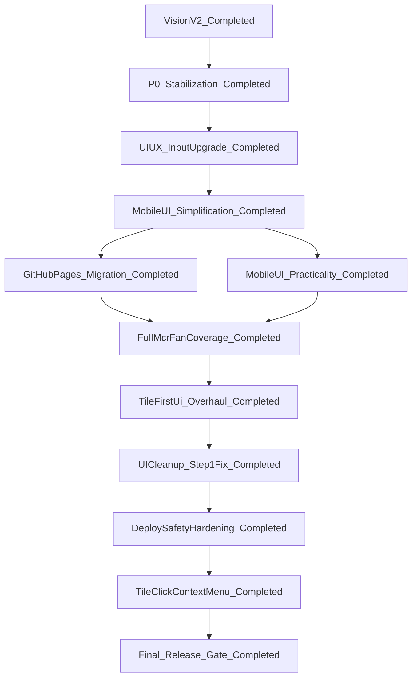

# HLM Master Plan

## Purpose

- Provide a single source of truth for HLM roadmap sequencing.
- Merge existing HLM plans into one coordinated execution model.
- Standardize engineering guardrails and release readiness gates.

## Completion Snapshot (Historical Baseline)

- Status: `completed` (historical baseline before reopening)
- MaintenanceMode: `active` (master plan closed; monitoring mode)
- CompletionDate: `2026-03-17`
- CompletedTracks:
  - `GitHub Pages migration`
  - `Security/privacy hardening`
  - `Mobile UI practicality`
  - `Full MCR fan coverage`
  - `UI cleanup and step 1 fix`
  - `Deploy safety hardening`
  - `Tile-click context menu`
  - `Context menu visual and layout`
  - `Final release gate`
- ValidationBaseline:
  - `npm test` pass
  - `npm run quality:complexity` pass
  - per-file `cloc` checks recorded in work evidence

## Reopened Track Snapshot (Historical)

- Status: `closed`
- ActiveTrack: `none`
- ChildExecutionPlan:
  - [hlm-tile-first-ui-overhaul_9db3c6ce.plan.md](hlm-tile-first-ui-overhaul_9db3c6ce.plan.md)
  - `hlm_ui_cleanup_and_step1_fix_07c1e0a1.plan.md` (historical reference;
  file not present in current workspace)
  - [hlm_deploy_hardening_b0d19373.plan.md](hlm_deploy_hardening_b0d19373.plan.md)
  - [hlm_tile_click_context_menu_998eab78.plan.md](hlm_tile_click_context_menu_998eab78.plan.md)
  - [hlm_context_menu_visual.plan.md](hlm_context_menu_visual.plan.md)
- ReopenDate: `2026-03-17`
- ReopenIntent:
  - `Implement tile-first hand input UI and workflow overhaul.`
  - `Apply deterministic dynamic context-menu legality at 14-tile boundary.`
  - `Ship locked picker-mode behavior (mobile two-layer default, desktop preference restore).`
- FollowUpIntent:
  - `UI cleanup and step 1 fix delivered.`
  - `Deploy safety hardening delivered.`
  - `Final release gate rerun completed.`

## Consolidated Plan Index

- Vision V2 track (historical snapshot, completed):
[hlm-vision-v2-plan_fbaccd9f.plan.md](hlm-vision-v2-plan_fbaccd9f.plan.md)
- P0 stabilization track (historical snapshot, completed):
[hlm-p0-stabilization_fadba898.plan.md](hlm-p0-stabilization_fadba898.plan.md)
- UI/UX input upgrade track (historical snapshot, completed):
[hlm-ui-ux-input-upgrade.plan.md](hlm-ui-ux-input-upgrade.plan.md)
- Mobile UI simplification track (historical snapshot, completed):
[hlm-mobile-ui-simplification.plan.md](hlm-mobile-ui-simplification.plan.md)
- GitHub Pages migration track (historical snapshot, completed):
[hlm_github_pages_migration_1186808d.plan.md](hlm_github_pages_migration_1186808d.plan.md)
- Mobile UI practicality upgrade track (historical snapshot, completed):
[hlm-mobile-ui-practicality-upgrade.plan.md](hlm-mobile-ui-practicality-upgrade.plan.md)
- Full MCR fan coverage track (historical snapshot, completed):
`full_mcr_fan_coverage_512ff761.plan.md` (historical external archive)
  - external historical reference (outside workspace scope)
  - optional local mirror path if later imported:
  `.cursor/plans/full_mcr_fan_coverage_512ff761.plan.md`
- Tile-first UI overhaul track (historical snapshot, completed):
[hlm-tile-first-ui-overhaul_9db3c6ce.plan.md](hlm-tile-first-ui-overhaul_9db3c6ce.plan.md)
- UI cleanup and step 1 fix track (completed):
`hlm_ui_cleanup_and_step1_fix_07c1e0a1.plan.md` (historical reference; file
not present in current workspace)
- Deploy safety hardening track (completed):
[hlm_deploy_hardening_b0d19373.plan.md](hlm_deploy_hardening_b0d19373.plan.md)
- Tile-click context menu track (completed):
[hlm_tile_click_context_menu_998eab78.plan.md](hlm_tile_click_context_menu_998eab78.plan.md)
- Context menu visual and layout (vertical menu, anchor positioning) (completed):
[hlm_context_menu_visual.plan.md](hlm_context_menu_visual.plan.md)
- Holistic UX and scoring (completed 2026-03-22; flower tiles, splash,
  context modal HIG, click reduction, result modal + fan lexicon + row info):
[hlm_holistic_ux_scoring.plan.md](hlm_holistic_ux_scoring.plan.md)
- Post-holistic UI polish (**pending**; presets removal, timing HIG, result
  layout, Guobiao lexicon, splash refinement):
[hlm_post_holistic_ui_polish.plan.md](hlm_post_holistic_ui_polish.plan.md)
- Five-principles exact scoring (**in_progress**; exact decomposition + five
  counting-principles constraint engine and full test hardening):
[hlm-five-principles-exact-engine_cf4e8446.plan.md](hlm-five-principles-exact-engine_cf4e8446.plan.md)
- Desktop web UI + help entry (**pending**; desktop two-pane layout, help
  action repurpose, explicit reset path):
[hlm_desktop_web_ui_ce34a47e.plan.md](hlm_desktop_web_ui_ce34a47e.plan.md)
- Historical supporting plans (traceability only):
  - [hlm_版本升级工具与中文术语统一_35161103.plan.md](hlm_版本升级工具与中文术语统一_35161103.plan.md)
  - `spike_full_automation_6a79ecff.plan.md` (historical reference; file
    not present in current workspace)
  - [hlm_layered_mahjong_encoding_rollout_(risk-hardened)_ee14faa7.plan.md](hlm_layered_mahjong_encoding_rollout_(risk-hardened)_ee14faa7.plan.md)

## Archived Superseded Plan Notes

- ArchivedPlan: `vlm_tile_encoding_plan_f7b7f64d.plan.md`
- PriorIntent:
  - Introduce layered tile encoding (`code<->id` + uncertainty mask).
  - Keep CSV and JSON external contracts stable.
  - Roll out via TDD with roundtrip and bounds tests.
- SupersededReason:
  - Replaced by a risk-hardened successor with stricter
  contract-freeze and migration-safety wording.
- SuccessorPlan:
  - `hlm_layered_mahjong_encoding_rollout_(risk-hardened)_ee14faa7.plan.md`
- ArchiveDate: `2026-03-16`
- ExecutionPolicy:
  - Do not recreate or execute the archived draft.
  - Execute successor plan only when this track is re-opened.

## Plan Location Policy

- Active HLM plans must live under:
`.cursor/plans`
- Any older/out-of-workspace plan is considered historical reference only.
- Execution always follows plans referenced in this master index.
- Completed child plans are treated as historical snapshots for traceability;
only plans marked `in_progress` or `pending` define executable next actions.

## Dependency and Execution Order

- Vision V2 and P0 are prerequisites.
- UI/UX plan executes in phased order defined in its own plan.
- Mobile simplification plan executes after UI/UX input-upgrade phases.
- GitHub Pages migration executes after mobile simplification exits.
- Mobile UI practicality upgrade executes after or in parallel with Pages
migration (master plan approval required for parallel).
- Security/privacy hardening (completed) ran after Pages artifact refactor.
- Full MCR fan coverage executes after both Pages migration and
practicality upgrade exit (or after Pages if practicality is deferred).
- Tile-first UI overhaul executes after Full MCR fan coverage exits.
- UI cleanup and step 1 fix executes after tile-first UI overhaul exits.
- Deploy safety hardening executes after UI cleanup track exits.
- Tile-click context menu track executes after deploy safety hardening
  (builds on completed tile-first UI overhaul).
- Final release gate reruns after tile-click context menu track exits.
- Holistic UX and scoring track (**new**): runs after the historical baseline
  above; does not invalidate prior `completed` milestones — see child plan
  [hlm_holistic_ux_scoring.plan.md](hlm_holistic_ux_scoring.plan.md).
- Post-holistic UI polish (**completed** 2026-03-22): see
  [hlm_post_holistic_ui_polish.plan.md](hlm_post_holistic_ui_polish.plan.md).

## Phase Status Dashboard

### Current delivery queue (post-baseline)

- TrackId: `track-desktop-web-ui-help`
- ChildPlan:
  [hlm_desktop_web_ui_ce34a47e.plan.md](hlm_desktop_web_ui_ce34a47e.plan.md)
- TrackTodoStatus: `in_progress` (implementation checkpoint 2026-03-27)
- Prior closed: `track-five-principles-exact-scoring` →
  [hlm-five-principles-exact-engine_cf4e8446.plan.md](hlm-five-principles-exact-engine_cf4e8446.plan.md)
  (2026-03-22)
- Earlier closed: `track-post-holistic-ui-polish` →
  [hlm_post_holistic_ui_polish.plan.md](hlm_post_holistic_ui_polish.plan.md)
  (2026-03-22)
- Historical closed: `track-holistic-ux-scoring` →
  [hlm_holistic_ux_scoring.plan.md](hlm_holistic_ux_scoring.plan.md)
  (2026-03-22)

### Current Status

- Owner: `project-owner`
- OverallStatus: `in_progress`
- ProgressPercent: `80` (implementation + automated gates complete)
- ActivePhase: `desktop-web-ui-help-manual-gates`
- Focus:
  - `Execute desktop/macOS UI uplift with two-pane layout and stronger`
    `information hierarchy while preserving current mobile flow.`
  - `Repurpose top-right action into explicit help entry and move reset`
    `to a clearly labeled, non-ambiguous control.`
  - `Apply full TDD + test/complexity/cloc gates before marking track done.`
- ExitGateCheck:
  - Unit: `pass`
  - Integration: `pass`
  - Regression: `pass`
  - FullSuite: `pass`
  - Complexity: `pass`
  - SLOCReview: `pass`
  - AccessibilityKeyboardFlow: `pass`
  - DesktopBrowserMatrix: `pending`
  - SecurityScan: `carry-forward pass`
  - PublicArtifactScope: `carry-forward pass`
  - PublishLayoutDecision: `carry-forward pass`
- RisksAndBlockers:
  - `No blocker; primary risk is desktop CSS regressions on tablet/mobile`
    `breakpoints without tight responsive scoping and test coverage.`
  - `Potential risk: help overlay focus handling and reset-action clarity`
    `can regress keyboard UX or cause accidental context loss.`
  - `Manual desktop browser matrix remains pending; automated browser-use`
    `validation was blocked by regional model availability.`
- NextActions:
  - `Keep child plan at hlm_desktop_web_ui_ce34a47e.plan.md as execution`
    `source of truth.`
  - `Complete manual keyboard accessibility checks for help/reset flow`
    `and focus return behavior.`
  - `Complete desktop browser matrix (Chrome + Safari) visual/flow`
    `verification for two-pane layout and modal interactions.`
  - `After manual gates pass, mark track-desktop-web-ui-help completed`
    `and sync child gates-and-closeout todo.`
- ValidationEvidence:
  - `Desktop fix iteration 2 (2026-03-27): context sheet moved inline into`
    `desktop side panel host, syncWizardModals skips context modal on desktop,`
    `and createModalActions enforces one-modal-at-a-time behavior.`
  - `Added/updated tests for desktop inline behavior and modal policy:`
    `appModalActions.test.js, appEventWiring.test.js,`
    `indexStylesheetLinks.test.js.`
  - `Re-ran full automated gates after iteration 2:`
    `test:unit/integration/regression/full + quality:complexity all pass.`
  - `Updated per-file cloc evidence captured for latest touched files.`
  - `Desktop/help implementation checkpoint (2026-03-27): moreBtn now opens`
    `help modal, explicit resetContextBtn added, desktop two-pane CSS`
    `rules added, and help focus-return/escape handling wired.`
  - `New/updated tests passed: appEventBindings.test.js,`
    `appEventWiring.test.js, indexStylesheetLinks.test.js.`
  - `Automated gates rerun pass: npm run test:unit,`
    `npm run test:integration, npm run test:regression, npm test,`
    `npm run quality:complexity.`
  - `Per-file cloc captured for all touched files via`
    `cloc --by-file --csv ...`
  - `Added assertions for help dialog ARIA markers and desktop media-query`
    `rules in indexStylesheetLinks.test.js.`
  - `Keyboard a11y behavior verified by unit tests in`
    `appEventWiring.test.js (focus return + Escape close handlers).`
  - `Attempted browser automation manual-gate run; blocked by model`
    `availability in current region.`
  - `Context menu visual: vertical layout, Material elevation, near-tile positioning.
    Tests passed; tileContextMenuController.test.js added.`
  - `Added dist artifact builder and workflow publish path switched to dist/.`
  - `Added security scan workflow: .github/workflows/security-scan.yml.`
  - `Sanitized deploy runtime test owner fixtures to example-owner placeholders.`
  - `Hardened result summary rendering to textContent-based DOM construction.`
  - `Validation commands passed: npm test, npm run quality:complexity.`
  - `Per-file cloc run completed for changed files with SLOC notes captured.`
  - `Cleanup pass removed dead modules and tests with full-gate rerun pass.`
  - `UI glue dedupe landed in public app wiring with no behavior drift.`
  - `MCR coverage and prior final release gate were completed historically.`
  - `Current rerun evidence: test:unit/integration/regression/full, complexity, cloc, and lints all pass.`
  - `Deploy hardening delivered: doctor mode, dry-run mode, protocol mismatch warning, auth-aware preflight hints, and README/runbook updates.`
  - `Deploy safety matrix workflow added for macOS/Windows deploy-focused checks.`
  - `Tile-click context menu track delivered: pickTileWithAction, dynamic
    menu, pattern-actions removed; all phases 1-5 complete.`
  - `Holistic UX/scoring (2026-03-22): flowerCount 0–8 + kongSummary caps,
    HUA_PAI dynamic fan, splash screen, context modal groups/steppers/timing
    incl. 抢杠和, auto wizard advance at 14 tiles (opt-out localStorage),
    result sticky header + fanLexicon + row ℹ️. Gates: npm test,
    quality:complexity, build:dist. Version 4.6.0.`
  - `Post-holistic UI polish (2026-03-22): removed context presets and info
    modal; HIG timing checkmarks; sticky context apply; FAN_LEXICON_ENTRIES
    (81 ids); splash visual pass; result modal without dedicated win-pattern
    row (CHANGELOG [4.7.0]). Gates: npm test, quality:complexity, cloc,
    build:dist. Version 4.7.0.`
  - `Five-principles exact scoring iteration 1 (2026-03-22): standard
    decomposition enumeration, best-score selection in scoreHand, one-time
    attach guard for HUA_LONG interactions, and new unit coverage. Gates:
    quality:complexity + unit/regression/integration/full all pass.`
  - `Five-principles exact scoring iteration 2 (2026-03-22): added regression
    golden case for 花龙套算一次 behavior (hua_long_attach_once_hand). Re-ran
    full gates: regression/unit/integration/complexity/full all pass.`
  - `Five-principles exact scoring iteration 3 (2026-03-22): exclusion logic
    now removes all repeated target-fan instances; unit test added for repeated
    target exclusion consistency. Re-ran full gates:
    unit/regression/integration/complexity/full all pass.`
  - `Five-principles exact scoring iteration 4 (2026-03-22): introduced
    principleConstraints module and same-fan-once constraint before conflict
    resolution; unit test added for duplicate same-fan instances. Re-ran full
    gates: unit/regression/integration/complexity/full all pass.`
  - `Five-principles exact scoring iteration 5 (2026-03-22): moved
    attach-once rule into principleConstraints and added dedicated principle
    unit tests. Re-ran full gates:
    unit/regression/integration/complexity/full all pass.`
  - `Five-principles exact scoring iteration 6 (2026-03-22): moved
    conflict-group and exclusion-map logic into principleConstraints; resolver
    now orchestrates principle steps only. Added principle-layer unit tests for
    these rules. Re-ran full gates:
    unit/regression/integration/complexity/full all pass.`
- LastUpdated: `2026-03-27` (desktop-web-ui-help implementation checkpoint:
  automated gates passed; iteration 2 desktop overlap/space fix applied;
  awaiting user visual confirmation + browser-matrix closeout)
- TrackCloseout:
  - `track-five-principles-exact-scoring completed on 2026-03-22.`

## Security and Privacy Hardening Track

### Objectives

- Reduce public exposure surface when repository visibility is public.
- Prevent account-identifying details from remaining in docs/tests defaults.
- Add CI checks to catch secret/token/privacy leaks before merge or release.
- Harden UI rendering patterns against future injection regressions.

### Scope

- Runtime publish boundary:
  - `.github/workflows/deploy-pages.yml`
- Public docs and runbooks:
  - `README.md`
  - `RELEASE_AND_PUBLISH.md`
  - `DEPLOY_TO_GITHUB_MERMAID.md`
- Test metadata placeholders:
  - `tests/unit/deployRuntime.test.js`
- Rendering safety:
  - `public/resultModalView.js`
  - `public/appStateActions.js`
- Release notes:
  - `CHANGELOG.md`

### Security Phase Tasks

1. Publish runtime-only artifact for GitHub Pages.
  - Stop publishing repository root for Pages artifact upload.
  - Ensure deploy output includes only runtime assets.
2. Sanitize public identifiers.
  - Replace personal/org markers with neutral placeholders
  such as `example-owner/example-repo`.
3. Enforce CI leak prevention.
  - Add security scan workflow and fail builds on detection.
4. Harden rendering implementation.
  - Replace templated `innerHTML` blocks with DOM creation
  and `textContent`.
5. Run full validation gates.
  - `npm run test:unit`
  - `npm run test:regression`
  - `npm run test:integration`
  - `npm test`
  - `npm run quality:complexity`
  - `cloc <file>` for each touched program file.

### Security Slice 1 (Historical Completed Slice): Pages Artifact Boundary

#### Goal

- Ensure GitHub Pages publishes runtime assets only, not repository root.

#### Target files

- `.github/workflows/deploy-pages.yml`
- Optional build/export support files if needed by chosen publish layout.

#### Entry checks (historical baseline)

- Existing deploy workflow is present and currently uploads `path: .`.
- Runtime dependency paths from `public/` to required modules are known.

#### Execution steps

1. Choose publish layout:
  - Option A: publish `public/` with explicit handling for required modules.
  - Option B: publish deterministic `dist/` runtime artifact.
2. Add or adapt publish output directory for the selected option.
3. Update Pages workflow upload path from repository root to that directory.
4. Confirm artifact excludes `tests/`, `scripts/`, and plan/docs-only files.
5. Keep app routing behavior intact for project-site URL structure.

#### Recommendation

- Selected option: Option B (`dist/` artifact).
- Rationale: reduce accidental source/test/docs exposure and keep
publish scope explicit.
- Use Option A (`public/`) only if runtime module dependencies are fully
self-contained under `public/` after validation.

#### Decision Matrix (Layout Selection)

- Current status: `locked` (Option B selected).
- Decision owner: `project-owner`.
- Decision gate: `PublishLayoutDecision` is marked `pass`.
- Criteria 1 - Exposure minimization:
  - Option A (`public/`): medium confidence unless imports are fully local.
  - Option B (`dist/`): high confidence with explicit runtime-only artifact.
- Criteria 2 - Build/ops simplicity:
  - Option A (`public/`): simpler pipeline if dependencies already local.
  - Option B (`dist/`): adds build/export step but clearer publish boundary.
- Criteria 3 - Regression risk:
  - Option A (`public/`): risk if `../src/*` imports remain unresolved.
  - Option B (`dist/`): lower runtime-path risk after deterministic export.
- Criteria 4 - Auditability:
  - Option A (`public/`): harder to prove excluded files over time.
  - Option B (`dist/`): easier artifact inspection and reproducible audits.
- Pass rule for locking layout:
  - Chosen option satisfies all entry checks and produces a runtime-only
  artifact with green test and complexity gates.
- Tie-breaker outcome:
  - Applied. Option B (`dist/`) is selected for stricter
  public-exposure control.

#### Exit checks

- Workflow no longer publishes repository root.
- Published artifact contains only files required to run the app.
- Publish layout decision is recorded as pass with rationale.
- Validation gates pass for touched scope:
  - `npm run test:unit`
  - `npm run test:integration`
  - `npm run test:regression`
  - `npm test`
  - `npm run quality:complexity`
  - `cloc <file>` for each touched program file.

### Security Exit Criteria

- Pages artifact verified as runtime-only.
- No account-identifying strings in public docs/tests,
except approved placeholders.
- Security scan workflow is present and passing.
- Rendering hardening changes keep behavior stable.
- All quality and test gates pass.

### Update Rules

- Update this dashboard only at phase boundaries.
- Keep statuses explicit: `now`, `next`, `blocked`, `done`.
- If blocked, include owner and unblocking condition in work notes.
- Do not mark `done` unless all required gates are recorded as pass.

## Security and Reliability Gates

- UI rendering safety:
  - No user-controlled HTML injection paths in render updates.
  - Use safe DOM text assignment for dynamic labels and messages.
- Asset integrity:
  - UI image assets must be local, versioned, and deterministic.
  - Missing assets must fallback to text without breaking flow.
- Contract integrity:
  - Canonical tile-code scoring input contract remains unchanged.
  - Any contract drift requires explicit approval before merge.
- Release blocking policy:
  - Any unresolved `blocked` item or failing gate blocks release.

## Plan Readiness Gate

- Scope readiness:
  - in-scope and out-of-scope modules are explicit.
- Execution readiness:
  - phases have explicit entry and exit criteria.
  - gate commands are concrete and available in project scripts.
- Security readiness:
  - security baseline and verification cases are documented.
- Rollback readiness:
  - phase-level rollback path is documented before implementation starts.
- Release readiness:
  - no unresolved blocker remains in dashboard at release gate.

## Review-Fix Loop Status (Execution Readiness)

- Purpose:
  - Iterate plan-level review and fixes on security, quality,
  implementation clarity, and dependency correctness before execution.
- Current loop result:
  - Historical MCR hardening remains baseline and is retained unchanged.
  - Master dependency model completed through UI cleanup, deploy hardening,
  and final release gate rerun.
  - Child [hlm_holistic_ux_scoring.plan.md](hlm_holistic_ux_scoring.plan.md)
    **implemented and closed** 2026-03-22 (see dashboard ValidationEvidence).
- Security readiness:
  - pass-with-tracking; enforce deterministic scoring and safe rendering
  boundaries in child-plan gates.
- Quality readiness:
  - pass; quality commands and SLOC/complexity controls are explicitly
  required in child-plan gates.
- Implementation readiness:
  - pass for holistic child plan (closed); **pass** for
    [hlm_post_holistic_ui_polish.plan.md](hlm_post_holistic_ui_polish.plan.md)
    after 2026-03-22 review–fix: file anchors, locked UI decisions, mermaid
    slice order, gates todo, infoModal removal scope, `uiFlowState` note.
- Dependency readiness:
  - pass; post-polish track depends only on holistic baseline in repo
  (v4.6.0).
- Remaining tracked prerequisite:
  - None; `track-post-holistic-ui-polish` closed 2026-03-22 (v4.7.0).

## Implementation Go/No-Go (for future reopened tracks)

- Go only when all checks are true:
  - active track is identified in dashboard `Current Status`,
  - phase exit criteria are defined in the active child plan,
  - gate commands are available and executable,
  - no untriaged blocker remains in `RisksAndBlockers`.
- No-Go when any check fails; update plans first, then re-review.

## Engineering Guardrails (Default Policy)

### Rule: Function Size and Complexity Control (Industry-Aligned)

#### Objective

- Keep code readable, testable, and maintainable by combining SLOC
checks with complexity and responsibility checks.

#### Standards

- Program or file SLOC target:
  - Preferred: keep each program file under 100 SLOC where practical.
  - Measure with `cloc <path-to-file>`.
  - Exception allowed only when splitting would reduce clarity or break
  cohesion.
- Function size:
  - Soft limit: 40 lines per function.
  - Hard warning threshold: 60 lines per function.
  - If exceeded, refactor into smaller, well-named helper functions.
- Single responsibility:
  - Each function should perform one logical operation.
  - Mixed responsibilities (validation + IO + transformation +
  persistence in one function) must be split.
- Complexity guardrails:
  - Enforce cyclomatic and cognitive complexity thresholds via linter or
  static analysis.
  - Any function flagged for high complexity must be refactored even if
  line count is below threshold.
- Line width (readability):
  - Use a 78-character column limit unless language or project style
  guide requires otherwise.
- Testing requirement for refactors:
  - Any refactor for size or complexity must include and maintain
  passing unit, function, and integration tests.
- Comment and documentation:
  - Follow strict `<= 78` columns on all added or edited lines,
  including comments.
  - Add file or module header comments on substantial files:
    - Purpose: one-line goal.
    - Description: 2-5 bullets on responsibilities, inputs/outputs, and
    side effects.
  - Add JSDoc on exported/public and non-trivial logic:
    - Include `@param`, `@returns`, and `@throws` when applicable.
    - Explain intent and constraints, not obvious mechanics.
  - In HTML/CSS, add section or rationale comments for non-obvious
  structure, fallbacks, or cross-browser behavior.
  - Keep comments concise, high-value, and wrapped to 78 columns.
  - Do not change runtime behavior just to add comments unless refactor
  is required by guardrails.

#### Decision Principle

- Prefer clarity and maintainability over strict numeric adherence.
- Numeric thresholds are guardrails, not goals by themselves.

## Enforcement Workflow

- Step 1: run `cloc <file>` to verify SLOC target.
- Step 2: run project lint or static analysis for size and complexity
violations:
  - `npm run quality:complexity`
- Step 3: refactor oversized or high-complexity functions into
cooperating modules.
- Step 4: run tests for changed scope first, then full suite and gates:
  - `npm run test:unit`
  - `npm run test:integration`
  - `npm run test:regression`
  - `npm test`

## Exception Protocol

- If a guardrail is exceeded, document in PR or work notes:
  - which rule is exceeded,
  - why splitting/refactor is not net-beneficial now,
  - mitigation and follow-up cleanup trigger.
- Exceptions are temporary and should be revisited in next refactor pass.

## Definition of Done

- Planned phase work is complete and acceptance criteria are met.
- No regressions against prior HLM tracks.
- Full test gates pass.
- Complexity checks pass.
- Touched files reviewed against SLOC and function-size guardrails.
- Security and reliability gates pass with no unresolved release blockers.

