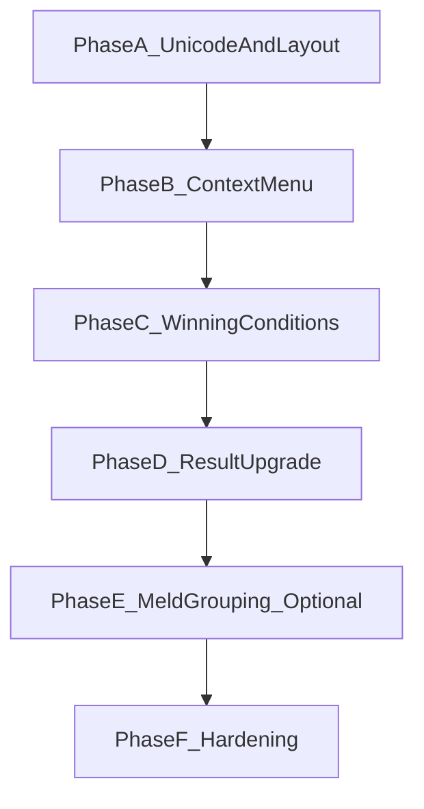

# HLM Mobile UI Practicality Upgrade Plan

## Parent Plan Link

- Master roadmap:
[hlm-master-plan.plan.md](hlm-master-plan.plan.md)

## Quick Start (Execution Order)

1. Phase A: Add `getTileUnicode`, 4x4 layout, wire into `makeTileFace`.
2. Phase B: Slot tap -> context menu, cascade to picker.
3. Phase C: Presets + card-style winning conditions.
4. Phase D: Result modal with breakdown and explanation inline.
5. Phase E: (Optional) Meld decomposition and row display.
6. Phase F: Remove "和了番数", run full gates.

## Goal

- Make the HLM app genuinely practical on mobile by:
  - Using the 14 hand slots as the primary interface with tap-to-context-menu
  - Enlarging hand slots (4x4 grid) and showing meld groupings when scoring
  - Displaying Mahjong tiles via Unicode instead of text
  - Providing natural, hierarchical winning-condition selection
  - Showing score breakdown and explanation inline (not hidden behind Info)
  - Removing the "和了番数" title from the page

## Current Status Dashboard

- Owner: `project-owner`
- OverallStatus: `completed`
- PlanClass: `traceability-only`
- ProgressPercent: `100`
- ActivePhase: `Phase_F_Hardening_Completed`
- Focus:
  - `All planned phases are completed and validated.`
- RisksAndBlockers:
  - `None currently tracked.`
- NextActions:
  - `Keep this plan as a historical execution snapshot.`
  - `Open a new child plan before any additional UI-scope work.`
- ExitGateCheck:
  - Unit: `pass`
  - Integration: `pass`
  - Regression: `pass`
  - FullSuite: `pass`
  - Complexity: `pass`
  - SLOCReview: `pass-with-notes`
- LastUpdated: `2026-03-17`

## Scope Lock

- In scope:
  - Home screen layout and interaction model
  - Tile display (Unicode with fallback)
  - Context menu / modal for slot-based selection
  - Winning conditions UI restructuring
  - Result modal content and layout
- Out of scope:
  - Scoring logic semantics
  - Domain contract changes outside UI orchestration

## Target Files

- [public/index.html](02product/01_coding/project/hlm/public/index.html)
- [public/tileAssets.js](02product/01_coding/project/hlm/public/tileAssets.js)
- [public/uiRenderers.js](02product/01_coding/project/hlm/public/uiRenderers.js)
- [public/styles-components.css](02product/01_coding/project/hlm/public/styles-components.css)
- [public/styles-modals.css](02product/01_coding/project/hlm/public/styles-modals.css)
- [public/appEventWiring.js](02product/01_coding/project/hlm/public/appEventWiring.js)
- [public/appStateActions.js](02product/01_coding/project/hlm/public/appStateActions.js)
- [public/resultModalView.js](02product/01_coding/project/hlm/public/resultModalView.js)
- [src/app/resultViewModel.js](02product/01_coding/project/hlm/src/app/resultViewModel.js)
- [src/rules/winValidator.js](02product/01_coding/project/hlm/src/rules/winValidator.js)
(optional: meld decomposition)
- [public/uiConfig.js](02product/01_coding/project/hlm/public/uiConfig.js)
(context presets for Phase C)

## Test Files (to extend or add)

- [tests/unit/tileAssets.test.js](02product/01_coding/project/hlm/tests/unit/tileAssets.test.js)
(Phase A: getTileUnicode)
- [tests/integration/mobilePickerFlow.test.js](02product/01_coding/project/hlm/tests/integration/mobilePickerFlow.test.js)
(Phase B: slot-tap context menu)
- [tests/unit/resultViewModel.test.js](02product/01_coding/project/hlm/tests/unit/resultViewModel.test.js)
(Phase D: result structure)

## Delivery Phases

### Phase A: Unicode Tiles and 4x4 Layout

- Add `getTileUnicode(tileCode)` in tileAssets.js.
- Map tile codes to U+1F000–U+1F021 (winds, dragons, wan, tiao, tong).
- Wire Unicode into `makeTileFace` with text/SVG fallback.
- Change tile preview from 7-column to 4x4 grid.
- Ensure touch targets >= 44px.

#### Exit Criteria

- Tiles render as Unicode where font supports it.
- Layout is 4x4 grid with 14 slots (2 empty or placeholder).
- Fallback to text/SVG when Unicode unavailable.
- `npm run test:unit` and `npm run test:integration` pass.

### Phase B: Slot Tap Context Menu

- Replace "继续选牌" flow: tap any slot opens context menu.
- Menu options: 单张, 对子, 刻子, 顺子, suit tabs (万/条/筒/字牌).
- Cascade: e.g. 顺子 -> 前/中/后位; suit -> tile grid.
- Position menu near tap (fixed/absolute).
- Keep picker modal for tile grid when pattern/suit chosen.

#### Exit Criteria

- User can complete 14 tiles via slot taps and menu only.
- No regression in existing picker behavior when opened from menu.
- Integration tests for slot-tap flow pass.

### Phase C: Winning Conditions Restructure

- Presets: 自摸+门前清, 点和+门前清, 点和+副露 (card-style buttons).
- Custom: expandable section with 和牌方式, 副露, 杠, 时机.
- Use radio/segmented control instead of raw selects.
- Summary on home: "自摸 · 门前清 · 无杠".

#### Exit Criteria

- Conditions selectable in fewer taps.
- Clear hierarchy: presets first, custom second.
- Summary reflects current selection.

### Phase D: Result Modal Upgrade

- Total fan prominent (large font).
- Per-fan list with individual counts (name + fan).
- Explanation text inline.
- Optional "详细解释" for excluded fans and audit.

#### Exit Criteria

- User sees conclusion, breakdown, and explanation in one view.
- No Info button required for basic understanding.

### Phase E: Meld Grouping (Optional)

- Add `decomposeMelds(tiles)` or extend winValidator.
- Return meld structure: [{ type, tiles }].
- Render result hand as rows: 顺子 3, 刻子 3, 对子 2, 杠 4.

#### Exit Criteria

- Calculated hand shows meld structure visually.
- Defer if winValidator extension is complex.

### Phase F: Cleanup and Hardening

- Remove "和了番数" from header.
- Run full gates: `npm test`, `npm run quality:complexity`, `cloc`.
- Document SLOC exceptions if any.

#### Exit Criteria

- All tests pass.
- Guardrails satisfied per master plan.
- No "和了番数" in DOM.

## Dependency and Execution Order

## TDD and Gates

- Per phase: write failing tests, implement, refactor, run gates.
- Gate commands:
  - `npm run test:unit`
  - `npm run test:integration`
  - `npm run test:regression`
  - `npm test`
  - `npm run quality:complexity`
  - `cloc <file>` for touched program files
- Follow master plan engineering guardrails (SLOC, function size, complexity).

## Unicode Mapping Reference

| tileCode    | Unicode         | Codepoint |
| ----------- | --------------- | --------- |
| E, S, Wn, N | U+1F000–U+1F003 | Winds     |
| R, G, Wh    | U+1F004–U+1F006 | Dragons   |
| 1W–9W       | U+1F007–U+1F00F | 万         |
| 1T–9T       | U+1F010–U+1F018 | 条         |
| 1B–9B       | U+1F019–U+1F021 | 筒         |

## Rollback and Risk Control

- Land each phase in isolated change sets.
- If context menu harms usability, rollback Phase B only.
- Never couple UI changes with scoring semantics updates.

## Security and Safety Baseline

- Render tile labels and dynamic values with `textContent`, not unsafe HTML.
- Unicode tile display is safe (no user-controlled HTML).
- Preserve accessibility: retain aria-labels for slots and tiles.

## Definition of Ready

- Scope and target files are explicit.
- Phase exit criteria are measurable.
- Gate commands exist in package.json and are executable.
- Master plan has linked this track in Consolidated Plan Index.

## Definition of Done (per phase)

- Phase exit criteria met.
- Tests written/updated and passing.
- No regression in existing flows.
- `npm test` and `npm run quality:complexity` pass.
- SLOC and function-size guardrails respected.

## Review-Revise Iteration Loop

- Before each phase: confirm entry criteria (prior phase done, gates pass).
- After each phase: run full gates, update plan status, document evidence.
- If any gate fails: fix before marking phase complete.

