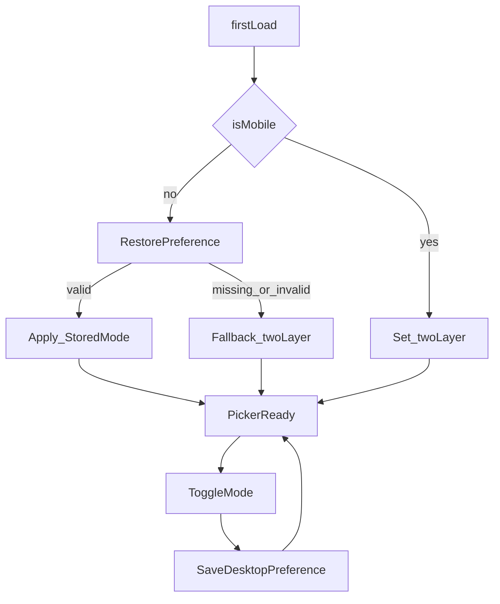

# HLM Tile-First UI Overhaul Plan

## Master-Plan Linkage

- Parent plan:
  [hlm-master-plan.plan.md](hlm-master-plan.plan.md)
- Add child-track entry in master index:
  `track-tile-first-ui-overhaul` (`pending` -> `in_progress` on start).
- Keep this child plan as executable source for this scope.

## Scope and Outcomes

- Rework hand-input flow to tile-first interaction.
- Split screen into two regions:
  - Top: high-readability 14-slot hand area (always visible).
  - Middle: tile selection area supporting one-layer and two-layer browsing.
- Add dynamic context menu so action options follow current hand state.

## Picker Mode Decision (Locked)

- One-layer (`Flat`): show all 34 playable tiles in one gallery.
- Two-layer (`Type -> Tiles`):
  - Layer 1: `万 / 条 / 筒 / 字`
  - Layer 2: all tiles under selected type.
- Default policy:
  - Mobile: default to two-layer.
  - Desktop: remember and restore last-used mode.
- Persist only picker mode preference (not hand content).

## Target Code Areas

- UI structure and menu container:
  [public/index.html](02product/01_coding/project/hlm/public/index.html)
- Event wiring for slot/context interactions:
  [public/appEventWiring.js](02product/01_coding/project/hlm/public/appEventWiring.js)
- UI state actions and sync behavior:
  [public/appStateActions.js](02product/01_coding/project/hlm/public/appStateActions.js)
- Menu/action rules and legality checks:
  [src/app/tilePatternActions.js](02product/01_coding/project/hlm/src/app/tilePatternActions.js)
- Rendering utilities for slots/grid/actions:
  [public/uiRenderers.js](02product/01_coding/project/hlm/public/uiRenderers.js)
- Tile picker constants and grouping:
  [public/uiConfig.js](02product/01_coding/project/hlm/public/uiConfig.js)
- Visual emphasis and layout:
  [public/styles-components.css](02product/01_coding/project/hlm/public/styles-components.css),
  [public/styles-responsive.css](02product/01_coding/project/hlm/public/styles-responsive.css)

## Execution Phases

1. Rule-engine first (TDD)
  - Add pure function(s) for context-menu availability:
    remaining slots, tile type/rank, copy cap, chow constraints.
  - Keep `resolvePatternAction` as final legality gate.
2. Dynamic context-menu rendering
  - Replace static menu behavior with state-driven rendering.
  - Show only legal actions (or disable with reason during rollout).
  - Preserve undo actions and slot-target semantics.
3. One-layer/two-layer picker UX
  - Add mode toggle (`flat` vs `two-layer`).
  - Enforce defaults:
    - Mobile first load => two-layer.
    - Desktop => restore persisted mode if valid.
  - Mode switch must not reset hand or edit cursor.
4. Accessibility/readability polish
  - Strengthen top 14-slot readability and selection visibility.
  - Keep touch targets mobile-safe and desktop density adaptive.
5. Validation and quality gates
  - `npm run test:unit`
  - `npm run test:integration`
  - `npm run test:regression`
  - `npm test`
  - `npm run quality:complexity`
  - `cloc` for each touched program file.

## Phase Entry and Exit Gates

- Phase 1 entry:
  - Existing picker and pattern tests pass in baseline.
  - Rule scope is frozen to action availability only.
- Phase 1 exit:
  - New failing tests added first, then pass after rule implementation.
  - No behavior drift in existing `resolvePatternAction` tests.

- Phase 2 entry:
  - Phase 1 rules merged and deterministic reasons confirmed.
- Phase 2 exit:
  - Context menu renders state-driven legal actions only.
  - Slot-target semantics and undo pathways remain intact.

- Phase 3 entry:
  - Dynamic menu flow stable in unit tests.
- Phase 3 exit:
  - Mobile default is `twoLayer`.
  - Desktop preference restore is verified.
  - Mode toggle does not mutate slots/cursor/history.

- Phase 4 entry:
  - Interaction behavior is stable in integration flow.
- Phase 4 exit:
  - Top 14-slot readability and selection emphasis are visibly improved.
  - No regression in core hand-input task completion.

- Phase 5 entry:
  - All implementation changes are frozen.
- Phase 5 exit:
  - Required gates all pass in order from project folder:
    - `cd 02product/01_coding/project/hlm`
    - `npm run test:unit`
    - `npm run test:integration`
    - `npm run test:regression`
    - `npm test`
    - `npm run quality:complexity`
    - `cloc <touched-file>`

## Risk and Rollback Plan

- Risk: dynamic menu over-filters valid actions.
  - Mitigation: deterministic reason priority plus unit matrix for edge ranks.
  - Rollback: revert dynamic-menu rendering/wiring changes in
    `public/uiRenderers.js` and `public/appEventWiring.js`,
    while keeping domain-rule tests.
- Risk: mode persistence causes incorrect default on mobile.
  - Mitigation: mobile-first-load path ignores persisted desktop preference.
  - Rollback: force `twoLayer` globally until persistence bug is resolved.
- Risk: UI-only changes accidentally alter scoring behavior.
  - Mitigation: keep scoring contract untouched; require regression suite pass.
  - Rollback: revert UI wiring layer only, keep domain/rules unchanged.

## Non-Goals (Scope Lock)

- Do not change scoring rule semantics or fan calculation algorithms.
- Do not modify external request/response contract for scoring pipeline.
- Do not introduce net-new modal flows unrelated to tile input.
- Do not alter release/deploy workflow scope in this track.

## Dynamic Menu Rule Matrix (Acceptance Baseline)

- `remaining = 14 - selectedCount`
- `single`: legal if `remaining >= 1` and copy limit not exceeded.
- `pair`: legal if `remaining >= 2` and copy limit not exceeded.
- `pung`: legal if `remaining >= 3` and copy limit not exceeded.
- `chow_*`: legal if `remaining >= 3`, base tile suited, rank in range.
- At `selectedCount = 12`: only `single` / `pair` legal.
- At `selectedCount = 13`: only `single` legal.
- At `selectedCount = 14`: no add-actions legal.

## Dynamic Menu Resolution Policy (Deterministic)

- Evaluate actions in two stages:
  - Stage A: structural eligibility (slots, tile type/rank).
  - Stage B: resource eligibility (copy-limit and final resolver legality).
- Reason priority (first failure wins):
  1. `hand_full_or_insufficient_slots`
  2. `chow_requires_suited_tile`
  3. `chow_rank_out_of_range`
  4. `tile_copy_limit`
  5. `action_not_supported`
- Visibility policy:
  - `undo_last` / `undo_slot` remain visible; disable if no target.
  - Illegal add-actions are hidden.

## Picker Mode State Machine

- States: `twoLayer`, `flat`
- Events: `firstLoad`, `restorePreference`, `toggleMode`, `reload`
- Rules:
  - Mobile first load -> `twoLayer`
  - Desktop reload -> restore valid stored mode
  - Invalid stored value -> fallback `twoLayer`
  - Mode change never mutates slots/cursor/history

## Test Strategy (TDD)

- Unit tests under
  [tests/unit](02product/01_coding/project/hlm/tests/unit):
  - [tilePatternActions.test.js](02product/01_coding/project/hlm/tests/unit/tilePatternActions.test.js)
  - [appEventWiring.test.js](02product/01_coding/project/hlm/tests/unit/appEventWiring.test.js)
  - [appStateActions.test.js](02product/01_coding/project/hlm/tests/unit/appStateActions.test.js)
- Integration flow extension:
  [mobilePickerFlow.test.js](02product/01_coding/project/hlm/tests/integration/mobilePickerFlow.test.js)
- Required assertions:
  - 12 -> 13 -> 14 tile transition narrows menu actions.
  - Illegal actions never mutate picker state.
  - Mobile defaults to two-layer on first load.
  - Desktop restores last-used mode.

## Execution Evidence (Completed)

- Dynamic legality and wiring:
  - `src/app/tilePatternActions.js`
  - `public/contextWiring.js`
  - `public/contextMenuView.js`
- Picker mode lock and persistence:
  - `public/pickerModeState.js`
  - `public/pickerModeView.js`
  - `public/appStateActions.js`
- UX readability and workflow structure:
  - `public/index.html`
  - `public/styles-components.css`
  - `public/appEventWiring.js`
  - `public/appEventBindings.js`
- Validation gates rerun (pass):
  - `npm run test:unit`
  - `npm run test:integration`
  - `npm run test:regression`
  - `npm test`
  - `npm run quality:complexity`
  - `cloc --by-file --include-lang=JavaScript <touched-files>`

## Definition of Done

- Tile-first UI supports both one-layer and two-layer selection modes.
- Picker mode policy enforced:
  - mobile default two-layer,
  - desktop restore last-used mode.
- Dynamic context menu reflects legal actions for current state.
- 12-tile scenario enforces `single`/`pair` only.
- All phase entry/exit gates are satisfied without open blocker.
- Unit/integration/regression/full tests and complexity pass.
- `cloc` checks completed for all touched program files.
- Child plan indexed in master with explicit track status.
