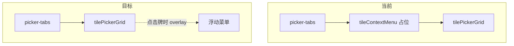

# HLM 上下文菜单改为真正弹出形式

## 问题

用户反馈：牌类型（万/条/筒/字牌）和具体麻将牌之间的区域仍然存在，未变为期望的**弹出菜单**形式。

**根因**：`#tileContextMenu` 位于 [public/index.html](public/index.html) 文档流中（第 57–76 行），夹在 `picker-tabs` 与 `#tilePickerGrid` 之间。即使有 `hidden` 属性，元素仍参与布局或显示时以固定块形式出现。

## 目标

- **关闭时**：该区域完全不占空间，牌类型下方直接是牌库
- **打开时**：菜单以浮动 overlay 形式出现，不挤占布局

---

## 实现方案

### 1. CSS 修改（[public/styles-components.css](public/styles-components.css)）

**1.1 强制 hidden 时不占空间**

```css
#tileContextMenu[hidden],
.tile-context-menu[hidden] {
  display: none !important;
}
```

**1.2 将菜单改为固定定位 overlay**

```css
.tile-context-menu {
  position: fixed;
  bottom: 100px;
  left: 50%;
  transform: translateX(-50%);
  z-index: 110;
  max-width: min(320px, calc(100vw - 28px));
  box-shadow: 0 4px 20px rgba(0, 0, 0, 0.15);
  /* 保留现有 grid/padding/border 等 */
}
```

- `z-index: 110`：高于 modal 的 100，确保浮于 picker 之上
- `bottom: 100px`：在视口底部上方，避免遮挡 sheet-footer
- `max-width`：防止桌面端过宽、小屏溢出

### 2. 关闭 picker 时同步关闭菜单（风险修复）

**风险**：当 picker 被程序关闭（如 wizard 下一步、计算后关闭）时，菜单的 `escapeHandler` 和 `clickOutsideHandler` 仍挂在 `document` 上，造成监听器泄漏。

**修复**：

- [tileContextMenuController.js](public/tileContextMenuController.js)：返回 `{ openTileContextMenu, closeTileContextMenu }`，不再只返回单一函数
- [handStateActions.js](public/handStateActions.js)：解构并暴露 `closeTileContextMenu`
- [appModalActions.js](public/appModalActions.js)：`createModalActions(store, modalRefs, { onBeforeClosePicker })`，在 `closeModalByKey("picker")` 内先调用 `onBeforeClosePicker?.()`
- [app.js](public/app.js)：创建 modalActions 时传入 `onBeforeClosePicker: () => stateActions.closeTileContextMenu?.()`（stateActions 先于 modalActions 创建）

### 3. 涉及文件


| 文件                                                                         | 修改                                                                                                                   |
| -------------------------------------------------------------------------- | -------------------------------------------------------------------------------------------------------------------- |
| [public/styles-components.css](public/styles-components.css)               | 添加 `[hidden]` 规则；`.tile-context-menu` 增加 fixed 定位、z-index、max-width、box-shadow；可移除 `margin-bottom`（fixed 元素不再参与流式布局） |
| [public/tileContextMenuController.js](public/tileContextMenuController.js) | 改为返回 `{ openTileContextMenu, closeTileContextMenu }`，内部 `closeMenu` 作为 `closeTileContextMenu` 暴露                     |
| [public/handStateActions.js](public/handStateActions.js)                   | 解构 `{ openTileContextMenu, closeTileContextMenu }`，在返回对象中同时暴露两者                                                      |
| [public/appModalActions.js](public/appModalActions.js)                     | `createModalActions` 增加可选第三参数 `{ onBeforeClosePicker }`，在 `closeModalByKey("picker")` 内先执行                           |
| [public/app.js](public/app.js)                                             | 创建 modalActions 时传入 `onBeforeClosePicker: () => stateActions.closeTileContextMenu?.()`                               |


---

## 错误与风险检查

### 已检查项

1. **hidden 不生效**：部分环境可能覆盖 UA 样式，显式 `[hidden] { display: none !important }` 可规避
2. **z-index 冲突**：modal 为 100，菜单 110，无其他 100–110 元素
3. **click-outside 行为**：点击「完成」时目标不在 menu 内，会触发 closeMenu，逻辑正确
4. **用户点击关闭**：点击 data-close 会先关闭 modal，同时 document click 会触发 clickOutside，closeMenu 会执行

### 风险与缓解


| 风险                 | 缓解                                                   |
| ------------------ | ---------------------------------------------------- |
| 程序关闭 picker 时监听器泄漏 | 在 closeModalByKey("picker") 时调用 closeTileContextMenu |
| 小屏菜单溢出             | max-width: min(320px, calc(100vw - 28px))            |
| 菜单被 sheet 裁剪       | position: fixed 相对于视口，不受 sheet overflow 影响           |
| 横屏/桌面 bottom 定位不适  | 可后续增加媒体查询微调，当前 100px 为保守值                            |


### 不修改项

- DOM 结构：保持 `#tileContextMenu` 在 picker 内，仅靠 CSS 脱离流
- 点击/ Escape 逻辑：保持不变
- `applyContextMenuAvailability`：不变

### 测试影响

- [appStateActions.test.js](tests/unit/appStateActions.test.js)：mock `byId` 未提供 `tileContextMenu` 时，`closeTileContextMenu` 为安全 no-op，无需修改
- [appModalActions](public/appModalActions.js)：无现有单元测试；可选补充 `onBeforeClosePicker` 调用覆盖
- 可选：在 [mobilePickerFlow.test.js](tests/integration/mobilePickerFlow.test.js) 或新建测试中，验证菜单 overlay 不占布局空间（需 JSDOM 或手动验证）

---

## 验证清单

- 打开选牌弹窗：牌类型下方直接是牌库，中间无空白
- 点击牌：菜单以 overlay 浮于牌库之上
- 选择选项 / 点击外部 / Escape：菜单关闭
- 点击「完成」关闭 picker：菜单关闭，无监听器残留
- 通过 wizard 下一步关闭 picker：菜单关闭，无监听器残留
- `npm test` 全部通过
- 集成测试无回归

---

## 流程图



---

## 执行顺序

1. **CSS**：先完成 styles-components.css，可立即验证布局效果
2. **Controller + HandState**：修改 tileContextMenuController 与 handStateActions，暴露 closeTileContextMenu
3. **Modal 注入**：修改 appModalActions 与 app.js，在 picker 关闭时调用 closeTileContextMenu
4. **验证**：运行 npm test，手动验证清单

---

## 回滚

- 仅 CSS 变更：还原 `.tile-context-menu` 与 `[hidden]` 规则
- 若需完全回滚：恢复 controller 单函数返回、移除 closeTileContextMenu 暴露、移除 onBeforeClosePicker 注入


