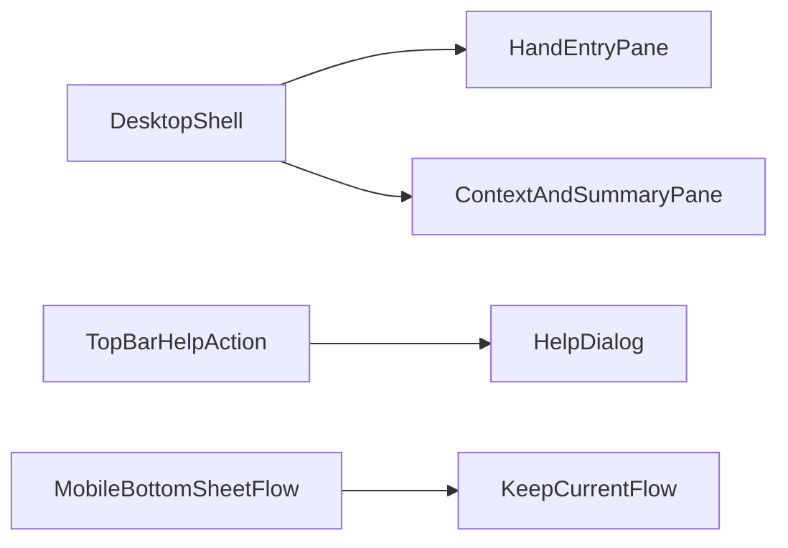

# HLM Desktop UI + Help Entry Plan

## Scope

- Improve `hlm` desktop/macOS web layout to use desktop-native
  space/hierarchy while keeping current mobile UX intact.
- Replace ambiguous top-right `...` behavior with a help entry; move reset
  into explicit controls.
- Keep current scoring logic unchanged (UI-only behavior except control
  wiring).
- Add explicit desktop breakpoints and preserve tablet/mobile behavior parity.
- Add keyboard-accessible help UX with predictable focus/escape behavior.

## Master Plan Linkage

- This file is the **baseline** desktop + help child plan.
- Master:
  [hlm-master-plan.plan.md](hlm-master-plan.plan.md) — track
  `track-desktop-web-ui-help` references this plan and the **active slice**
  below.
- Master track `track-desktop-web-ui-help`: workspace + context dual UI **shipped**
  in **v4.9.4** (2026-03-28); see master **ValidationEvidence**. Residual items:
  manual desktop browser matrix + regression passes (master **NextActions**).

## Follow-on: Desktop workspace UI (active slice)

- **Implemented 2026-03-28** (hand-first layout, inline picker under hand,
  compact rail; mobile unchanged):
  [desktop_workspace_ui_76498db2.plan.md](desktop_workspace_ui_76498db2.plan.md)
- **Follow-up same release:** shell `align-content: start` vertical pack fix
  (user-confirmed); recorded in that plan’s Follow-up section.
- Scope is **desktop ≥1024px only**; does not replace this plan’s mobile/tablet
  contracts or help/reset behavior.

## Follow-on: 和牌条件桌面双套 UI（已完成）

- **用户决策：** **桌面双套 UI** — 窄屏/移动端 **不替换** 现有控件；桌面（≥1024px）
  在侧栏内联 context 中增加 **第二套** 控件并与 **hidden 真源** 双向同步。
- **控件范围（详见子计划）：**
  - **时机事件** → 桌面 **`<select>`**；移动 **保留** HIG `radio` 列表。
  - **花牌 / 杠** → 桌面 **`input type="number"`**（含暗明合计 ≤4）；移动 **保留** 步进器。
  - **和牌方式、门前/副露** → **两套共用** 现有分段 `radio`（子计划列为低优先级再议）。
- **权威执行说明、todos、门控：**
  [hlm_desktop_context_controls_dual_ui.plan.md](hlm_desktop_context_controls_dual_ui.plan.md)
  — **status `completed`**; shipped **v4.9.4**.

## Architecture Direction

- Desktop breakpoint introduces a two-pane shell:
  - Left pane: hand entry and tile operations.
  - Right pane: context conditions + summary + primary progression action.
- Mobile/tablet keep current bottom-sheet-first flow.
- Help action opens a non-destructive help surface (modal/sheet/dialog) with
  quick usage guidance.

## File Targets

- UI structure:
  [../../public/index.html](../../public/index.html)
- Desktop responsive layout:
  [../../public/styles-responsive.css](../../public/styles-responsive.css)
- Shared primitives/components:
  [../../public/styles-base.css](../../public/styles-base.css),
  [../../public/styles-components.css](../../public/styles-components.css),
  [../../public/styles-modals.css](../../public/styles-modals.css)
- Top-right action wiring:
  [../../public/appEventWiring.js](../../public/appEventWiring.js)
- Reset helpers and context sync:
  [../../public/uiBindings.js](../../public/uiBindings.js)
- Home state labels/hints:
  [../../public/homeStateView.js](../../public/homeStateView.js)
- App bootstrapping refs/actions:
  [../../public/app.js](../../public/app.js),
  [../../public/appRefs.js](../../public/appRefs.js)
- Tests to update/add: `tests/unit/*ui*.test.js`,
  `tests/integration/*flow*.test.js`

## Execution Plan

1. Add failing tests first (TDD) for:
  - Desktop layout class/state expectations at desktop breakpoint.
  - `moreBtn` opening help UI instead of resetting context.
  - Explicit reset control path still resets context safely.
  - Help open/close keyboard behavior (`Enter`, `Escape`, focus return).
  - No data loss when opening/closing help and reset confirmation path.
2. Introduce desktop shell markup and semantic regions in `index.html` with
   minimal DOM churn.
3. Implement desktop-only responsive CSS (grid/two-pane, spacing density,
   sticky/right panel behaviors).
4. Implement help surface content and wiring for `moreBtn`.
5. Add explicit reset control with safe UX:
  - clear label (`重置条件`) and non-ambiguous placement.
  - optional lightweight confirmation before destructive reset.
6. Relocate reset action wiring and update labels/ARIA.
7. Update unit/integration tests for new UI behavior and flow continuity.
8. Run quality gates and closeout updates (including master plan status sync).

## Acceptance Criteria

- Desktop/macOS view no longer appears as stretched mobile; primary tasks are
  visible with reduced modal dependency.
- Mobile UX remains functionally unchanged.
- Top-right action is clearly labeled/helpful and non-destructive.
- Reset remains available as explicit action with clear wording.
- Accessibility: keyboard focus path and ARIA labels for new help/reset
  controls.
- Help dialog can be opened/closed fully by keyboard and focus is restored to
  trigger element.
- No silent context reset from top-right action.
- Desktop behavior validated at `>=1024px`; tablet behavior validated at
  `760-1023px`; mobile behavior validated at `<760px`.

## Validation Gates

- `npm run test:unit`
- `npm run test:integration`
- `npm run test:regression`
- `npm test`
- `npm run quality:complexity`
- `cloc <file>` for each touched program file
- Lint/diagnostic check for touched files
- Manual UX gate (document evidence in notes):
  - Chrome desktop latest on macOS/PC: layout + help/reset flow pass
  - Safari desktop latest on macOS: layout + help/reset flow pass
  - Mobile narrow viewport simulation: no flow regression
- Accessibility gate:
  - keyboard-only pass for help/reset controls
  - visible focus indicator on all new interactive controls

## Risks and Mitigations

- Risk: desktop CSS regressions on tablet/mobile.
  - Mitigation: isolate desktop rules under breakpoint and add regression
    tests.
- Risk: user confusion if reset is moved.
  - Mitigation: explicit reset label + placement near context controls.
- Risk: over-large UI files.
  - Mitigation: enforce SLOC/function limits, split helpers where needed.
- Risk: help overlay traps/loses focus and harms keyboard navigation.
  - Mitigation: add keyboard/focus tests and explicit focus-return handling.
- Risk: accidental data loss from reset action.
  - Mitigation: add confirmation or undo-safe affordance and test coverage.

## Rollback Plan

- If desktop layout introduces regressions, disable desktop two-pane rules and
  fall back to current single-column flow while keeping help text-only update.
- If help/reset wiring destabilizes flow, keep `moreBtn` as no-op help entry
  and preserve existing context state until follow-up fix lands.
- Rollback validation: rerun unit/integration/regression + smoke check for
  picker/context/result paths.

## Closeout Requirements

- Update this child plan todos to actual statuses.
- Update master plan active track/status/next actions and validate consistency
  against implementation/test state.
- Re-read both plan files after update to verify links and statuses are
  synchronized.

## Review-Fix Readiness

- Iteration status: `pass` (2026-03-27, iteration 2).
- Findings resolved:
  - Master track linkage completed and marked `in_progress`.
  - Queue/dashboard status and progress semantics synchronized.
  - Child/master links verified workspace-local and executable.
  - Added missing risk coverage for focus trapping and accidental reset.
  - Added missing gates for browser matrix and accessibility checks.
  - Added rollback section with executable fallback path.
- Ready-to-carry-on gate:
  - Planning artifacts are consistent and ready for TDD execution start.
  - Implementation checkpoint (2026-03-27): code changes landed and
    automated gates passed; pending manual browser matrix and keyboard UX
    verification before final track closure.
  - Gate update (2026-03-27): keyboard UX verification covered by unit tests;
    desktop browser matrix still pending due environment-limited automation.
  - Fix iteration (2026-03-27): desktop context sheet mounted inline into side
    panel and modal policy switched to one-modal-at-a-time; full automated
    gates re-run pass. Awaiting user visual confirmation for final closure.
  - Density iteration (2026-03-27): desktop split changed to wider left pane
    (2.6fr/360-430px), context spacing tightened, tile preview expanded to
    10 columns on desktop; full automated gates re-run pass.

## Snapshot feedback (initial page, v4.9.2)

User-reported issues (from desktop screenshot):

1. **Stacked surfaces (help over conditions)**
   - "使用帮助" modal sits on top of "和牌条件" while both read as blocking
     overlays. That breaks the one-surface-at-a-time mental model and hides
     the condition form.
   - **Corrective actions (planned):**
     - When opening help, ensure no second layer reads as a full-screen modal:
       either use a compact popover anchored to 帮助, or temporarily hide
       inline context / dim only the main pane, not a second card stack.
     - Audit `#contextModal`: if inline host moved the sheet, confirm the
       empty modal root never paints backdrop or stacks with `#helpModal`.
     - Optional: help as right-rail or `dialog` without full-viewport dim
       when desktop inline context is visible.

2. **Wasted viewport (right and bottom)**
   - Content stays left-heavy; large grey areas remain.
   - **Corrective actions (planned):**
     - Consider `min-height` on `.app-shell` or vertical centering for
       desktop so the block does not hug the top.
     - Optional third band: e.g. tips, keyboard shortcuts, or version in a
       footer row that uses horizontal space without clutter.

3. **Wizard copy vs visible UI (step 1)**
   - Help says "先选满 14 张再进条件" but 和牌条件 is visible on first paint
     (0/14), which feels contradictory.
   - **Corrective actions (planned):**
     - On step 1 desktop: show only hand + nav; keep conditions collapsed or
       behind "下一步" until step 2, **or** change help copy to match
       "条件可随时调整，计算前确认即可".
     - Align inline context visibility with `wizard.step` in DOM/CSS.

4. **Primary task obscured**
   - Modals draw focus away from 当前手牌.
   - **Corrective actions (planned):** Reduce modal use on first paint;
     reserve help for explicit user action and single layer.

**Next execution slice:** Baseline snapshot fixes are **done**. Proceed with
[desktop_workspace_ui_76498db2.plan.md](desktop_workspace_ui_76498db2.plan.md)
(inline picker + larger hand + compact rail). Optional later: revisit snapshot
feedback item 2 (overall density / empty margin) after that slice lands.

## Snapshot fix slice (2026-03-28)

- Status: `done` — implemented and gated.
- Scope (delivered):
  1. Desktop step 1: hide inline `desktopContextHost` (and reset CTA) via
     `desktop-step-1` / `desktop-step-2` on `#desktopSidePanel`; aligned with
     wizard step (`public/homeStateView.js`, `public/styles-responsive.css`).
  2. Desktop help: `#helpPopover` anchored under **帮助** (≥1024px); narrow
     viewports keep `#helpModal` (`public/index.html`, `public/appEventWiring.js`,
     `public/app.js` + `onBeforeOpenModal` in `public/appModalActions.js`).
  3. Help copy updated in modal + popover (`public/index.html`).
  4. Desktop shell `min-height` + padding (`public/styles-responsive.css`).
- Gates: `npm test` + `npm run quality:complexity` pass (2026-03-28);
  `cloc` on `appEventWiring.js` ~201 code lines (wiring module; split deferred).
- Remaining (manual): desktop browser matrix + a11y spot-checks per master
  **NextActions**; user visual confirmation for snapshot items 1–3.

### Desktop layout hotfix (2026-03-28, overlap + grid)

- **Cause:** `@media (min-width: 760px)` `.sticky-footer` used `left: 50%`,
  `transform: translateX(-50%)`, and `max-width: 760px`. The 1024px block did
  not override those, so the right rail stayed viewport-centered and drew on top
  of the hand card (looked like “missing” slots 8–10 and broken two-pane).
- **Fix:** In the 1024px `.container.app-shell .desktop-side-panel` rule, set
  `left/right: auto`, `transform: none`, `max-width: none`, `width: 100%`;
  `min-width: 0` on `.hand-card`; seven-column tile preview; nav title
  **和了么**; shell `max-width: min(1440px, 100vw - 24px)`.
