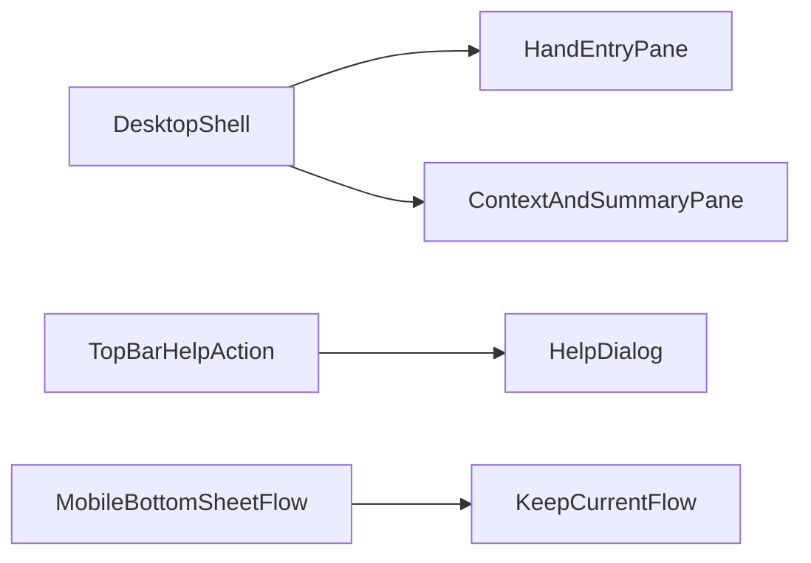

# HLM Desktop UI + Help Entry Plan

## Scope

- Improve `hlm` desktop/macOS web layout to use desktop-native
  space/hierarchy while keeping current mobile UX intact.
- Replace ambiguous top-right `...` behavior with a help entry; move reset
  into explicit controls.
- Keep current scoring logic unchanged (UI-only behavior except control
  wiring).
- Add explicit desktop breakpoints and preserve tablet/mobile behavior parity.
- Add keyboard-accessible help UX with predictable focus/escape behavior.

## Master Plan Linkage

- Child plan target:
  [hlm_desktop_web_ui_ce34a47e.plan.md](hlm_desktop_web_ui_ce34a47e.plan.md)
- Master plan to update:
  [hlm-master-plan.plan.md](hlm-master-plan.plan.md).
- Add a new master track item with:
  - Track id for desktop UI uplift + help action.
  - Child plan link to this plan file.
  - Status set to `in_progress` during execution; synchronize to `completed`
    only after all gates pass.

## Architecture Direction

- Desktop breakpoint introduces a two-pane shell:
  - Left pane: hand entry and tile operations.
  - Right pane: context conditions + summary + primary progression action.
- Mobile/tablet keep current bottom-sheet-first flow.
- Help action opens a non-destructive help surface (modal/sheet/dialog) with
  quick usage guidance.

## File Targets

- UI structure:
  [../../public/index.html](../../public/index.html)
- Desktop responsive layout:
  [../../public/styles-responsive.css](../../public/styles-responsive.css)
- Shared primitives/components:
  [../../public/styles-base.css](../../public/styles-base.css),
  [../../public/styles-components.css](../../public/styles-components.css),
  [../../public/styles-modals.css](../../public/styles-modals.css)
- Top-right action wiring:
  [../../public/appEventWiring.js](../../public/appEventWiring.js)
- Reset helpers and context sync:
  [../../public/uiBindings.js](../../public/uiBindings.js)
- Home state labels/hints:
  [../../public/homeStateView.js](../../public/homeStateView.js)
- App bootstrapping refs/actions:
  [../../public/app.js](../../public/app.js),
  [../../public/appRefs.js](../../public/appRefs.js)
- Tests to update/add: `tests/unit/*ui*.test.js`,
  `tests/integration/*flow*.test.js`

## Execution Plan

1. Add failing tests first (TDD) for:
  - Desktop layout class/state expectations at desktop breakpoint.
  - `moreBtn` opening help UI instead of resetting context.
  - Explicit reset control path still resets context safely.
  - Help open/close keyboard behavior (`Enter`, `Escape`, focus return).
  - No data loss when opening/closing help and reset confirmation path.
2. Introduce desktop shell markup and semantic regions in `index.html` with
   minimal DOM churn.
3. Implement desktop-only responsive CSS (grid/two-pane, spacing density,
   sticky/right panel behaviors).
4. Implement help surface content and wiring for `moreBtn`.
5. Add explicit reset control with safe UX:
  - clear label (`重置条件`) and non-ambiguous placement.
  - optional lightweight confirmation before destructive reset.
6. Relocate reset action wiring and update labels/ARIA.
7. Update unit/integration tests for new UI behavior and flow continuity.
8. Run quality gates and closeout updates (including master plan status sync).

## Acceptance Criteria

- Desktop/macOS view no longer appears as stretched mobile; primary tasks are
  visible with reduced modal dependency.
- Mobile UX remains functionally unchanged.
- Top-right action is clearly labeled/helpful and non-destructive.
- Reset remains available as explicit action with clear wording.
- Accessibility: keyboard focus path and ARIA labels for new help/reset
  controls.
- Help dialog can be opened/closed fully by keyboard and focus is restored to
  trigger element.
- No silent context reset from top-right action.
- Desktop behavior validated at `>=1024px`; tablet behavior validated at
  `760-1023px`; mobile behavior validated at `<760px`.

## Validation Gates

- `npm run test:unit`
- `npm run test:integration`
- `npm run test:regression`
- `npm test`
- `npm run quality:complexity`
- `cloc <file>` for each touched program file
- Lint/diagnostic check for touched files
- Manual UX gate (document evidence in notes):
  - Chrome desktop latest on macOS/PC: layout + help/reset flow pass
  - Safari desktop latest on macOS: layout + help/reset flow pass
  - Mobile narrow viewport simulation: no flow regression
- Accessibility gate:
  - keyboard-only pass for help/reset controls
  - visible focus indicator on all new interactive controls

## Risks and Mitigations

- Risk: desktop CSS regressions on tablet/mobile.
  - Mitigation: isolate desktop rules under breakpoint and add regression
    tests.
- Risk: user confusion if reset is moved.
  - Mitigation: explicit reset label + placement near context controls.
- Risk: over-large UI files.
  - Mitigation: enforce SLOC/function limits, split helpers where needed.
- Risk: help overlay traps/loses focus and harms keyboard navigation.
  - Mitigation: add keyboard/focus tests and explicit focus-return handling.
- Risk: accidental data loss from reset action.
  - Mitigation: add confirmation or undo-safe affordance and test coverage.

## Rollback Plan

- If desktop layout introduces regressions, disable desktop two-pane rules and
  fall back to current single-column flow while keeping help text-only update.
- If help/reset wiring destabilizes flow, keep `moreBtn` as no-op help entry
  and preserve existing context state until follow-up fix lands.
- Rollback validation: rerun unit/integration/regression + smoke check for
  picker/context/result paths.

## Closeout Requirements

- Update this child plan todos to actual statuses.
- Update master plan active track/status/next actions and validate consistency
  against implementation/test state.
- Re-read both plan files after update to verify links and statuses are
  synchronized.

## Review-Fix Readiness

- Iteration status: `pass` (2026-03-27, iteration 2).
- Findings resolved:
  - Master track linkage completed and marked `in_progress`.
  - Queue/dashboard status and progress semantics synchronized.
  - Child/master links verified workspace-local and executable.
  - Added missing risk coverage for focus trapping and accidental reset.
  - Added missing gates for browser matrix and accessibility checks.
  - Added rollback section with executable fallback path.
- Ready-to-carry-on gate:
  - Planning artifacts are consistent and ready for TDD execution start.
  - Implementation checkpoint (2026-03-27): code changes landed and
    automated gates passed; pending manual browser matrix and keyboard UX
    verification before final track closure.
  - Gate update (2026-03-27): keyboard UX verification covered by unit tests;
    desktop browser matrix still pending due environment-limited automation.
  - Fix iteration (2026-03-27): desktop context sheet mounted inline into side
    panel and modal policy switched to one-modal-at-a-time; full automated
    gates re-run pass. Awaiting user visual confirmation for final closure.
  - Density iteration (2026-03-27): desktop split changed to wider left pane
    (2.6fr/360-430px), context spacing tightened, tile preview expanded to
    10 columns on desktop; full automated gates re-run pass.
