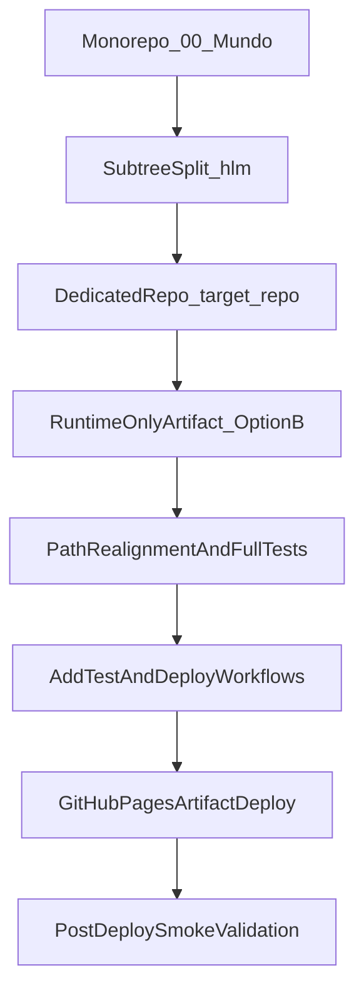

# HLM Dedicated Repo and Pages Migration Plan

## Current Status Dashboard

- Owner: `project-owner`
- OverallStatus: `completed`
- ProgressPercent: `100`
- ActivePhase: `Phase_6_Rollout_Completed`
- Focus:
  - `Option B dist-artifact deployment is implemented in current repo.`
  - `Post-hardening cleanup completed with passing quality and test gates.`
  - `Dedicated target-repo extraction and handoff are completed.`
- RisksAndBlockers:
  - `None currently tracked.`
- NextActions:
  - `Keep workflow parity checks in routine maintenance reviews.`
  - `Open new child plan for any migration-scope changes.`
- ExitGateCheck:
  - Unit: `pass`
  - Integration: `pass`
  - Regression: `pass`
  - FullSuite: `pass`
  - Complexity: `pass`
  - SLOCReview: `pass-with-notes`
  - PublicArtifactScope: `pass`
- ValidationEvidence:
  - `Added scripts/buildDist.js and package script npm run build:dist.`
  - `Updated deploy-pages workflow to test + build dist + publish dist.`
  - `Added security-scan workflow using gitleaks action.`
  - `Updated docs and mermaid deploy guide for dist-based publishing.`
  - `Added local artifact hygiene policy (.gitignore) for dist output.`
  - `Removed dead app modules and deduped UI glue with full gate reruns.`
  - `Validation passed: npm test, npm run quality:complexity, cloc checks.`
  - `Dedicated target-repo extraction and handoff are completed.`
- LastUpdated: `2026-03-17`

## Goal

- Mirror `goja` publishing model for `hlm`.
- Publish from dedicated target repo to GitHub Pages.
- Keep browser app functional with runtime-only `dist/` artifact publish.
- Enforce full test validation before deploy.

## Scope Lock

- Dedicated target repo: `<owner>/<repo>`.
- Option B runtime-only `dist/` artifact publish structure.
- Artifact-based GitHub Pages workflow in Actions.

## Phase 1: Repository Extraction and Baseline Verification

- Split `hlm` history from monorepo using subtree split:
  - `git subtree split --prefix=02product/01_coding/project/hlm -b hlm-split`
- Push split branch to target repo `main` (safe path depends on remote state).
- Clone `<owner>/<repo>` locally as the new working repo.
- Verify root contains only `hlm` project files and commit history is present.

Key references:

- [Monorepo source path](02product/01_coding/project/hlm)

## Phase 2: Runtime-Only Artifact Refactor (Option B)

- Add deterministic `dist/` export layout for runtime-only deployment.
- Keep source layout (`public/`, `src/`, docs, tests) unchanged in repository.
- Ensure exported runtime entry and module links are valid inside `dist/`.
- Ensure no test/docs/scripts files are included in published artifact.

## Phase 3: Test and Docs Path Realignment

- Update test imports/path assertions that currently reference `public/...`:
  - [tests/unit/indexStylesheetLinks.test.js](tests/unit/indexStylesheetLinks.test.js)
  - [tests/unit/appStateActions.test.js](tests/unit/appStateActions.test.js)
  - [tests/unit/tileAssets.test.js](tests/unit/tileAssets.test.js)
- Update docs for dist-based publish workflow:
  - [README.md](README.md)
  - [RELEASE_AND_PUBLISH.md](RELEASE_AND_PUBLISH.md)

## Phase 4: GitHub Actions (Mirror goja Style)

- Add test workflow:
  - `.github/workflows/test.yml`
  - Trigger: push/PR to `main`
  - Steps: checkout, setup-node, install deps
    (`npm ci` when lockfile exists, otherwise `npm install`), `npm test`
- Add or update deploy workflow:
  - `.github/workflows/deploy-pages.yml` or `.github/workflows/deploy.yml`
  - Trigger: push to `main`, manual dispatch
  - Steps: checkout, setup-node, install deps
    (`npm ci` when lockfile exists, otherwise `npm install`), `npm test`, assemble `dist/`,
    configure/upload/deploy pages artifact
- Artifact assembly must include runtime files only.

Reference pattern:

- [goja deploy workflow](02product/01_coding/project/goja/.github/workflows/deploy.yml)
- [goja test workflow](02product/01_coding/project/goja/.github/workflows/test.yml)

## Phase 5: Validation Gates (TDD/Quality/Release Safety)

- TDD-first sequence for refactor deltas:
  - adjust/extend tests first for path/layout assumptions
  - implement minimal code/path changes
  - run full suite until green
- Mandatory validation commands:
  - `npm test`
  - `npm run test:unit`
  - `npm run test:regression`
  - `npm run test:integration`
- Complexity/size guardrails:
  - `npm run quality:complexity`
  - `cloc <changed-file>` for touched program files to enforce SLOC target guidance
- Pages smoke validation post-deploy:
  - URL loads: `https://<owner>.github.io/<repo>/`
  - no 404 for module imports/assets
  - core hand-calc flow works on mobile and desktop.

## Phase 6: Rollout and Risk Controls

- Use a dedicated migration branch in `<owner>/<repo>`.
- Keep commits small by phase (layout, test updates, workflows).
- Protect `main` with required passing checks before merge.
- If remote `hlm` is non-empty, use non-destructive merge strategy (`--allow-unrelated-histories`) instead of forced overwrite.

## Acceptance Criteria

- `<owner>/<repo>` contains only `hlm` project at root.
- Runtime app works from published `dist/` artifact.
- All test suites pass locally and in Actions.
- Deploy workflow publishes successfully to `https://<owner>.github.io/<repo>/`.
- No broken asset/module links in production.

