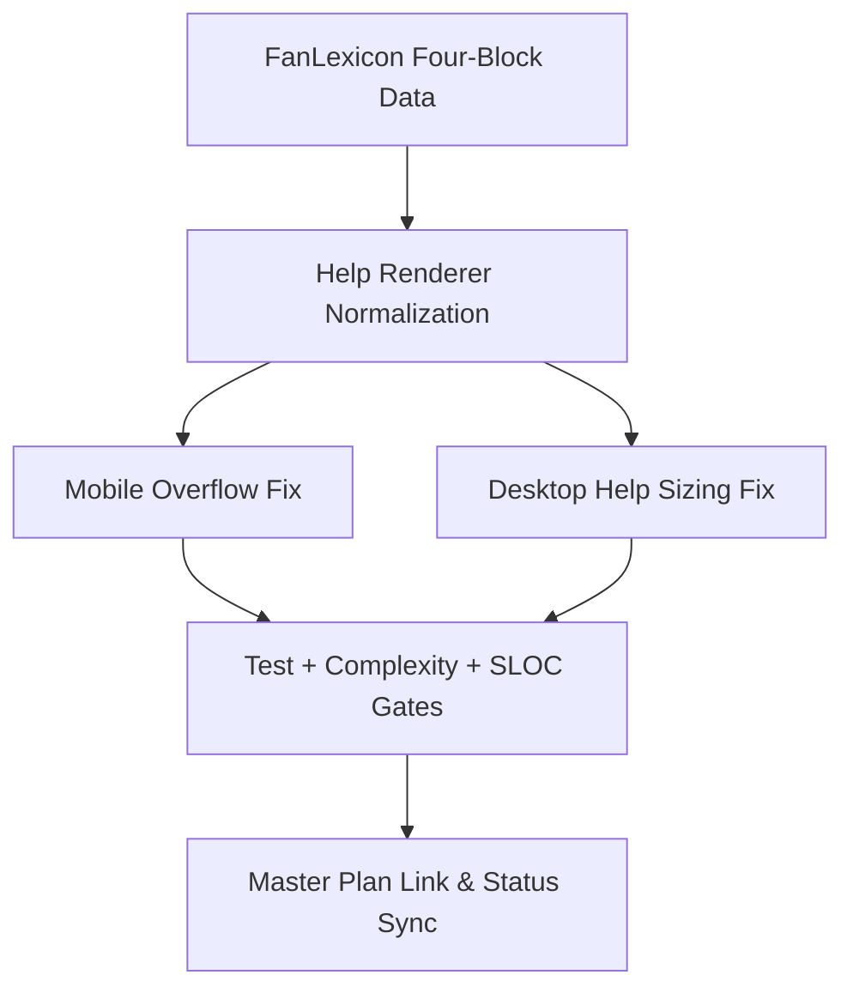

# HLM Help Four-Block Upgrade Plan

## Goal

Deliver a beginner-oriented help experience by:

- removing mobile horizontal scroll in help surfaces,
- improving desktop help sizing/proportion,
- restructuring fan explanations into `定义 / 判定要点 / 易错 / 例子`,
- and linking this child plan into the master plan dashboard and queue.

## Scope

- Help content template and mount/render logic:
  - [public/index.html](../../public/index.html)
  - [public/helpContentMount.js](../../public/helpContentMount.js)
- Help styles (mobile + desktop):
  - [public/styles-components.css](../../public/styles-components.css)
  - [public/styles-modals.css](../../public/styles-modals.css)
  - [public/styles-responsive.css](../../public/styles-responsive.css)
- Fan lexicon data model:
  - [src/config/fanLexiconEntries.js](../../src/config/fanLexiconEntries.js)
- Master linkage and closeout:
  - [hlm-master-plan.plan.md](hlm-master-plan.plan.md)

## Delivery Approach

## Phases

### Phase 1: Data and Rendering Contract

- Define four-block schema per fan entry:
  - `brief` (定义)
  - `criteria[]` (判定要点)
  - `pitfalls[]` (易错)
  - `example` (例子)
- Add backward-compatible normalization in help rendering so existing string
  entries still render safely during migration.
- Keep search behavior unchanged (search by fan display name/summary).

### Phase 2: Mobile and Desktop Help UX Fixes

- Remove horizontal overflow in help modal/popover content by:
  - constraining x-overflow,
  - enabling long-token wrapping,
  - and handling long inline code safely.
- Improve desktop help proportions:
  - increase help panel width and usable height,
  - keep comfortable reading line length and scroll behavior.

### Phase 3: Content Expansion for Beginners

- Expand fan entries from one-line copy to four-block educational copy.
- Keep wording beginner-friendly and rule-consistent with current registry IDs.
- Ensure each fan has at least one concrete example sentence.

### Phase 4: Validation and Master-Plan Linkage

- Run TDD-first cycle for changed behavior:
  - add/update unit tests for help rendering contract and compatibility,
  - verify no regression in help search and mount idempotency.
- Run required gates:
  - unit/regression/integration/full tests,
  - complexity check,
  - per-file `cloc` for touched program files.
- Update master plan with:
  - new track todo entry,
  - child-plan link in index/dashboard,
  - active/next status and closeout evidence fields.

## Acceptance Criteria

- No horizontal scrollbar appears in help on mobile viewports.
- Desktop help surface uses screen space proportionally (wider and taller than
  current baseline without layout breakage).
- Every fan entry in active lexicon renders 4 sections: 定义 / 判定要点 / 易错 /
  例子.
- Legacy string entry fallback (if any) does not break rendering.
- Help search/filter and deep-link behavior remain functional.
- All test and quality gates pass.
- Master plan contains canonical workspace-local link to this child plan and
  synchronized track status fields.

## Risks and Controls

- Risk: long migration of all fan entries causes inconsistent states.
  - Control: normalization fallback + phased content migration.
- Risk: CSS changes impact non-help modals.
  - Control: scope selectors to help containers and add regression checks.
- Risk: master/child status drift.
  - Control: explicit closeout checklist and re-read validation before
    finalization.

## Closeout Checklist

- Child plan todos reflect actual execution state.
- Master plan track + queue + next actions updated.
- All links are workspace-local and valid.
- Consistency verified across implementation state, child plan, and master
  dashboard.

---

## Delivered (execution record)

- Help fan entries render as four blocks: `定义 / 判定要点 / 易错 / 例子`.
- Rendering keeps backward compatibility for legacy string entries.
- Help modal/popover: horizontal overflow addressed on mobile; desktop help
  surfaces use larger, more proportional width/height.

## Validation Evidence

- Full suite: `npm test` (unit/regression/integration/e2e) pass.
- Quality gate: `npm run quality:complexity` pass.
- SLOC: `cloc` on touched files in this slice.

## Linked Master Track

- Track id: `track-help-fan-four-block-upgrade`.
- Master: [hlm-master-plan.plan.md](hlm-master-plan.plan.md).
