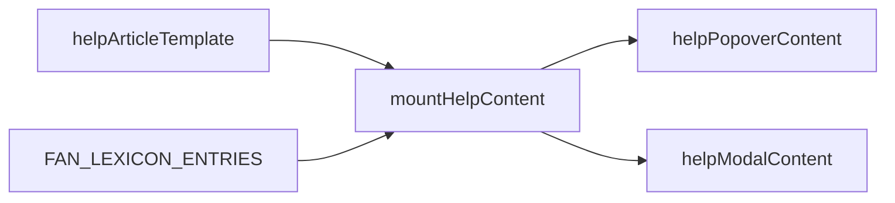

# HLM 中文帮助（目的 / 步骤 / 番种释义）

## Master / 关联

- **Master：** [hlm-master-plan.plan.md](hlm-master-plan.plan.md) — **track-help-zh-expansion**，交付队列 **Active slice**。
- **语境：** [hlm_desktop_web_ui_ce34a47e.plan.md](hlm_desktop_web_ui_ce34a47e.plan.md)（popover / modal）；番种数据与
  [hlm_holistic_ux_scoring.plan.md](hlm_holistic_ux_scoring.plan.md) 一脉（静态 lexicon）。

## 现状

- [`public/index.html`](../../public/index.html) 内 **`#helpPopover`** 与 **`#helpModal`** 各有一套相同短文案（约 46–54、332–339 行），易漂移。
- [`src/config/fanLexiconEntries.js`](../../src/config/fanLexiconEntries.js) + [`getFanLexiconText`](../../src/config/fanLexicon.js) 已服务结果页 ℹ️；帮助未复用。

## 目标（中文-only）

1. **程序目的**：国标麻将 **计番 / 番种拆解** 辅助；非规则书正式解释，以官方书面规则为准。
2. **使用步骤**：选满 14 张（桌面内联选牌 vs 移动底栏一句）→ **下一步** 和牌条件 → **计算** → 结果分组与番种明细；**重置条件** vs **清空手牌**。
3. **番种说明**：**番** / **起和番** / **不计** 与工具检测关系；逐条释义来自 `FAN_LEXICON_ENTRIES`（折叠列表，释义为现有浓缩句）。

## 实现要点

### 单源与幂等

- 在 [`public/index.html`](../../public/index.html) 增加 **`<template id="helpArticleTemplate">`**：仅 **静态** 章节（`h4` + 段落 / `ol`），**不含** 番种循环 HTML。
- **`public/helpContentMount.js`**（新模块，导出 `mountHelpContent(byId)`）：
  1. 若两容器之一已带 `data-help-mounted="1"`，**立即 return**（防重复执行 / HMR）。
  2. `querySelector` 拿到 `#helpPopover .help-content` 与 `#helpModal .help-content`；**清空** 内层后再 `importNode(template.content, true)` 克隆进 **各自** 容器（同一模板克隆两份，DOM 独立）。
  3. 构建 **番种区**：包在 `<section id="helpFanLexiconRegion" aria-label="番种释义列表">` 内；对 `Object.entries(FAN_LEXICON_ENTRIES)` 建 `
`，`
` 用 `getFanDisplayName(id)`（无则回退 `id`）；`
` 为词条全文（与 lexicon 一致，勿在中间截断）。
  4. **排序**：按 **summary 展示名** `localeCompare`，`"zh-Hans"`；同文按 `id` 次要排序。
- **数据导入**：自 `../src/config/fanLexiconEntries.js` 与 `../src/rules/fanRegistry.js` 的 `getFanDisplayName`（与 [`public/app.js`](../../public/app.js) 相同的 `src` ESM 路径约定）。
- **调用时机**：[`public/app.js`](../../public/app.js) 在 **`wireAppEvents(...)` 之后**、**`stateActions.syncHomeState()` 之前或之后均可**，须保证首次点「帮助」前已执行；推荐紧接 `wireAppEvents` 后一行。
- **样式**：[`public/styles-components.css`](../../public/styles-components.css) 优先：`h4.help-section-title`、`#helpFanLexiconRegion`、`details.help-fan-entry` 间距与圆角；勿改 [`public/styles-responsive.css`](../../public/styles-responsive.css) popover 的 `max-height`/`overflow-y`。
- **无障碍**：面板保持 `role="dialog"`；正文 `h4` 勿跳级盖过 `h3`；`details` 默认可键盘展开。

### 实施顺序（与 frontmatter todos 对齐）

| 顺序 | todo id | 内容 |
|------|---------|------|
| 1 | template-static-zh | `helpArticleTemplate` + 去掉旧静态 `p.summary-text`（由模板取代） |
| 2 | mount-help | `helpContentMount.js` + `app.js` 调用 |
| 3 | css-help | 章节 + details 样式 |
| 4 | tests-changelog-plan | 测试、CHANGELOG、计划 closeout |

## 验收标准（实现完成后逐项勾选）

- 桌面 **popover** 与窄屏 **modal** 打开后，文案 **段落级一致**（无半边旧版）。
- 含 **目的、步骤、番概念、番种折叠列表** 四可读区块（名称可微调，语义须覆盖）。
- 番种条数与 `FAN_LEXICON_ENTRIES` 键数一致；排序符合 `zh-Hans`。
- `mountHelpContent` 二次调用 **不重复** 追加节点。
- **帮助** 仍可通过 **关闭** / **Escape** 关闭（现有 [`appEventWiring.js`](../../public/appEventWiring.js) 行为不变）。
- `npm test` 与 `npm run quality:complexity` 通过；`cloc` 记录新增文件（若超 100 行评估是否拆分）。

## 测试与文档

- [`tests/unit/indexStylesheetLinks.test.js`](../../tests/unit/indexStylesheetLinks.test.js)：断言 `helpArticleTemplate`、`helpFanLexiconRegion`（或稳定 id 正则）。
- 可选：[`tests/unit/helpContentMount.test.js`](../../tests/unit/helpContentMount.test.js) mock `document` / `byId`，断言幂等与排序（最小用例）。
- [`CHANGELOG.md`](../../CHANGELOG.md)：`[Unreleased]` **Changed** — 中文帮助详版。

## 完成后的计划 closeout（执行者负责）

1. 本文件 frontmatter **`todos`** → 全部 **completed**；**`status`** → **completed**。
2. [hlm-master-plan.plan.md](hlm-master-plan.plan.md)：**`track-help-zh-expansion`** → **completed**；**Current delivery queue** 将下一 Active slice 置空或标明无；**ProgressPercent** 递增；**ValidationEvidence** 记 gates + 日期。
3. **Focus** 中 Primary 换下一条或回退桌面回归项。

## 范围外

- 非中文；联网规则全文；LLM；强行扩展 `fanLexiconEntries` 为长文（另开任务）。

## 风险

- 列表变长：**滚动** 与 **焦点**须在实机复验（尤以 iOS Safari modal 为甚）。

## 跟进（2026-03-30，已实施）

- **番种释义 UX：** 模板内 `.help-fan-search`、`.help-fan-empty`；
  `helpContentMount.js` 按 summary 过滤、`id="fan-<REGISTRY_ID>-popover|modal"`、
  `data-fan-registry-id`、`matchesFanSearchQuery` 单测；`package.json` 测试 glob
  加引号以跑全单元/回归/集成；相关断言与 mock 已校正。
- **深链：** `#fan-<REGISTRY_ID>`（及 `-popover`/`-modal` 后缀）经
  `helpFanHash.js` 打开帮助并定位条目；`wireAppEvents` 返回 `openHelp`。
- **门禁：** `npm test`、`npm run quality:complexity` pass；
  `cloc`：`helpContentMount.js` 80 code 行、`helpFanHash.js` 64 code 行。

## 实施记录（2026-03-29）

- `public/index.html`：删除两处重复短文案，新增
  `#helpArticleTemplate`（中文四区块）与 `#helpFanLexiconRegion`。
- `public/helpContentMount.js`：新增 `mountHelpContent(byId)`，
  负责 template 双端克隆、幂等防重复、`zh-Hans` 排序、番种折叠注入。
- `public/app.js`：在 `wireAppEvents` 后调用 `mountHelpContent(byId)`。
- `public/styles-components.css`：新增帮助章节、步骤列表与 `details`
  样式。
- `tests/unit/indexStylesheetLinks.test.js`：新增
  `helpArticleTemplate` / `helpFanLexiconRegion` 断言。
- `CHANGELOG.md`：`[Unreleased]` 增加帮助详版变更记录。

## 门禁结果

- `npm test`：pass（unit/regression/integration）。
- `npm run quality:complexity`：pass。
- `cloc public/helpContentMount.js`：45 code 行。
