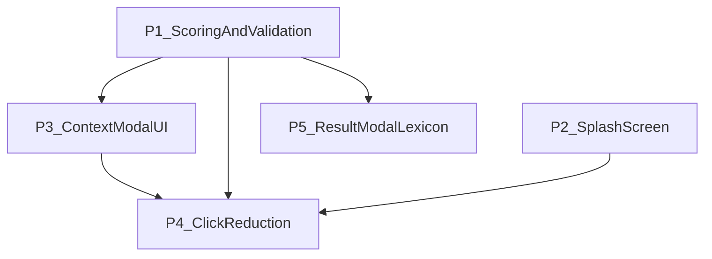

# HLM 综合体验与计番计划（五项合一）

## 主计划链接

- **Master（单一路线图）**:
`[hlm-master-plan.plan.md](hlm-master-plan.plan.md)`
- **本计划**: 同文件（`hlm_holistic_ux_scoring.plan.md`）。
- **Master 已链入**: `todos` 含 `track-holistic-ux-scoring`（**completed**
2026-03-22）；**Consolidated Plan Index** 与本文件一致。
- **执行记录**: 已实现五项 pillar + 门禁；版本 **4.6.0**；`npm test`、
`quality:complexity`、`build:dist` 已通过。

## 计划审查闭环（执行前后自检）

- Mermaid 依赖图**无环**，与正文实现顺序一致。
- 文内仓库链接均为相对路径、可从未来 PR diff 中解析。
- 与 `[hlm-master-plan.plan.md](hlm-master-plan.plan.md)` 的
`track-holistic-ux-scoring` 状态字段一致（本轨道已 **completed**）。
- 五项 pillar 在 **Definition of done** 中有可验证条目。

## 范围总览

| #   | 主题         | 目标                                                                                                                       |
| --- | ---------- | ------------------------------------------------------------------------------------------------------------------------ |
| 1   | 花牌张数与计番    | 国标：**每花 1 番**；用户在和牌条件中告知张数；引擎与 UI 闭环。                                                                                    |
| 2   | 启动画面       | 专业第一印象；展示核心能力；**显示版本号**（复用 `getDisplayVersion()`）。                                                                       |
| 3   | 和牌条件 Modal | 按 [Apple HIG](https://developer.apple.com/design/human-interface-guidelines/) 与移动表单最佳实践：**分组、清晰层级、合适控件**；杠与时机**始终可选可见**。 |
| 4   | 减少点击       | **满 14 张自动进入下一环节**为主；全路径审计其它可省步骤。                                                                                        |
| 5   | 结果 Modal   | **版面专业化**、尽量占满可用屏高；番种明细可读、美观；**静态词典** + **行内 ℹ️**（≥44pt）查看释义，**少点击**。                                                    |

**已锁定决策**（来自先前确认）: 花牌为**方案 A**（和牌条件内计数，不占 14 槽）；杠为**暗杠/明杠个数步进器**，映射 `kongSummary`。**番种详解正文**采用**项目内静态词典**（按番种 `id`，离线可测）。**番种详解交互**
已锁定为 **C：行内 ℹ️ 按钮**（见下文 Pillar 5「已锁定交互」小节）。

## 依赖顺序（建议实现流）

说明：**P1** 先于 **P3** 接线；**P2** 可与 P1/P3 并行；**P5** 依赖稳定 `fan id`
与计分结果结构（与 **P1** 衔接），可与 **P3** 并行实现；**P4** 与 **P5** 无硬
先后，合并发版前做联合回归（含结果区披露与向导自动下一步）。

---

## Pillar 1 — 花牌张数 + 杠数据 + 计番算法

### 现状（摘要）

- [public/resultStateActions.js](../public/resultStateActions.js) 未传
`flowerCount`，UI 路径不触发 `HUA_PAI`。
- [src/rules/fanDetectors.js](../src/rules/fanDetectors.js) 对每条番种使用注册表
固定 `fan`；需对 `HUA_PAI` **按 `flowerCount` 覆盖番数**（每花 1 番）。
- 杠番种读 `[contextDetectors.js](../src/rules/detectors/contextDetectors.js)`
中 `kongSummary`，与界面 `kongType` 单选**脱节**；步进器 +
`kongType: "none"` + `kongSummary` 为一致方案。

### 实现要点

1. **校验**:
  [src/contracts/structuredContextValidator.js](../src/contracts/structuredContextValidator.js)
   — `flowerCount` 整数 **0–8**；`kongSummary.an` / `.ming` 非负整数且
   **an + ming ≤ 4**（与标准手牌最多四组面子一致）。
2. **检测**:
  [src/rules/fanDetectors.js](../src/rules/fanDetectors.js) — 命中 `HUA_PAI` 时
   `fan = flowerCount`（>0 时命中）。
3. **请求**:
  [public/resultStateActions.js](../public/resultStateActions.js) — `context` 含
   `flowerCount`、`kongSummary`、`kongType: "none"`、既有枚举字段。
4. **解释文案**:
  [src/llm/explainer.js](../src/llm/explainer.js) 若将花牌写死为 1 番，需改为与
   动态番数一致或避免写死数值。
5. **测试**: TDD — `fanDetectors` / `scoreHand` / `evaluateCapturedHand`；
  更新 [tests/unit/appStateActions.test.js](../tests/unit/appStateActions.test.js)
   等 DOM 桩。

---

## Pillar 2 — 程序启动画面

### 设计细节（HIG 取向）

- **结构**: 全屏或安全区内**居中卡片** — 品牌（应用名 + 副标题「国标麻将计番」）→
**三条核心价值**（短句 + 可选线性图标，例如：手牌录入 / 番种拆解 / 条件与规则说明）
→ **版本**（次要样式，`getDisplayVersion()`，与
[src/config/appVersion.js](../src/config/appVersion.js) 同源）。
- **时长**: 约 **600–1200 ms** 后淡出主界面；避免阻塞首屏可交互时间过长。
- **动效**: 尊重 `prefers-reduced-motion: reduce` — 静态或极短淡入。
- **可访问性**: 容器 `aria-live="polite"` 或简短 `aria-label`（可选）；焦点不困在遮罩内过久。
- **实现落点**: 在 [public/index.html](../public/index.html) 增加启动层节点 +
CSS（如 [public/styles-components.css](../public/styles-components.css)）；在
[public/app.js](../public/app.js) 模块加载后**移除或隐藏**启动层。版本文案与
主界面 `#versionBadge` 同源（`getDisplayVersion()`），避免两套版本字符串。

---

## Pillar 3 — 和牌条件 Modal 全面重设计

### 问题对照

- 杠、时机挤在 `
`，**与预设、主流程层级不一致**。
- [src/contracts/handState.js](../src/contracts/handState.js) 中 `TIMING_EVENTS` 含
`qianggang`，**HTML 缺少「抢杠和」**。
- 多列 `segmented-row` 小屏易换行显乱。

### UI 结构（推荐）

1. **快捷预设**（保留）: 三张卡片；选中后同步下方所有控件（含花、杠、时机）。
  **实现约束**: 当前 [public/uiConfig.js](../public/uiConfig.js) 的
   `CONTEXT_PRESETS` 仅含 `winType` / `handState`；须扩展预设对象或在
   `applyPreset` 中显式写入花/杠/时机的默认值，使行为与文案一致。
2. **分组 A — 和牌方式 / 门前状态**: 两组 **Segmented Control**（各 2 项），互斥清晰。
3. **分组 B — 花牌**: **步进器** 0–8，标签说明「不计入 14 张手牌」。
4. **分组 C — 杠**: **暗杠个数**、**明杠个数**步进器（约束总和 ≤ 4）；不再使用四选一
  `kongType` 单选作为主输入。
5. **分组 D — 时机事件**: **单列单选列表**（radio list），选项与枚举一致：**无、海底捞月、
  河底捞鱼、杠上开花、抢杠和**。
6. **导航**: 顶部或底部单一 **Primary**「完成」/「应用」；避免重复主操作（HIG：主操作位置稳定）。
7. **样式**:
  [public/styles-modals.css](../public/styles-modals.css) — 组标题、分割线、留白、
   触摸目标 ≥ 44pt 等效；注释说明非显然布局时 wrapping ≤ 78 列。

### 逻辑 wiring

- 更新 [public/contextWiring.js](../public/contextWiring.js)、
[public/uiBindings.js](../public/uiBindings.js) 中 `resetContext` /
`syncContextRadios`（可重命名为同步函数以涵盖**步进器 + 时机列表 + 隐藏域**）。
- [public/homeStateView.js](../public/homeStateView.js) 摘要行展示花张数与
「暗×·明×」杠摘要。

---

## Pillar 4 — 减少用户点击次数

### 全程序审计结论与落点

| 机会              | 位置                                                                                                                | 行为                                                                                                                                                   |
| --------------- | ----------------------------------------------------------------------------------------------------------------- | ---------------------------------------------------------------------------------------------------------------------------------------------------- |
| **满 14 张自动下一步** | [handPickerActions.js](../public/handPickerActions.js) 中 `pickTile` / `pickTileWithAction` 成功且 `syncHomeState` 之后 | 若 `canCalculate` 且向导步骤为 1，调用与 [handleWizardNextClick](../public/appEventWiring.js) 相同的「下一步」语义（`goWizardNext` + `syncWizardModals`），打开和牌条件、关选牌 sheet。 |
| 防打扰             | 同上                                                                                                                | 可选：`localStorage`「满 14 不自动跳转」开关；默认开启自动跳转。                                                                                                            |
| 条件确认后少一步        | [appEventWiring.js](../public/appEventWiring.js) / modal 关闭                                                       | 可选：关闭和牌条件 sheet 时若已在步骤 2，直接 `calculate()`（或主按钮「计番」二合一）；需与「仅关闭不计算」区分，建议 **Primary = 计番并关闭**。                                                          |
| 选牌「完成」          | 自动跳转后                                                                                                             | 保留「完成」作显式关闭；满 14 可自动关 picker 或仅推进向导（产品偏好：推进向导 + 关 picker 与当前 `syncWizardModals` 一致）。                                                                 |
| **更多** 按钮       | [appEventWiring.js](../public/appEventWiring.js) 中 `moreBtn`                                                      | 当前会 `resetContext` — 文档或 UI 标明「重置」含义，避免误点；可选改为明确「重置会话」菜单。                                                                                            |
| 结果页             | `playAgainBtn`                                                                                                    | 已有一键；保持。                                                                                                                                             |

### 实现注意

- 自动跳转应**复用** [handleWizardNextClick](../public/appEventWiring.js) 或抽出
共享的 `advanceWizardAfterTilesFilled(...)`，避免复制 `goWizardNext` +
`syncWizardModals` 逻辑导致漂移。

### 测试

- 扩展 [tests/integration/mobilePickerFlow.test.js](../tests/integration/mobilePickerFlow.test.js)
或新增集成测：模拟选满 14 张后期望向导步骤与 modal 状态。
- 单元测：`uiFlowState` / wizard 不变量。

---

## Pillar 5 — 结果 Modal + 番种静态词典与详解交互

### 现状（摘要）

- [public/index.html](../public/index.html) 中 `#resultModal` 为常规 sheet，
`max-height: 84vh`（见 [public/styles-modals.css](../public/styles-modals.css)），
内部 **标题 + 状态 + 总分 + 和牌分组 + 番种 ul** 堆叠，番种仅为
`名称（N番）` 文本（[public/resultModalView.js](../public/resultModalView.js)
中 `renderFanList`）。
- [src/app/resultViewModel.js](../src/app/resultViewModel.js) 已映射 `id` → 中文名
（[src/rules/fanRegistry.js](../src/rules/fanRegistry.js) 中 `getFanDisplayName`），
**无**标准释义字段。
- 「详细解释」依赖 [public/index.html](../public/index.html) 中 `#openInfoBtn`
打开另一 Modal，与**单番种**颗粒度不符且多步。

### 目标【1】— 整体 UI：空间与专业感

- **Sheet**：在 HIG 前提下提高 **可视区域利用率**（例如适度提高 `max-height`、
压缩冗余 margin、**粘性顶栏**固定总分/状态便于长列表滚动）。
- **分区**：「摘要区」（和牌结论、总番、和牌型）与「番种明细」**分组列表**样式
（组头、分隔、行高与字号层级）；命中番与（若展示）排除番分区可辨。
- **番种行**：**左**为番种名 + 番数（正文区可保留未来扩展，如轻扫等）；**右**为
**ℹ️** 专用控件，`aria-label` 含番种名；**整行不**作为释义触发器，降低滚动误触。
**ℹ️** 命中区 **≥ 44×44 pt**（或 CSS 等效最小触摸目标）。
- **样式落点**：
[public/styles-modals.css](../public/styles-modals.css) 与必要时
[public/styles-components.css](../public/styles-components.css)；避免 `innerHTML`
拼接用户可控串（延续现有 `textContent` 安全策略）。

### 目标【2】— 番种详解：静态词典 + 少点击

- **数据**：新建或扩展只读模块（例如 `src/config/fanLexicon.js` 或与
[src/rules/fanRegistry.js](../src/rules/fanRegistry.js) 并列的 `fanLexiconMap`），键为
**稳定 `fan id`**，值为 **中文释义**（可含 1～3 句定义 + 常见要点；长度上限在
实现时约定，避免单行过长）。
- **覆盖策略**：TDD 要求「凡 `FAN_REGISTRY` 中会出现的 id 均有词条或显式 fallback
（如「释义待补」）」— 具体门禁在实现阶段用测试列表或抽样 + CI 断言最小覆盖率。
- **View model**：
[buildResultViewModel](../src/app/resultViewModel.js)（或并列纯函数）
为每条 `matchedFans` / `excludedFans` 附加 `detailText`（或 lazy getter），供 UI 渲染。
**Info Modal** 中排除番列表若继续展示，可复用同一 `detailText` 或仅显示名称（实现
阶段择一并测）。

### Pillar 5 — 已锁定交互（方案 C：行内 ℹ️）

- **用户选择**: **C — 行内 ℹ️**（2026-03-22 确认）。
- **行为**: 点击 **ℹ️** → 展示该番种静态释义；再次点击 **ℹ️**（或实现上采用
「展开块内关闭」**同一热区**）→ 收起。目标仍为 **1 次打开、1 次关闭**，无额
外层级页面。
- **呈现**: 优先 **该行下方内联展开**（仍在结果 sheet 内，不新开全屏 Modal）；
若内联在极长文案下影响布局，可退化为 **窄 bottom 内嵌层**（仍属单次 sheet，
不回到「详细解释」大 Modal）。
- **未选方案存档**: A（整行/chevron 展开）已否决；B（整行打开独立窄 sheet）未采用。

### 实现要点

1. **词典与注册表**：词条与 [src/rules/fanRegistry.js](../src/rules/fanRegistry.js)
  **id 对齐**；
  新增内容走 **TDD**（例如 `tests/unit/fanLexicon.test.js`：抽样 id、缺失键策略）。
2. **渲染**：改写 `renderFanList` 或拆为 `renderFanBreakdown(target, fans, options)`，
  使用 **DOM API**；**仅 ℹ️** `button` 切换详情可见性；`aria-expanded` /
  `aria-controls` 绑在 **ℹ️** 与其详情容器上（勿绑整行）。
3. **Info Modal**：保留作「全文审计」；结果 Modal 内以 **单番展开** 为主路径，
  减少用户对 `openInfoBtn` 的依赖（可不删除，避免回归老用户习惯）。
4. **测试**：扩展
  [tests/unit/resultViewModel.test.js](../tests/unit/resultViewModel.test.js)
   与（若存在）结果渲染相关测试；可选 **DOM** 级轻测 **ℹ️** 切换。

---

## 横切：质量与文档

- **TDD**: 先写/改测试再改实现（花牌番数、校验、点击路径、**番种词典与结果
Modal 披露**）。
- **命令**: `npm test`、`npm run quality:complexity`；各改动源文件 `cloc`（项目惯例）。
- **发布产物**: 若验证 GitHub Pages 的 `dist/` 输出，在门径中列入
`npm run build:dist` 并检查 `scripts/buildDist.js` 是否拷贝更新后的
`public/` 资产。
- **CHANGELOG**: 使用**实际发布日**日期条目（执行当日）。
- **SLOC/复杂度**: 超限时拆出 `public/contextStepperBindings.js` 等小模块。

## 与其它计划的关系

- 若仓库中曾存在仅含「花+杠」的窄计划文件，**以本文件为唯一执行源**；窄计划标为
historical 或删除重复项，避免双源。

## 实施就绪清单（开工前核对）

以下全部满足即可认为**可进入编码**，无需再改计划结构：

1. **无开放决策**: 花牌 A、杠步进器、`kongType: "none"`+`kongSummary`、静态词典、
  **ℹ️ 交互 C** 均已锁定。
2. **依赖清晰**: P1 先于 P3 接线；P2/P5 可与 P3 并行；P4 与 P5 联合回归前合并。
3. **门禁命令**（横切）: `npm test`、`npm run quality:complexity`、对各改动源文件
  `cloc`；发布验证时 `npm run build:dist`。
4. **主计划**: 开工将 `[hlm-master-plan.plan.md](hlm-master-plan.plan.md)` 中
  `track-holistic-ux-scoring` 置 `in_progress`；收尾置 `completed` 并更新
   **LastUpdated** 与 dashboard 证据。
5. **审查闭环**: 执行前后各跑一遍本文「计划审查闭环」与 **Definition of done**。

## Definition of done

- **P1**: `flowerCount` 与 `kongSummary` 从 UI 进入 `scoreHand`；`HUA_PAI` 番值等于花张数；
非法花数或杠总数被拒。
- **P2**: 冷启动可见启动层；版本号正确；`prefers-reduced-motion` 下无强动效。
- **P3**: 和牌条件 sheet 分组清晰；杠为双步进器；时机含抢杠和；单一 Primary 主操作。
- **P4**: 满 14 张默认自动进入步骤 2（或 documented 开关关闭时保持原行为）；新增/更新测试覆盖。
- **P5**: 结果 sheet 布局与番种列表达到计划中的分区/粘性顶栏等要求；静态词典可查；
**行内 ℹ️**（≥44pt 热区）**1 次**展开释义、**1 次**收起；整行不触发释义；a11y
属性齐备。
- 全测试与质量门通过；CHANGELOG 已更新。
- Master：`track-holistic-ux-scoring` 与 dashboard 证据、**LastUpdated** 已更新；
索引链接有效；本文件 **计划审查闭环** 五项已自检。

## 后续精修（验收反馈 → 新子计划）

v4.6.0 上线后用户验收项（去预设、时机 HIG、底栏应用、结果区改版、国标释义、
启动页美化）已写入独立执行计划，请勿与本文件已关闭 todos 混跑：

- [**hlm_post_holistic_ui_polish.plan.md**](hlm_post_holistic_ui_polish.plan.md)
- Master todo：`track-post-holistic-ui-polish`（pending）
