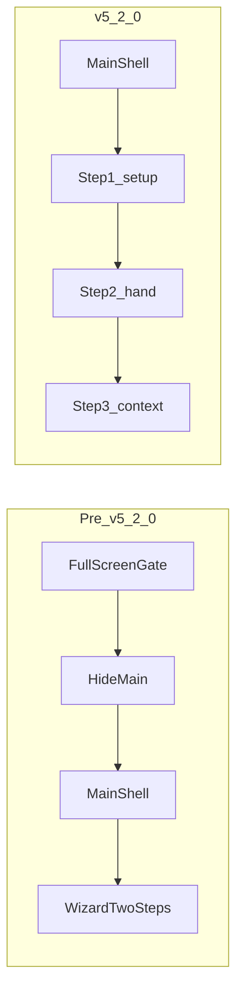

# HLM: Unified onboarding in main shell + HIG polish

**Status:** `completed` — shipped **v5.2.0**（2026-04-03）  
**Parent:** [hlm-master-plan.plan.md](hlm-master-plan.plan.md)  
**Master track id:** `track-onboarding-shell-hig`  
**CHANGELOG:** [CHANGELOG.md](../../CHANGELOG.md) § **[5.2.0]**

## Locked architecture decision — Option B

**Chosen path (confirmed by product owner): Option B** — move round setup into
**`main.app-shell`** as **wizard step 1** (single surface, shared footer /
wizard controls); remove the pattern that **hides `main`** behind a full-screen
gate overlay.

**Explicitly out of scope for this track — Option A:** keep a separate
full-screen `#roundSetupGate` and only renumber copy to 1/3–3/3 while the
wizard state stays internally 1–2. That lighter approach is **not** the target.

Implementation must match Option B end-to-end: **three wizard steps** in
[`src/app/uiFlowState.js`](src/app/uiFlowState.js), modal sync and CTAs keyed
to steps **1 / 2 / 3**, setup UI **in-flow** inside the shell.

## Goal（**已达成的意图**）

- **单壳体验**：Splash 后用户在 [public/index.html](public/index.html) 的
  `main.app-shell` 内完成 **1/3 设定 → 2/3 手牌 → 3/3 条件**。
- **已移除**全屏 gate 对 `main` 的隐藏；稳定 id 仍由
  [tests/unit/roundSetupGateDom.test.js](tests/unit/roundSetupGateDom.test.js)
  锁定（含 `startRoundBtn`）；**`collectRoundPlayers`** 逻辑在
  [public/appStateActions.js](public/appStateActions.js)。
- **HIG**：本 track 以流程与文案为主；**全模态 HIG** 列为可选后续。

## Prerequisites（已完成，实施前只读校验）

- [hlm_round_setup_four_player_settlement_c30c89d1.plan.md](hlm_round_setup_four_player_settlement_c30c89d1.plan.md)（四家、`collectRoundPlayers` 契约）
- [hlm_round_setup_table_ui_525519a5.plan.md](hlm_round_setup_table_ui_525519a5.plan.md)（牌桌俯视 UI、DOM id）

与 master **Dependency** 一致；不阻塞：MCR P0 / 结算角色 / 规则预设（规则预设仍在 **context 模态** 内，见 [public/index.html](public/index.html)）。

## Acceptance criteria（验收 — **已于 2026-04-03 满足**）

- Splash 之后 **`main.app-shell` 可布局**：已移除 `setRoundGateVisible` 对 `main` 的
  `display:none`；文案 **步骤 1/3 … 3/3** 与 `homeStateView` 一致。
- **`uiFlowState`** 三步；**`handleWizardNextClick`** 在 **step === 3** 计算；
  **`syncWizardModals`** 按 1/2/3 对齐 picker/context；桌面内联 context 保留。
- 离开步骤 1：**`goWizardNext`** 内联 **`collectRoundPlayers`**（
  [public/appStateActions.js](public/appStateActions.js)）并写 `roundState`
  （`initialized`、`players`、`dealerSeat`），等价原 `startRoundBtn` 数据。
- **`roundSetupGateDom.test.js`**：id / `data-seat` 契约 + **`#roundSetupGate` 在
  `<main>` 内** + **`handCardSection`** id（已加测）。
- **`playAgain`**：**`jumpWizardStep(2)`** + `syncWizardModals({ step: 2 })`。
- 门禁：**`npm test`**、**`quality:complexity`**、**`build:dist`**、已 touch 文件
  **`cloc`**；CHANGELOG **[5.2.0] 2026-04-03**。

## State invariants（**已实现的运行时约定**）

- **Step 1**：仅显示设定卡片（`handCardSection` 隐藏）；`syncWizardModals(step 1)`
  关 picker/context；footer「**下一步**」提交设定；**`startRoundBtn`** 在 HTML 中
  `hidden`（契约 id 保留）。
- **Step 2**：手牌；未满 14 张 **`goWizardNext` → `needs: "tiles"`**；自动满 14 进
  下一步仍由 **`wizardUi.afterPickerSync`** 在 **step 2** 触发。
- **Step 3**：条件；**下一步** → **`calculate`**（旧逻辑 step 2）。

## Primary file touch list（可增删，实施时 cloc 复核）

- [src/app/uiFlowState.js](src/app/uiFlowState.js)，[tests/unit/uiFlowState.test.js](tests/unit/uiFlowState.test.js)
- [public/index.html](public/index.html)（`#roundSetupGate` 迁入 `main`）
- [public/app.js](public/app.js)，[public/appStateActions.js](public/appStateActions.js)，[public/appEventWiring.js](public/appEventWiring.js)
- [public/homeStateView.js](public/homeStateView.js)
- [public/styles-components.css](public/styles-components.css)，[public/styles-responsive.css](public/styles-responsive.css)
- [tests/unit/roundSetupGateDom.test.js](tests/unit/roundSetupGateDom.test.js)
- 视改动范围：[tests/unit/appStateActions.test.js](tests/unit/appStateActions.test.js)、[tests/unit/appEventWiring.test.js](tests/unit/appEventWiring.test.js)、[tests/unit/appModalActions.test.js](tests/unit/appModalActions.test.js)、[tests/unit/indexStylesheetLinks.test.js](tests/unit/indexStylesheetLinks.test.js)

## Phase exit criteria（执行记录 — 已全部满足）

1. **State**：`uiFlowState.test.js` 三步边界 ✓  
2. **DOM/CSS**：`#roundSetupGate` 在 `main`、非全屏 ✓  
3. **Wiring**：`appEventWiring` / `appStateActions` 单测 ✓  
4. **Tests**：全套件绿 ✓  
5. **HIG**：本切片仅文案/步骤提示；**未**做全量模态 HIG 审计（可选 follow-up）

## Rollback（历史）

- 若需回退：**git revert** 至 v5.2.0 之前提交（恢复全屏 gate + 两步向导）。

## Plan readiness verdict

- **completed (2026-04-03)** — v5.2.0；门禁见上 **Acceptance criteria**。

## Flow: legacy vs shipped

## Implementation phases（设计档案 — 与仓库一致）

### Phase 1 — State model (TDD first)

- Extend [src/app/uiFlowState.js](src/app/uiFlowState.js): `totalSteps: 3`,
  `clampWizardStep` **1–3**, `setWizardStep` preserves `totalSteps: 3`.
- Update [tests/unit/uiFlowState.test.js](tests/unit/uiFlowState.test.js) for
  bounds and `next` / `prev` at step 3.

### Phase 2 — DOM / CSS relocation

- Move the setup card into **`main.app-shell`** (e.g. first section inside
  main), keeping **`id="roundSetupGate"`** on a wrapper that is **not**
  full-viewport blocking (prefer **keeping ids** to minimize churn).
- Adjust [public/styles-components.css](public/styles-components.css) /
  [public/styles-responsive.css](public/styles-responsive.css): in-flow card
  layout; preserve table metaphor and dealer highlight
  (`syncRoundSetupDealerHighlight` in [public/app.js](public/app.js)).
- **Remove** `setRoundGateVisible` / `hideRoundGateWithTransition` usage that
  hides `main`; splash behavior unchanged (`dismissSplash`).
- **`startRoundBtn`**: **已隐藏**（HTML `hidden`）；仅 footer「下一步」通过
  **`goWizardNext`** 提交设定并进入 step 2。

### Phase 3 — Wiring (`goWizardNext` / modals / home view)

- [public/appStateActions.js](public/appStateActions.js) `goWizardNext`:
  - **Step 1 → 2**: `collectRoundPlayers(byId)` + `dealerSeat` → `roundState`；
    **`initialized: true`**；再 `nextWizardStep`。
  - **Step 2 → 3**: Keep **`canCalculate`** guard (14 tiles).
  - **Step 3**: Calculate via **Next** in `handleWizardNextClick`, not
    `goWizardNext`.
- [public/appEventWiring.js](public/appEventWiring.js) `handleWizardNextClick`:
  calculate branch **`step === 3`**; `syncWizardModals`: step **1** closes
  picker+context; **2** opens picker (mobile) / desktop rules preserved; **3**
  opens context (mobile) and closes picker (same as today’s step 2).
- [public/homeStateView.js](public/homeStateView.js): hints and CTA visibility
  for steps **1 / 2 / 3**; `openPickerBtn` only on step 2; `desktop-step-*`
  for three steps.
- `openPickerBtn` → `jumpWizardStep(2)` (not 1). **`playAgain`**: default
  return to **hand step (2)** after clear (not setup), unless product changes.

### Phase 4 — Tests and contracts

- Update tests that assume **2-step** wizard (e.g. `appStateActions`,
  `appEventWiring`, `appModalActions` if step-aware).
- Add coverage for step 1 → 2 `roundState.initialized`, modal sync, back
  **3 → 2 → 1**.
- [tests/unit/roundSetupGateDom.test.js](tests/unit/roundSetupGateDom.test.js):
  id / `data-seat` + **`main` 内 gate** + **`handCardSection`** ✓

### Phase 5 — HIG / polish

- **已交付范围**：步骤文案与壳内布局；**未交付**：全模态焦点/触控专项审计
  （见 **hig-modal-pass** todo 说明）。

### Gates（**2026-04-03 已跑通**）

- `npm run test:unit` → `test:integration` → `test:regression` → `npm test` ✓  
- `npm run quality:complexity` ✓  
- `cloc`（已 touch 程序文件）✓  
- `npm run build:dist` ✓  
- [CHANGELOG.md](CHANGELOG.md) **[5.2.0] — 2026-04-03** ✓

## Master plan linkage

- [hlm-master-plan.plan.md](hlm-master-plan.plan.md)：**`track-onboarding-shell-hig`**
  **`completed`**；index、dependency、mermaid 后文字、**Phase Status Dashboard**、
  **Focus**、**NextActions**、**ValidationEvidence**、**LastUpdated**、
  **TrackCloseout** 已与 v5.2.0 对齐。

## Risks / mitigations（**交付后**）

- **Resize / 断点**：三步 + `syncWizardModals` 已在单测覆盖主要分支；**手工**
  仍建议过一遍窄屏/桌面（见 master **NextActions**）。
- **Desktop picker host**：与 [public/desktopPickerMount.js](public/desktopPickerMount.js)
  共用；若后续改步号须同步测 `syncWizardModals`。

## Out of scope

- Scoring / settlement logic rewrites.
- Features beyond onboarding + modal HIG polish.

## Post-close follow-up（**2026-04-04**）

- 中文帮助 `#helpArticleTemplate` 已与三步向导对齐；契约见
  `tests/unit/indexStylesheetLinks.test.js`（**v5.2.1**）。
