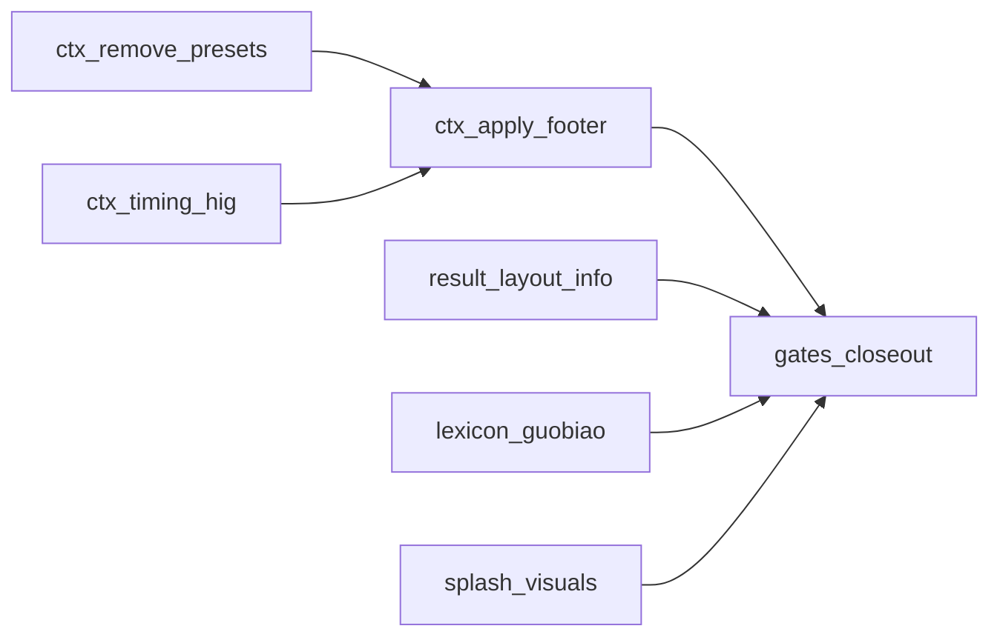

# HLM 后续精修：和牌条件 / 结果 / 番种释义 / 启动页

**父级交付**: [hlm_holistic_ux_scoring.plan.md](hlm_holistic_ux_scoring.plan.md)（v4.6.0 已合入）。

**Master 链接**: [hlm-master-plan.plan.md](hlm-master-plan.plan.md) — 对应 todo
`track-post-holistic-ui-polish`。

## 交付后修订（与界面一致，2026-03-22）

- v4.6.1 曾一度加入结果 sticky 区 **`#resultWinPattern`**（`vm.winPatternText`）及
  分隔线；**用户验收后已去除**该独立「和牌型」行，避免与底部 `explanation` 中
  「和牌类型：…」重复感。
- **当前行为**：[`public/index.html`](../public/index.html) 无 `#resultWinPattern`；
  [`renderResultModal`](../public/resultModalView.js) 不再写入和牌型节点；
  [`src/app/resultViewModel.js`](../src/app/resultViewModel.js) 仍保留
  `winPatternText`（单测与将来复用）；[`src/llm/explainer.js`](../src/llm/explainer.js)
  生成的 **`explanation`** 仍含和牌类型与总番、命中番种摘要。
- **CHANGELOG**：[`CHANGELOG.md`](../CHANGELOG.md) `[Unreleased]` 记录上述移除。

## 用户确认项（2026-03-22 验收）

1. **去掉「默认和牌条件」** — 已确认为 **移除三张快捷预设卡片**（自摸+门前清 /
   点和+门前清 / 点和+副露），**不**改「自动弹出 sheet」行为（除非另有需求）。
2. **时机事件控件** — 对照 [Apple HIG](https://developer.apple.com/design/human-interface-guidelines/)
   在 Web/PWA 约束下选用更接近 **列表选择** 的呈现（见下文推荐）。
3. **应用按钮** — 移至 **和牌条件 sheet 最底部**（建议 **sticky footer**，
   内容区可滚动）。
4. **结果 Modal** — **移除「详细解释」按钮**及相关打开逻辑；**独立和牌型行**
   曾在 v4.6.1 实现后 **按用户反馈撤销**（无 `#resultWinPattern`）；和牌结构类型
   由 **底部 `explanation`**（和牌类型…）与 **和牌分组** 共同体现。
5. **番种释义** — 当前为通用句；需按 **麻将国标（中国麻将竞赛规则）** 建立
   **逐 id 可核对** 的条文式释义（允许 1～3 句压缩表述，须与规则表一致）。
   研究来源优先级（需交叉核对）:
   - [维基文库：中国麻将竞赛规则](https://zh.wikisource.org/zh-hans/%E4%B8%AD%E5%9B%BD%E9%BA%BB%E5%B0%86%E7%AB%9E%E8%B5%9B%E8%A7%84%E5%88%99)
   - 体育总局《中国麻将竞赛规则（试行）》公开转载页（如 xqbase 等，**以原文为准**）
   - 工具内 `fanRegistry` / `FAN_CATALOG` id 与规则 **第八章番种** 表逐项映射清单
   **版权声明**: 释义正文为对规则的**摘要转述**，文件头注明来源与「以官方文本为准」；
   避免整章照搬。
6. **启动页** — 在现有结构上加 **视觉细化**（见下文）。

## 时机控件：HIG 取向（实现约束）

- **锁定方案 A（默认）**：**Grouped list**（类 iOS Form 分组列表）— 每行一项、
  **右侧选中标记（✓）**、整行可点、**最小高度 44pt**；点击行时更新
  `#timingEvent` hidden，并移动视觉选中态（与当前 `syncContextRadios` 兼容）。
- **实现技巧**：可保留 **隐藏 `<input type="radio" name="timingEvent">`**
  于各行内（现有校验逻辑不变），仅把外观改为列表行 + 对勾，避免重写
  [`public/contextWiring.js`](../public/contextWiring.js) 同步逻辑。
- **备选 B**：独立 bottom sheet 单列（Action sheet 式）；工作量高于 A，仅当
  A 在极窄屏上仍显拥挤时采用。
- **避免**：未样式原生 `<select>` 作为主交互。

## 结果 Modal 信息顺序（**当前已实现**）

自上而下：

1. 标题栏 + 关闭  
2. 状态 pill（和牌/未和牌）  
3. **总番**（sticky 顶区至此）  
4. **和牌分组**（滚动区）  
5. 番种明细（行内 ℹ️ 保留）  
6. **`explanation` 段落**（含和牌类型、总番、命中番种等摘要文案）  
7. **仅「再来一手」**（无「详细解释」、无 `#infoModal`）

**说明**：曾规划在总番下增加独立「和牌型」行；已按「交付后修订」节撤销。

**已锁定（减面）**：移除 `#openInfoBtn` 与 [`wireAppEvents`](../public/appEventWiring.js)
  中 `openInfo` 绑定；移除 [`public/index.html`](../public/index.html) 整段
  `#infoModal`；[`createAppRefs`](../public/appRefs.js) / [`appModalActions`](../public/appModalActions.js)
  去掉 `info` 键；[`playAgainBtn`](../public/appEventWiring.js)  handler 不再
  `closeModalByKey("info")`；[`resultStateActions.js`](../public/resultStateActions.js)
  已无 `openInfo`。结果区 **ℹ️ 行内释义** 为主路径。

## 番种释义工程步骤

1. **建映射表**（建议 `src/config/fanLexiconSources.md` 或模块顶注释表）：
   `fan id` → 规则表番种名称 → 章节/表号。**注意**：
   [`fanRegistry.js`](../src/rules/fanRegistry.js) 中不同 id 可能共用相似
   `zhName`（如「全大」类），释义**必须按 id 区分**，不可只按中文名键控。
2. **在线检索 + 交叉核对**：优先
   [维基文库](https://zh.wikisource.org/zh-hans/%E4%B8%AD%E5%9B%BD%E9%BA%BB%E5%B0%86%E7%AB%9E%E8%B5%9B%E8%A7%84%E5%88%99)
   与权威转载；每条保留可追溯引用（章节/节名）。
3. **实现**：以 **条文式** 文案替换 [`fanLexicon.js`](../src/config/fanLexicon.js)
   内 AUTO 通用模板；**全覆盖** `FAN_REGISTRY`。**SLOC**：若单文件 >100 行
  （`cloc`），拆出 `fanLexiconEntries.js`（仅数据）+ 薄 `fanLexicon.js`（导出）。
4. **测试**：扩展 [`fanLexicon.test.js`](../tests/unit/fanLexicon.test.js) —
   全 id 非空、最小长度、**禁止**等于占位串「释义待补」；对高流量 id 增加
   关键词断言（如「花牌」含「花」）。
5. **`renderInfoTip`**：已随 info modal 删除（[`resultModalView.js`](../public/resultModalView.js)
   无此导出）。

## 启动页美化方向

- **层次**: 背景 **渐变 + 极低对比网格/噪点**（CSS，免大图）；卡片 **毛玻璃或
  轻阴影** 与主站 `--card` 协调。  
- **字体**: 标题字重/字距；副标题与列表 **字阶** 符合 8pt 网格。  
- **动效**: `prefers-reduced-motion` 下 **跳变**；否则 **stagger 淡入**（短于
  1s）。  
- **可选**: 本地 **SVG** 线框牌面/「和」字标（无版权风险），避免外链图床。

## Definition of done

- 预设卡片不可见；`bindPresetButtons` / `CONTEXT_PRESETS` / `applyPreset` 无残留
  死代码（或测试专用导出需注明）。  
- 时机为列表式 HIG 取向控件；应用按钮在底部固定可见（小屏滚动不丢）。  
- 结果区：sticky 为状态 + 总番，下接和牌分组与番种明细；无独立和牌型行、无
  「详细解释」按钮；**无孤立 `#infoModal`**。  
- `fanLexicon` 每条 id 为国标对齐释义；测试禁止占位句；`cloc` 合规或已拆分。  
- 启动页视觉可验收；`npm test`、`npm run quality:complexity`、`npm run build:dist`、
  `CHANGELOG`、master **`track-post-holistic-ui-polish` → completed**。

## 实现落点（按文件，便于开工）

| 范围 | 主要文件 |
|------|----------|
| 去预设 | [`public/index.html`](../public/index.html)、[`public/app.js`](../public/app.js)、[`public/uiConfig.js`](../public/uiConfig.js)、[`public/handContextActions.js`](../public/handContextActions.js)、[`public/appEventWiring.js`](../public/appEventWiring.js)、[`public/uiBindings.js`](../public/uiBindings.js)（若仅预设用 `bindPresetButtons` 可删导出或保留空操作） |
| 时机 UI | [`public/index.html`](../public/index.html)、[`public/styles-modals.css`](../public/styles-modals.css)、必要时 [`public/contextWiring.js`](../public/contextWiring.js) |
| 底栏应用 | [`public/index.html`](../public/index.html)、[`public/styles-modals.css`](../public/styles-modals.css)（`context-sheet` flex 柱 + `footer` sticky） |
| 结果区 + 删 Info | [`public/index.html`](../public/index.html)、[`public/resultModalView.js`](../public/resultModalView.js)、[`public/appRefs.js`](../public/appRefs.js)、[`public/appEventWiring.js`](../public/appEventWiring.js)、[`public/appModalActions.js`](../public/appModalActions.js)、[`src/app/uiFlowState.js`](../src/app/uiFlowState.js)（去掉 `modal.info` 与 JSDoc 中的 `info`）、[`public/resultStateActions.js`](../public/resultStateActions.js)（可选删 `openInfo`） |
| 番种 | [`src/config/fanLexicon.js`](../src/config/fanLexicon.js)（+ 可能 `fanLexiconEntries.js`）、[`tests/unit/fanLexicon.test.js`](../tests/unit/fanLexicon.test.js) |
| 启动页 | [`public/index.html`](../public/index.html)、[`public/styles-components.css`](../public/styles-components.css)、[`public/app.js`](../public/app.js) |

## 建议实现顺序（依赖）

说明：**预设 / 时机 / 底栏** 同属 context sheet，可同一 PR 内联调；**释义** 与
**结果区** 可并行；**启动页** 独立；最后统一 **gates-closeout**。

## 计划审查闭环（执行前后自检）

- 子计划 **Definition of done** 每条可在界面或测试中对应验证。  
- 文内仓库链接均为相对路径（自 `hlm/.cursor/plans/` 出发的 `../` 指向项目根）。  
- 与 Master 的 `track-post-holistic-ui-polish` 状态同步（pending → in_progress →
  completed）。  
- 无未决「是否删除 infoModal」— 已锁定删除整段 modal 与 refs。  
- 番种释义有 **来源/版权声明** 与 **按 id 唯一** 约束书面记录。

## 实施就绪清单（编码前核对）

1. **无开放决策**：时机方案 A、infoModal 全删、和牌型**不**单独占行（仅
   explanation）、预设全删。  
2. **门禁命令**：`npm test`、`npm run quality:complexity`、改动文件 `cloc`、
   发布验证 `npm run build:dist`。  
3. **Master**：开工将 `track-post-holistic-ui-polish` 标 `in_progress`；收尾
   `completed` 并更新 **LastUpdated** 与 **ValidationEvidence**。  
4. **Regression**：[`tests/regression/goldenCases`](../tests/regression/goldenCases.json)
  不依赖预设 UI；若有 E2E 依赖 `openInfoBtn` 须改测。

## 依赖与风险

- **释义工作量**：81 项量级，宜 **分 2～3 批 PR**（先高频番种 + 测试门禁，
  后长尾），避免单次超大 diff。  
- **来源差异**：以 **wikisource / 最接近官方 PDF 的文本** 为准；转载页仅作辅证。  
- **uiFlowState**：若 modal 键从 state 删除，需核对
  [`src/app/uiFlowState.js`](../src/app/uiFlowState.js) 初始 `modal` 对象是否
  仍含 `info` — 应一并移除并跑 [`uiFlowState.test.js`](../tests/unit/uiFlowState.test.js)。
