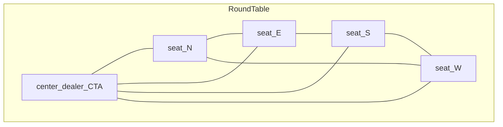

# HLM Round Setup — Table Metaphor UI

## Master Plan Link

- Parent: [hlm-master-plan.plan.md](hlm-master-plan.plan.md)
- Master track id: `track-round-setup-table-ui`
- This child plan file:
  `hlm_round_setup_table_ui_525519a5.plan.md`
- Depends on (completed):
  [hlm_round_setup_four_player_settlement_c30c89d1.plan.md](hlm_round_setup_four_player_settlement_c30c89d1.plan.md)
  (functional gate + settlement; this track is UI-only on the gate).

## Goal

Replace the flat two-column form grid in `#roundSetupGate` with a
**top-down table metaphor**: 北 (top), 东 (right), 南 (bottom), 西 (left),
clockwise like standard diagrams; **center** holds dealer control + primary
CTA and short helper copy.

## Hard constraints

- Keep **element IDs** unchanged so
  [public/app.js](../../public/app.js) `collectRoundPlayers()` and the
  start handler stay valid:
  - `playerNameE` / `playerScoreE`, and `S`, `W`, `N`
  - `dealerSeat`, `startRoundBtn`
- Prefer no changes under `src/app/` (settlement). Optional tiny
  presentational sync in `public/app.js` only.

## Implementation approach

1. **[public/index.html](../../public/index.html)**  
   - Grid wrapper e.g. `.round-setup-table` with areas: `seat-n`, `seat-e`,
     `seat-s`, `seat-w`, `table-center`.  
   - Each seat: 风位标题 + name/score inputs (same `id`s).  
   - Center: `dealerSeat`, `开始对局`, one-line instruction.

2. **[public/styles-components.css](../../public/styles-components.css)**  
   - Table surface (felt-like or neutral), rounded frame; reuse
     `var(--card)`, `var(--border)` where possible.  
   - Seat panels: compact; adequate touch targets.

3. **[public/styles-responsive.css](../../public/styles-responsive.css)**  
   - Narrow view: 2×2 seat grid + center block; wind labels always visible.  
   - No new mandatory motion; respect `prefers-reduced-motion`.

4. **Optional:** [public/app.js](../../public/app.js) — on `dealerSeat`
   `change`, set `is-dealer` (or similar) on the active seat panel.

## TDD / tests

- Add **tests/unit/roundSetupGateDom.test.js**: read `public/index.html`,
  assert IDs above exist; assert each seat exposes a stable wind cue
  (e.g. heading or `data-seat` on a wrapper).  
- Gates: `npm test`; `npm run quality:complexity` if JS grows; `cloc` on
  touched files.

## Master plan maintenance

When this track **starts**: set master frontmatter todo
`track-round-setup-table-ui` to `in_progress` and Phase Dashboard active
slice to this child. When **done**: mark todo `completed`, set Active
slice to none (or next track), record validation evidence per
[plan-closeout-before-final](../../../../../../.cursor/rules/plan-closeout-before-final.mdc).

## Acceptance criteria

- Desktop and mobile: four seats read as N/E/S/W; center shows dealer +
  CTA.  
- Preserved IDs; start-round smoke passes.  
- `npm test` pass; new unit test pass; complexity/SLOC guardrails on
  touched files.

## Implementation status

- **Shipped** 2026-04-03: `public/index.html` table grid, felt-style
  `.round-setup-table`, responsive areas in `styles-responsive.css`,
  `syncRoundSetupDealerHighlight` in `public/app.js`,
  `tests/unit/roundSetupGateDom.test.js`, `CHANGELOG.md` [4.12.0].

## Out of scope

- Dealer rotation automation, scoring changes, result modal settlement
  layout changes.
