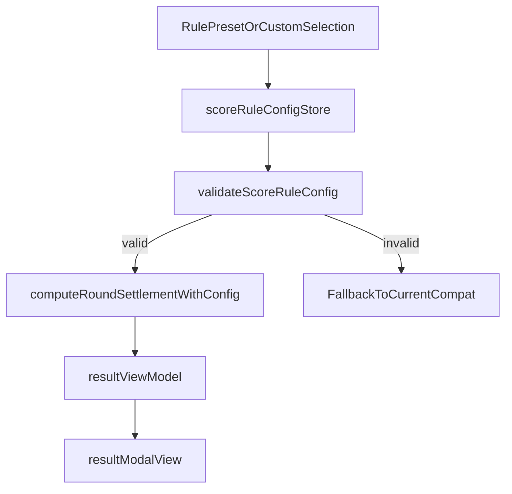

# HLM Score Config + MCR Presets Plan

## Master Plan Link

- Parent: [hlm-master-plan.plan.md](hlm-master-plan.plan.md)
- Master track id: `track-score-config-mcr-presets`
- This child plan file:
  `hlm_score_config_mcr_presets_620b275b.plan.md`
- Dependencies (completed):
  - [hlm_round_setup_four_player_settlement_c30c89d1.plan.md](hlm_round_setup_four_player_settlement_c30c89d1.plan.md)
  - [hlm_round_settlement_roles_visible_01c13181.plan.md](hlm_round_settlement_roles_visible_01c13181.plan.md)

## Goal

- Make settlement algorithm flexible/scalable via `scoreRuleConfig`.
- Ship both presets:
  - `MCR_Official` (target formula baseline)
  - `Current_Compat` (current linear behavior compatibility)
- Expose preset/custom selection UI and persistence while keeping deterministic
  testability.

## Target Architecture

## Scope

- In scope:
  - Versioned score config schema + validator.
  - Preset registry (`MCR_Official`, `Current_Compat`).
  - Settlement engine integration to consume config.
  - UI controls to choose preset and manage custom config clone.
  - Local persistence and safe fallback on invalid config.
  - Full tests (unit/integration/regression) for both presets and guardrails.
- Out of scope:
  - Rewriting fan detection rules engine.
  - Network sync/account-level profile storage.

## TDD-First Implementation Slices

### Slice 1: Config schema + validator module

- Add `src/config/scoreRuleConfig.js` and validator module in `src/app/` or
  `src/contracts/`.
- Include fields:
  - `meta` (`id`, `name`, `version`, `editable`)
  - `fanToPoint` (`mode: linear|table`)
  - `distribution` (`zimo`, `dianhe` multipliers/modes)
  - `dealerRule`, `extraItems`, `capFloor`, `guards`
- Tests first in `tests/unit/`:
  - accepts valid `MCR_Official` and `Current_Compat`
  - rejects invalid multipliers/missing keys/bad table map
  - deterministic fallback selection behavior

### Slice 2: Preset registry and migration-safe defaults

- Define preset registry and default selection policy:
  - Default preset: `MCR_Official`
  - Compatibility preset retained for legacy behavior snapshots.
- Add migration/version handling:
  - Unknown/old config -> fallback to `Current_Compat` with warning surface.
- Tests:
  - registry completeness
  - version mismatch fallback

### Slice 3: Settlement engine integration

- Refactor [roundSettlement.js](../../src/app/roundSettlement.js) to consume a
  `ruleConfig` input.
- Preserve existing role guards (`dianhe` requires valid discarder).
- Ensure conservation invariant remains enforced.
- Tests:
  - parity tests for `Current_Compat` vs current behavior baseline
  - MCR preset expected examples

### Slice 4: UI + persistence

- Add rule selection controls in context/settings UI:
  - preset select (`MCR_Official`, `Current_Compat`, `Custom`)
  - custom clone/edit entry point (guarded form)
- Persist selected rule + custom payload in local storage.
- On load:
  - validate persisted config
  - invalid -> fallback + user-visible notice.
- Candidate files:
  - [index.html](../../public/index.html)
  - [app.js](../../public/app.js)
  - [contextWiring.js](../../public/contextWiring.js)
  - [styles-modals.css](../../public/styles-modals.css)

### Slice 5: Result transparency and diagnostics

- Show active rule id/version in result summary.
- On fallback, show concise note (`配置无效，已回退到兼容预设`).
- Candidate files:
  - [resultViewModel.js](../../src/app/resultViewModel.js)
  - [resultModalView.js](../../public/resultModalView.js)

### Slice 6: Regression gates and evidence

- Run and record:
  - `npm test`
  - `npm run quality:complexity`
  - `cloc <touched-files>`
- Add integration cases for both presets and edge-role flows.
- Update changelog entry with date and preset behavior summary.

## Acceptance Criteria

- Settlement engine uses config, not hard-coded multipliers.
- Both presets are available and tested:
  - `MCR_Official`
  - `Current_Compat`
- Invalid persisted/custom config never crashes scoring flow; fallback works.
- Result modal shows active rule id/version and fallback notice when
  applicable.
- Full test/complexity/SLOC gates pass.

## Implementation Status

- Completed 2026-04-03:
  - Added preset registry and schema validator:
    `src/config/scoreRuleConfig.js`,
    `src/contracts/scoreRuleConfigValidator.js`.
  - Added local rule selection/custom clone persistence:
    `public/scoreRuleState.js`.
  - Refactored settlement to consume `ruleConfig`:
    `src/app/roundSettlement.js`.
  - Wired UI + result transparency:
    `public/index.html`, `public/app.js`, `public/resultStateActions.js`,
    `public/appRefs.js`, `src/app/resultViewModel.js`,
    `public/resultModalView.js`.
  - Added/updated tests:
    `tests/unit/scoreRuleConfigValidator.test.js`,
    `tests/unit/roundSettlement.test.js`,
    `tests/unit/resultViewModel.test.js`,
    `tests/unit/indexStylesheetLinks.test.js`.
  - Gates passed: `npm test`, `npm run quality:complexity`, `cloc`.

