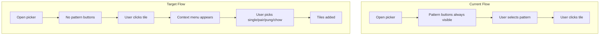

# HLM Tile-Click Context Menu Plan

## Master-Plan Linkage

- Parent plan:
  [hlm-master-plan.plan.md](hlm-master-plan.plan.md)
- Add new track in master plan: `track-tile-click-context-menu` (status:
  `completed`).
- Dependency: Builds on completed `track-tile-first-ui-overhaul`; reuses
  `getContextActionAvailability` and `applyContextMenuAvailability`.

## Scope and Outcomes

- Remove persistent `.pattern-actions` (单张, 对子, 刻子, 顺子前/中/后位)
  from picker modal.
- When user clicks a tile in the tile grid, show a context popup with
  only legal options.
- Dynamic visibility: at 12 tiles only single/pair; at 13 only single; at
  14 none.
- Reuse existing rule engine:
  [src/app/tilePatternActions.js](../src/app/tilePatternActions.js)
  `getContextActionAvailability` and
  [public/contextMenuView.js](../public/contextMenuView.js)
  `applyContextMenuAvailability`.

## Current vs Target Flow

## Target Code Areas

- [public/index.html](../public/index.html): Remove or hide
  `.pattern-actions` and `pickerActionHint` from picker modal.
- [public/pickerRenderFlow.js](../public/pickerRenderFlow.js): Change
  tile grid `onPick` to open context menu instead of direct `pickTile`.
- [public/handPickerActions.js](../public/handPickerActions.js): Add
  `pickTileWithAction(baseTile, actionId)` or extend `pickTile` to
  accept optional `actionId`.
- [public/appEventBindings.js](../public/appEventBindings.js): Remove
  `bindPatternActionButtons` usage for picker; add context-menu bindings.
- [public/contextMenuView.js](../public/contextMenuView.js): Already has
  `applyContextMenuAvailability`; add menu show/hide and positioning.
- [public/contextWiring.js](../public/contextWiring.js): Wire tile
  click to show menu; wire menu option click to `pickTileWithAction`.
- [public/homeStateView.js](../public/homeStateView.js): Remove
  `pickerActionHint` and `renderPatternActionButtons` usage for picker.
- [public/styles-components.css](../public/styles-components.css): Style
  context menu popup; remove or repurpose `.pattern-actions` styles.

## Phase Entry and Exit Gates

### Phase 1: TDD and Action API

- Entry: Existing picker and pattern tests pass; `getContextActionAvailability`
  and `resolvePatternAction` tests pass.
- Exit: `pickTileWithAction(baseTile, actionId)` implemented; unit tests
  for explicit action and 12/13/14 boundary pass; no drift in
  `resolvePatternAction` tests.

### Phase 2: Context Menu UI and Wiring

- Entry: Phase 1 merged; rule output deterministic.
- Exit: Tile click opens menu; menu shows only legal options via
  `applyContextMenuAvailability`; menu option click calls
  `pickTileWithAction` and closes menu; click-outside or Escape closes
  menu; menu positioned near tile or fixed for mobile.

### Phase 3: Remove Static Pattern UI

- Entry: Phase 2 stable; integration flow passes.
- Exit: `.pattern-actions` and `pickerActionHint` hidden or removed;
  `bindPatternActionButtons` not used for picker; `syncHomeStateView`
  does not depend on pattern hint for picker.

### Phase 4: Edge Cases and Long-Press Lock

- Entry: Phase 3 merged; core flow complete.
- Exit: Long-press lock decided (remove or add "锁定" in menu);
  slot-tap flow (editingIndex) verified; undo/clear/delete work; no
  regression in mobilePickerFlow integration tests.

### Phase 5: Validation and Gates

- Entry: All implementation changes frozen.
- Exit: From project folder:
  - `npm run test:unit`
  - `npm run test:integration`
  - `npm run test:regression`
  - `npm test`
  - `npm run quality:complexity`
  - `cloc` for each touched file
  - CHANGELOG updated with today's date.

## Implementation Details

### pickTileWithAction

- Add to [handPickerActions.js](../public/handPickerActions.js).
- Signature: `pickTileWithAction(baseTile, actionId)`.
- Calls `resolvePatternAction(store.pickerState, baseTile, actionId)`.
- On `ok`: `addTilesToPicker(store.pickerState, result.tiles)`; sync.
- On fail: show hint via `refs.pickerActionHintEl` if present (or
  remove hint element and skip).

### Context Menu DOM

- Add `#tileContextMenu` in picker modal or as overlay.
- Buttons with `data-context-action` for: single, pair, pung,
  chow_front, chow_middle, chow_back.
- Optional: `.context-chow-submenu` wrapper for chow items (contextMenuView
  supports it); flat list also works (chowWrap null is safe).
- Labels: 单张, 对子, 刻子, 顺子前位, 顺子中位, 顺子后位.

### Menu Show/Hide Flow

- `showTileContextMenu(anchorRect, baseTile, pickerState)`:
  - Compute `getContextActionAvailability(pickerState, baseTile)`.
  - Apply `applyContextMenuAvailability(menuEl, map)`.
  - Position menu (e.g. above/below anchor, or fixed bottom on mobile).
  - Add click-outside and Escape listeners.
- On menu option click: `pickTileWithAction(baseTile, actionId)`; close
  menu; remove listeners.

### Picker onPick Wiring

- [pickerRenderFlow.js](../public/pickerRenderFlow.js) receives
  `onPick` from params.
- Change from `onPick: (tile) => stateActions.pickTile(tile)` to
  `onPick: (tile) => stateActions.openTileContextMenu(tile)`.
- `openTileContextMenu` added to stateActions (from handStateActions or
  new tileContextMenuController).

### editingIndex Flow

- When user taps slot in 14-slot preview, picker opens with
  `editingIndex` set.
- `addTilesToPicker` already uses `editingIndex` from state when
  present.
- Tile grid click still provides `baseTile`; menu option provides
  `actionId`; `pickTileWithAction` uses `store.pickerState` which
  includes `editingIndex`. No change needed.

## Test Files to Extend or Add

- [tests/unit/appStateActions.test.js](../tests/unit/appStateActions.test.js)
  or new `tests/unit/tileContextMenu.test.js`: `pickTileWithAction` (via
  handPickerActions or stateActions).
- [tests/unit/tilePatternActions.test.js](../tests/unit/tilePatternActions.test.js):
  Already covers `getContextActionAvailability`; ensure 12/13/14 cases.
- [tests/integration/mobilePickerFlow.test.js](../tests/integration/mobilePickerFlow.test.js):
  Extend for tile-click -> menu -> add flow.

## Risks and Mitigations

- **Over-filtering menu options**: Use deterministic
  `getContextActionAvailability`; unit matrix for 12/13/14 and chow rank
  edge cases.
- **Menu overflow on small screens**: Position fixed or near bottom;
  ensure touch targets >= 44px.
- **Regression in slot-tap flow**: Verify editingIndex path in
  integration test; keep `addTilesToPicker` contract.
- **Dead code (pickerAction, lock)**: Remove or keep for backward
  compat; Phase 3 explicitly removes picker usage.
- **Accessibility**: Menu must support keyboard (Escape to close) and
  focus management; aria attributes for screen readers.

## Rollback Plan

- Revert Phase 2–3 changes to restore `.pattern-actions` and direct
  `pickTile` flow.
- Keep Phase 1 `pickTileWithAction` if useful; otherwise revert.
- Rollback path: revert commits for pickerRenderFlow, index.html,
  contextWiring, appEventBindings, homeStateView.

## Non-Goals

- Do not change scoring rule semantics or fan calculation.
- Do not change picker mode (flat vs two-layer) behavior.
- Do not change slot-tap-to-open-picker behavior for 14-slot preview.

## Execution Evidence (Completed)

- Phase 1: `pickTileWithAction` in handPickerActions; tileContextMenu.test.js.
- Phase 2: tileContextMenuController.js; #tileContextMenu in index.html;
  picker onPick wired to openTileContextMenu.
- Phase 3: pattern-actions and pickerActionHint removed; bindPatternActionButtons
  removed; syncHomeStateView simplified.
- Phase 4: Long-press lock removed; editingIndex unit test added.
- Phase 5: npm test pass; CHANGELOG updated; plan links validated.
