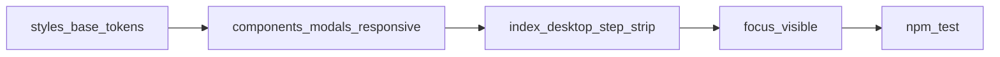

# HLM UI theme + desktop wizard

## Status

- **Completed** 2026-04-09 — gates: `npm test`, `npm run quality:complexity`.

## Purpose

- One coherent visual system (tokens) across shell, cards, tiles, modals,
  splash.
- Desktop (≥1024px) wizard cues aligned with common patterns: visible steps,
  clear primary action, without changing scoring or `uiFlowState` flow.

## Non-goals

- Rule/fan/scoring logic changes.
- Tile image redesign.
- Replacing the existing two-pane desktop shell or mobile-first layout.

## Master plan linkage

- **Master file:** [hlm-master-plan.plan.md](hlm-master-plan.plan.md)
- **Master frontmatter todo id:** `track-ui-theme-desktop-wizard`
- **Canonical workspace path:** `.cursor/plans/hlm_ui_theme_desktop_wizard_bb8d2233.plan.md`
  (under `hlm/`).
- **On execution start:** set that master todo to `in_progress`; dashboard
  `Active TrackId` → `track-ui-theme-desktop-wizard`; `Queue mode` → `active`.
- **On ship:** full gates + CHANGELOG; master todo + child todos →
  `completed`; dashboard `Active TrackId` → `none`, `Queue mode` →
  `maintenance` (or next track).

## Prerequisites

- Completed baselines: desktop shell, workspace layout, onboarding three-step
  shell (see master index:
  [hlm_desktop_web_ui_ce34a47e.plan.md](hlm_desktop_web_ui_ce34a47e.plan.md),
  [desktop_workspace_ui_76498db2.plan.md](desktop_workspace_ui_76498db2.plan.md),
  [hlm_onboarding_shell_merge_f9a1c8e0.plan.md](hlm_onboarding_shell_merge_f9a1c8e0.plan.md)).

## Implementation phases

### Phase 1 — Design tokens

**File:** [public/styles-base.css](../../public/styles-base.css)

- Add semantic variables, e.g. `--surface-page`, `--surface-raised`,
  `--text-primary`, `--text-muted`, `--border-default`, `--accent`,
  `--accent-contrast`, `--focus-ring`, `--shadow-sm`, `--shadow-md`.
- Map existing `--bg`, `--card`, `--primary` into the new names or alias
  legacy names to new tokens so downstream migration is incremental.
- Keep a **single** accent family (current calm blue is fine).

### Phase 2 — Token migration

**Files:**

- [public/styles-components.css](../../public/styles-components.css)
- [public/styles-modals.css](../../public/styles-modals.css)
- [public/styles-responsive.css](../../public/styles-responsive.css)

- Replace repeated `#fff` / `rgba(...)` where they denote the same semantic
  role as tokens.
- Prefer breakpoint-scoped rules for desktop-only experiments; do not alter
  mobile tap targets without explicit intent.

### Phase 3 — Desktop wizard structure

**Files:**

- [public/index.html](../../public/index.html)
- [public/styles-responsive.css](../../public/styles-responsive.css)

- Add **desktop-only** markup for a **step strip**: 1 设定玩家 → 2 录入手牌 →
  3 和牌条件, wired visually to existing step visibility (e.g.
  `desktop-step-*`, wizard sections — inspect current classes before editing).
- **Do not** rename or remove stable `id` attributes used by JS.
- **JS:** Prefer CSS-only. If `aria-current` or step labels need JS, extend an
  existing small module (e.g. round setup / wizard sync) and add a **unit
  test** for any new exported helper.

### Phase 4 — Accessibility

- `:focus-visible` using `--focus-ring` on buttons, links, and key controls.
- Do not regress [public/modalFocusUtils.js](../../public/modalFocusUtils.js)
  trap behavior or Escape wiring.

### Phase 5 — Verification

- `npm test` (full suite).
- `npm run quality:complexity` when edited modules are near limits.
- `cloc` on changed files per project SLOC guardrails.
- If release artifacts are updated from `public/`, run
  `npm run build:dist` and verify output consistency.

## Acceptance criteria

- Mobile/tablet layouts and touch targets remain acceptable; Playwright suite
  green.
- No breaking changes to scoring request DOM ids in `public/index.html`.
- Desktop ≥1024px shows an obvious three-step wizard progression.
- Modals, help popover, and splash use the same token palette as the shell.

## Risk controls

- Scope risky layout changes behind `@media (min-width: 1024px)` (or project
  standard desktop breakpoint).
- Preserve bootstrap module graph under [public/](../../public/); avoid
  growing any single function past project complexity limits.

## Note on duplicate plan files

A Cursor-generated copy may exist under the user-level `.cursor/plans/`
folder. **This workspace path is authoritative** per plan-storage policy.
