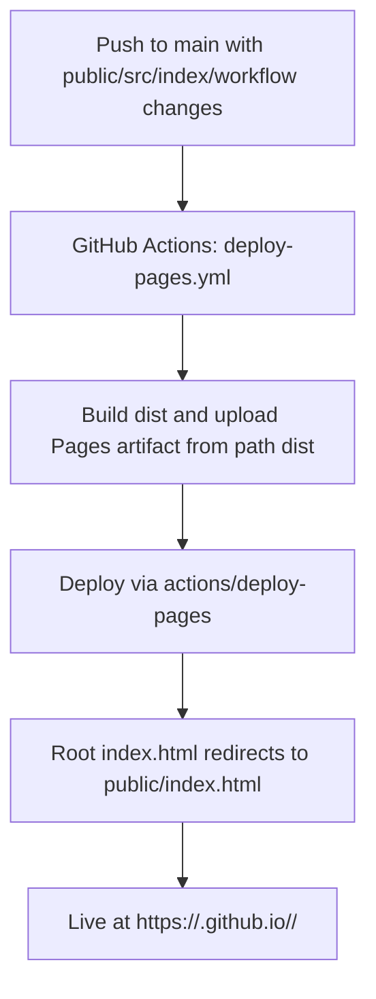
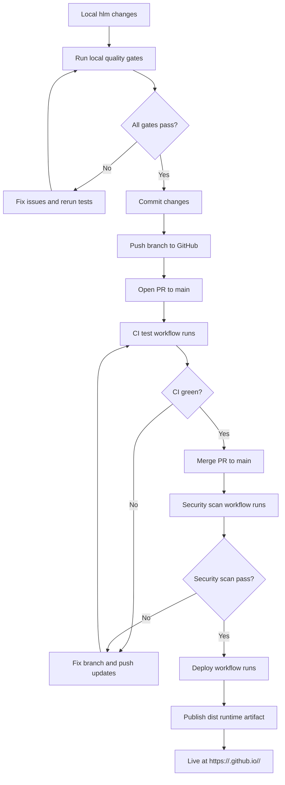
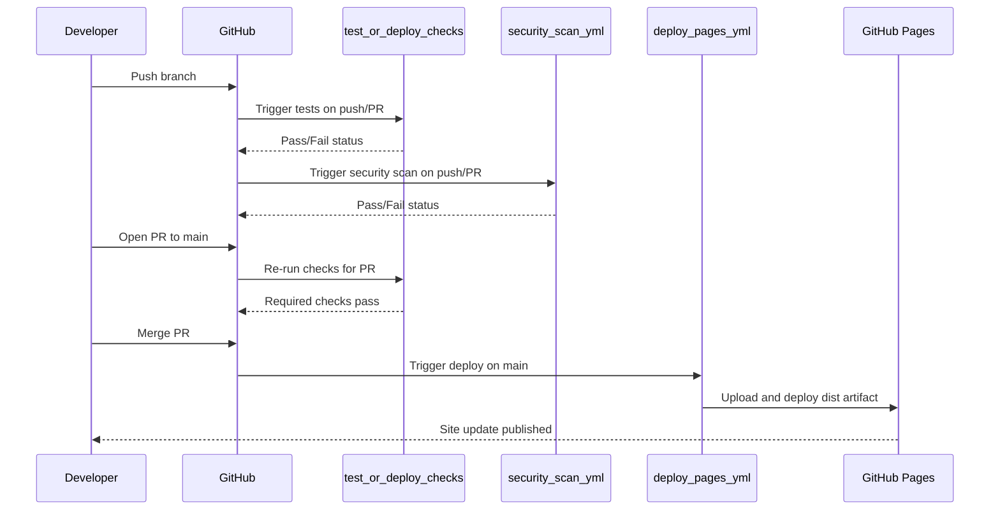
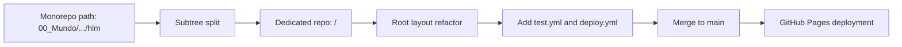
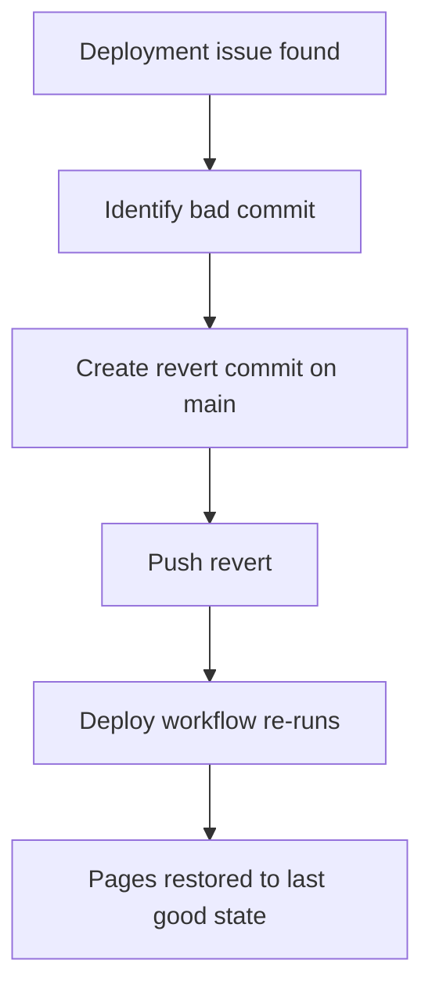

# HLM Deploy to GitHub (Mermaid Guide)

This file describes the deployment path for `hlm` to GitHub and GitHub
Pages using Mermaid diagrams.

## 1) Current Deployment Flow (Repository Today)



## 2) Target Deployment Flow (After Migration)



## 3) Target CI/CD Workflow Sequence

> Note: `test.yml` and `deploy.yml` are target workflow files for the
> GitHub Pages migration plan. They are referenced as the intended deploy
> state and may not exist yet in the current repo snapshot.



## 4) Migration-to-Deploy Relationship



## 5) Required Local Commands Before PR

```bash
npm test
npm run quality:complexity
```

## 6) Rollback Path


